**Nombre de la Universidad:** Universidad Peruana de Ciencias Aplicadas
**Facultad:** Ingeniería  
**Carrera:** Ingeniería de Software
**Ciclo:** 2026-10  

**Código del curso:** 1ASI0729  
**Nombre del curso:** Desarrollo de Aplicaciones Open Source
**NRC:** 11863  
**Nombre del profesor:** Iván Robles Fernández

**"Informe de Trabajo: AV1"**
**Nombre del startup:** RetailPulse

**Relación de integrantes:**

* U20241B331 - Faustino Hurtado, Anghelo Edwin
* U202319178 - Franco del Carpio, José María
* U20251C350 - Godoy Santillan, Jesus Andres
* U202310349 - Rubio Ortiz, Luis Sebastián
* U20211D989 - Vallejo Trujillo, Fabio Cesar

##### Abril, 2026

---

## Registro de Versiones del Informe

## Registro de Versiones del Informe

| Avance | Fecha | Autor | Descripción de Modificación |
|--------|------|------|-----------------------------|
| AV1 | 23/04/2026 | Equipo RetailPulse (Fabio Vallejo, Jesus Godoy, Luis Rubio, Anghelo Hurtado, José del Carpio) | Elaboración completa del informe incluyendo: Carátula, Project Report Collaboration Insights, Student Outcome, Capítulo I (Introducción), Capítulo II (Requirements Elicitation & Analysis), Capítulo III (Requirements Specification), Capítulo IV (Product Design), Capítulo V (Product Implementation, Validation & Deployment), Software Configuration Management, Software Development Environment Configuration, Source Code Management, Source Code Style Guide & Conventions, Software Deployment Configuration, Sprint Planning 1, Aspect Leaders and Collaborators, Sprint Backlog 1, Development Evidence, Execution Evidence, Services Documentation Evidence, Software Deployment Evidence, Team Collaboration Insights, Conclusiones, Bibliografía y Anexos. |

---

## Project Report Collaboration Insights

El equipo ha utilizado un flujo de trabajo en github: [retailpulse-report](https://github.com/RetailPulse-NRC11863/retailpulse-report)

---

## Contenido

1. [Student Outcome](#student-outcome)
2. [Capítulo I: Introducción](#capítulo-i-introducción)
3. [Capítulo II: Requirements Elicitation & Analysis](#capítulo-ii-requirements-elicitation--analysis)
4. [Capítulo III: Requirements Specification](#capítulo-iii-requirements-specification)
5. [Capítulo IV: Product Design](#capítulo-iv-product-design)
6. [Capítulo V: Product Implementation, Validation & Deployment](#capítulo-v-product-implementation-validation--deployment)
7. [Conclusiones](#conclusiones)
8. [Bibliografía](#bibliografía)

---

## Student Outcome

**ABET - EAC - Student Outcome 3:** Capacidad de comunicarse efectivamente con un rango de audiencias.

### Student Outcome

<table>
  <tr>
    <th>Criterio específico</th>
    <th>Acciones realizadas</th>
    <th>Conclusiones</th>
  </tr>
  <tr>
    <td><strong>Comunica oralmente con efectividad a diferentes rangos de audiencia.</strong></td>
    <td>
      <p><strong>Faustino Hurtado, Anghelo Edwin</strong><br>
      <strong>AV1:</strong> Participó en la explicación de los artefactos de Lean UX, incluyendo assumptions, hypothesis statements y Lean UX Canvas. Asimismo, sustentó el análisis competitivo, las estrategias frente a competidores, los lineamientos visuales, la arquitectura de organización y las User Stories asignadas.</p>
      <p><strong>Franco del Carpio, José María</strong><br>
      <strong>AV1:</strong> Explicó la construcción del Ubiquitous Language, el Product Backlog y los sistemas de arquitectura de información, incluyendo labeling, SEO tags, searching y navigation systems. También participó en la sustentación del registro de entrevistas y User Stories.</p>
      <p><strong>Godoy Santillan, Jesus Andres</strong><br>
      <strong>AV1:</strong> Presentó los antecedentes y la problemática, los segmentos objetivo y los artefactos de needfinding, como User Personas y User Task Matrix. Además, explicó el Landing Page Wireframe, el Container Diagram, los Class Diagrams y la configuración del entorno de desarrollo.</p>
      <p><strong>Rubio Ortiz, Luis Sebastián</strong><br>
      <strong>AV1:</strong> Sustentó el Impact Mapping, el Landing Page Mock-up, los Web Applications Mock-ups y el prototipo de la aplicación web. También explicó los Component Diagrams, las convenciones de estilo de código, la configuración de despliegue y las User Stories asignadas.</p>
      <p><strong>Vallejo Trujillo, Fabio Cesar</strong><br>
      <strong>AV1:</strong> Presentó la descripción de la startup, los Lean UX Problem Statements, el Context Diagram, el diseño de base de datos, la gestión del código fuente, los User Flow Diagrams, el Big Picture Event Storming, el Design-Level Event Storming y el registro de entrevistas.</p>
    </td>
    <td>
      <p><strong>AV1:</strong><br>
      Durante el AV1, el equipo desarrolló la capacidad de comunicar oralmente los principales avances del proyecto RetailPulse a distintos tipos de audiencia. Las exposiciones permitieron explicar tanto aspectos de negocio, como la problemática, segmentos y propuesta de valor, como aspectos técnicos, incluyendo arquitectura, diseño de base de datos, prototipos y artefactos de DDD. La distribución de responsabilidades favoreció que cada integrante pudiera sustentar una parte específica del proceso de ingeniería y comunicar su aporte con claridad.</p>
    </td>
  </tr>
  <tr>
    <td><strong>Comunica por escrito con efectividad a diferentes rangos de audiencia.</strong></td>
    <td>
      <p><strong>Faustino Hurtado, Anghelo Edwin</strong><br>
      <strong>AV1:</strong> Redactó y documentó secciones relacionadas con Lean UX Assumptions, Lean UX Hypothesis Statements, Lean UX Canvas, análisis de competidores, estrategias frente a competidores, General Style Guidelines, Web Applications Wireframes, Organization Systems y User Stories.</p>
      <p><strong>Franco del Carpio, José María</strong><br>
      <strong>AV1:</strong> Elaboró documentación vinculada al Ubiquitous Language, Product Backlog, Labeling Systems, SEO Tags and Meta Tags, Searching Systems, Navigation Systems, Registro de Entrevista y User Stories, contribuyendo a la claridad del informe técnico y funcional.</p>
      <p><strong>Godoy Santillan, Jesus Andres</strong><br>
      <strong>AV1:</strong> Documentó los antecedentes y la problemática, segmentos objetivo, User Personas, User Task Matrix, Landing Page Wireframe, Software Architecture Container Diagrams, Class Diagrams y Software Development Environment Configuration.</p>
      <p><strong>Rubio Ortiz, Luis Sebastián</strong><br>
      <strong>AV1:</strong> Redactó y documentó el Impact Mapping, Landing Page Mock-up, Web Applications Mock-ups, Web Applications Prototyping, Software Architecture Components Diagrams, Source Code Style Guide & Conventions, Software Deployment Configuration y User Stories.</p>
      <p><strong>Vallejo Trujillo, Fabio Cesar</strong><br>
      <strong>AV1:</strong> Elaboró la documentación de la descripción de la startup, Lean UX Problem Statements, Software Architecture Context Diagram, Database Diagrams, Source Code Management, Web Applications User Flow Diagrams, Big Picture Event Storming, Design-Level Event Storming y Registro de Entrevistas.</p>
    </td>
    <td>
      <p><strong>AV1:</strong><br>
      En el AV1, el equipo evidenció comunicación escrita efectiva mediante la elaboración colaborativa del informe del proyecto. La documentación permitió organizar de manera clara los fundamentos del negocio, los hallazgos de investigación, los requisitos, el diseño UX/UI, la arquitectura de software, el diseño orientado a objetos, la base de datos y la gestión del desarrollo. Esto permitió presentar RetailPulse de forma comprensible para audiencias técnicas y no técnicas, manteniendo coherencia entre el problema, la solución, los artefactos de diseño y las decisiones arquitectónicas.</p>
    </td>
  </tr>
</table>

---

## Capítulo I: Introducción

### 1.1. Startup Profile

#### 1.1.1. Descripción de la Startup

RetailPulse es una startup tecnológica conformada por estudiantes de la Universidad Peruana de Ciencias Aplicadas (UPC), orientada al desarrollo de soluciones digitales para mejorar la gestión comercial y la experiencia de compra en tiendas físicas del sector retail. La problematica surge a partir de que el comercio electrónico cuenta con métricas detalladas sobre el comportamiento de sus usuarios, muchos negocios físicos todavía operan con información limitada, tomando decisiones comerciales en función de intuición, experiencia previa o únicamente datos de venta.

La propuesta de valor de RetailPulse se materializa en una plataforma web SaaS que conecta la analítica de comportamiento en tienda con herramientas de apoyo operativo y experiencia asistida para el cliente. Por un lado, permite a boutiques, minimarkets y tiendas de conveniencia visualizar información como zonas de mayor tráfico, tiempo de permanencia, productos con alta interacción y baja conversión, y patrones de circulación dentro del local. Por otro lado, incorpora una interfaz web de consulta para el cliente en tienda, mediante la cual puede buscar productos, verificar disponibilidad, ubicar artículos dentro del local y acceder a promociones o recomendaciones durante su recorrido.

RetailPulse no se limita a mostrar datos, sino que los transforma en acciones concretas para el negocio. A partir de la información capturada, la plataforma puede generar recomendaciones para optimizar la distribución del local, activar promociones en zonas estratégicas, emitir alertas al personal cuando una zona requiere atención y facilitar decisiones relacionadas con exhibición, stock y conversión. De esta manera, RetailPulse busca llevar al retail físico un nivel de inteligencia operativa similar al del comercio electrónico, ayudando a los negocios a vender con mayor precisión y a los clientes a comprar con menos fricción.

#### 1.1.2. Perfiles de integrantes del equipo

<table>
  <tr>
    <td rowspan="3"></td>
    <td>Jesús Andres Godoy Santillan (U20251C350)</td>
  </tr>
  <tr>
    <td>Ingeniería de Software</td>
  </tr>
  <tr>
    <td>Soy Jesús, tengo 23 años. Me apasiona la programación desde temprana edad, habiendo desarrollado proyectos que van desde videojuegos hasta plataformas para eventos online con creadores de contenido. Cuento con experiencia en el desarrollo de sistemas personalizados para el sector agroindustrial y brindo asesoría técnica en soluciones tecnológicas y resolución de problemas.</td>
  </tr>
  <tr>
    <td rowspan="3"></td>
    <td>Faustino Hurtado, Anghelo Edwin (U20241B331)</td>
  </tr>
  <tr>
    <td>Ingeniería de Software</td>
  </tr>
  <tr>
    <td>Tengo 20 años. Me interesa el aprendizaje de nuevas tecnologías y el desarrollo de aplicaciones. Me considero una persona responsable, con capacidad para el razonamiento lógico y buena disposición para el trabajo en equipo en proyectos colaborativos.
</td>
  </tr>
  <tr>
    <td rowspan="3"></td>
    <td>Franco del Carpio, José María (U202319178)</td>
  </tr>
  <tr>
    <td>Ingeniería de Software</td>
  </tr>
  <tr>
    <td>[Insertar biografía aquí]</td>
  </tr>
  <tr>
    <td rowspan="3"></td>
    <td>Rubio Ortiz, Luis Sebastián (U202310349)</td>
  </tr>
  <tr>
    <td>Ingeniería de Software</td>
  </tr>
  <tr>
    <td>Soy Luis Sebastián, tengo 20 años. Cuando empecé a aprender cada vez más sobre las computadoras desde pequeño, supe que este era mi camino. Me gusta aprender cosas nuevas, y tengo experiencia trabajando en equipo no solo en el contexto universitario, sino también en ambientes laborales.</td>
  </tr>
  <tr>
    <td rowspan="3"></td>
    <td>Vallejo Trujillo, Fabio Cesar (U20211D989)</td>
  </tr>
  <tr>
    <td>Ingeniería de Software</td>
  </tr>
  <tr>
    <td>Soy Fabio, estudiante de ingenieria de software en quinto ciclo. Tengo 22 años, me gusta aprender nuevas tecnologías de programación y mantener buenas prácticas. Puedo aportar al proyecto manteniendo al grupo organizado con los entregables y con mis conocimientos técnicos en las multiples areas de programación, modelado de base de datos y arquitectura de software.</td>
  </tr>
</table>

### 1.2. Solution Profile

#### 1.2.1 Antecedentes y problemática

What?

Muchos negocios minoristas físicos operan actualmente con información limitada sobre lo que sucede dentro de sus locales. A diferencia del comercio electrónico, que posee métricas detalladas del usuario, el retail físico toma decisiones basadas en la intuición o únicamente en datos de venta final, ignorando el comportamiento previo a la conversión.

When?

La problemática se manifiesta durante todo el horario de atención comercial, especialmente cuando se acumula tráfico en zonas específicas sin que el personal lo note o cuando un cliente no encuentra un producto y abandona la tienda por falta de asistencia inmediata.

Where?

El problema se localiza en el interior de tiendas físicas como boutiques, minimarkets y tiendas de conveniencia. Estas carecen de herramientas para visualizar patrones de circulación o para ofrecer consultas digitales de stock en el mismo punto de venta.

Who?

Los afectados son los dueños y administradores de negocios retail, quienes no pueden optimizar su rentabilidad por zona, y los compradores, quienes experimentan fricciones al buscar productos o promociones.

Why?

La causa principal es la ausencia de una infraestructura digital que conecte sensores de monitoreo con interfaces de usuario, lo que genera exclusión de datos valiosos y limitaciones en la atención al cliente.

How?

La solución se implementará mediante una arquitectura distribuida que incluye un RESTful API en Java y una Web Application en Angular. Esta plataforma capturará eventos de interacción, generará mapas de calor para el administrador y ofrecerá un quiosco web de consulta para el comprador.

How much?

¿Cuánto afecta este problema?: Afecta al 100% de la eficiencia operativa del local, ya que las zonas de baja conversión no son identificadas ni corregidas a tiempo.

¿Cuánto costará resolver este problema?: El costo se define por el desarrollo de la arquitectura Open Source, el despliegue en la nube y el mantenimiento de los servicios de analítica.

¿Cuántas personas se beneficiarán?: Se beneficiarán tanto el personal operativo (mejor coordinación) como los cientos de clientes diarios que encontrarán una tienda más organizada y asistida.

Conclusiones de 5w y 2h:

En conclusión, el análisis identifica una desconexión crítica entre el potencial de venta del local y el conocimiento real del cliente. Retailplus implementará una solución innovadora que lleva la inteligencia del mundo online al entorno físico, eliminando la fricción para el comprador y maximizando la precisión operativa para el negocio.


#### 1.2.2 Lean UX Process

##### 1.2.2.1. Lean UX Problem Statements

En el retail físico, especialmente en boutiques y minimarkets, los negocios enfrentan una desventaja importante frente al comercio electrónico ya que no cuentan con herramientas que les permitan comprender con claridad qué ocurre dentro del local antes de que se concrete una venta. En la mayoría de los casos, los dueños o administradores solo pueden apoyarse en reportes de ventas, observación informal del comportamiento del cliente o criterios empíricos para decidir cómo distribuir productos, dónde colocar promociones, que promociones enviar a sus clientes o qué zonas del local requieren mayor atención.

Hemos identificado que este problema afecta directamente a dos segmentos clave. Por un lado, los dueños y administradores de tiendas necesitan visibilidad sobre el comportamiento de los clientes dentro del espacio físico para tomar decisiones comerciales mejor fundamentadas. Por otro lado, los propios compradores dentro de la tienda no siempre cuentan con una experiencia ágil para ubicar productos, promociones irresistibles, consultar stock o acceder a información útil durante su recorrido, lo que puede generar fricción, pérdida de tiempo y oportunidades desaprovechadas de venta.

Actualmente, ambas necesidades permanecen desconectadas. Mientras el negocio no dispone de información suficiente para optimizar su operación y mejorar la conversión, el cliente tampoco recibe apoyo inmediato dentro del local para encontrar lo que necesita o descubrir oportunidades y ofertas relevantes. Como consecuencia, se pierden posibilidades de mejorar la experiencia en tienda, aumentar ventas, optimizar la atención del personal y fomentar la fidelización.

¿Cómo podríamos desarrollar una plataforma web que permita a los dueños y administradores de tiendas físicas entender mejor el comportamiento de los clientes dentro del local y, al mismo tiempo, ofrecer a los compradores una experiencia de consulta asistida que reduzca fricción, facilite la compra y contribuya al incremento de la conversión y la fidelización?

##### 1.2.2.2. Lean UX Assumptions

**A. Business Assumptions**

1. Creemos que nuestros clientes necesitan reducir la pérdida de ventas por quiebres de stock y entender el flujo de clientes en su tienda.
2. Estas necesidades se resuelven con una plataforma SaaS que integre analítica de mapas de calor y un quiosco web de asistencia al comprador.
3. Nuestros primeros clientes serán administradores y dueños de minimarkets y tiendas de conveniencia urbanas.
4. **Valor #1 esperado:** visibilidad del tráfico en tiempo real y reducción de fricción en la compra.
5. **Beneficios adicionales:** optimización de la distribución del local, reposición ágil de productos, mejora en la experiencia del cliente.
6. **Adquisición:** referencias boca-a-boca, visitas comerciales a locales físicos y alianzas con gremios de retail.
7. **Ingresos:** suscripción mensual escalonada basada en el tamaño del local o número de zonas monitoreadas.
8. **Competencia principal:** RetailNext, Dor, Sensormatic Solutions.
9. **Ventaja competitiva:** integración de analítica operativa con asistencia directa al cliente, precio accesible y arquitectura open source.
10. **Mayor riesgo de producto:** rechazo a la instalación de sensores o cámaras por percepción de complejidad.
11. **Mitigación:** ofrecer un plan piloto inicial de bajo impacto, onboarding guiado y mostrar métricas accionables en la primera semana.
12. **Otros supuestos críticos:** conectividad a internet estable dentro de los locales comerciales; disposición de los clientes a usar pantallas interactivas.

**B. User Assumptions**

* **¿Quién es el usuario?** Administradores de tiendas físicas, personal operativo y compradores finales.
* **¿Dónde encaja el producto?** En el ecosistema físico de la tienda (oficina para el admin, pasillos para el personal y quiosco para el cliente).
* **Problema a resolver:** toma de decisiones empíricas → zonas de baja conversión y saturación de consultas al personal.
* **Uso típico:** revisar mapas de calor, recibir alertas de reposición, buscar la ubicación de un producto en el quiosco.
* **Características importantes:** analítica en tiempo real, alertas operativas, buscador interactivo de productos, UI intuitiva.
* **Look & feel:** dashboards oscuros (dark mode) para contraste de datos analíticos; UI limpia, clara y amigable con botones grandes para el quiosco web.

**C. User Outcome & Benefit Assumptions**

* Distribución de productos optimizada basada en datos reales, no en intuición.
* Menos consultas repetitivas al personal, permitiendo enfoque en tareas clave.
* Compradores encuentran productos y promociones de forma rápida y autónoma.
* Reducción de ventas perdidas por alertas preventivas de falta de stock.

**D. Business Outcome Assumptions (métricas objetivo)**

* Aumentar en un 25 % la tasa de conversión en zonas optimizadas en 3 meses.
* Reducir en un 30 % el tiempo promedio de búsqueda de productos por parte de los clientes.
* Disminuir a menos de 5 minutos el tiempo de respuesta del personal ante alertas de zonas desatendidas.
* Lograr la adopción de la plataforma en 10 locales piloto en los primeros 3 meses (2026).

**E. Feature Assumptions**

1. **Dashboard de analítica y mapas de calor** permite a la gerencia optimizar el layout de la tienda.
2. **Quiosco web interactivo** acelera la búsqueda de productos y mejora la experiencia de compra autónoma.
3. **Sistema de alertas operativas** notifica al personal sobre quiebres de stock para reposición inmediata.
4. **Módulo de promociones personalizadas** fideliza al cliente y aumenta las ventas cruzadas en zonas estratégicas.

##### 1.2.2.3. Lean UX Hypothesis Statements

**1. Dashboard de analítica y mapas de calor**
> Creemos que al ofrecer un dashboard con mapas de calor en tiempo real incrementaremos la tasa de conversión de las tiendas en un 25 %. Sabremos que estamos bien cuando veamos los siguientes comentarios del mercado: administradores reportan que "ahora sé exactamente qué pasillos son los más rentables y cómo distribuir mis productos" y/o los dashboards muestran un aumento del 25 % en ventas en las zonas optimizadas del local.

**2. Quiosco web interactivo**
> Creemos que implementar un quiosco web interactivo para la búsqueda autónoma de stock reducirá el tiempo de búsqueda del cliente en un 30 %. Sabremos que estamos bien cuando veamos los siguientes comentarios del mercado: compradores comentan que "fue muy fácil y rápido encontrar el pasillo de mi producto sin tener que buscar a un vendedor" y/o el sistema registra que más del 80 % de las consultas en pantalla terminan en una búsqueda exitosa en menos de 1 minuto.

**3. Sistema de alertas operativas**
> Creemos que incorporar notificaciones móviles sobre quiebres de stock o zonas desatendidas reducirá el tiempo de respuesta del personal a menos de 5 minutos. Sabremos que estamos bien cuando veamos los siguientes comentarios del mercado: el personal de piso expresa que "las alertas me permiten reponer los productos antes de que el estante quede vacío" y/o se observa una reducción de más del 40 % en el tiempo en que un anaquel reporta falta de inventario.

**4. Módulo de promociones personalizadas**
> Creemos que mostrar sugerencias y promociones cruzadas directamente en el quiosco web aumentará las ventas de productos complementarios en un 20 %. Sabremos que estamos bien cuando veamos los siguientes comentarios del mercado: dueños de negocio afirman que "las promociones en pantalla realmente impulsan las compras impulsivas de los clientes" y/o el número de cupones o promociones canjeadas en caja crece de manera sostenida más del 20 % mensual.

##### 1.2.2.4. Lean UX Canvas

<table>
  <tr>
    <td valign="top" width="33%">
      <b>1. Problema de negocios</b><br><br>
      El estado actual del sector retail físico ha dependido principalmente de la intuición y la observación visual por parte de administradores para distribuir el local. Utilizan reportes de ventas finales sin entender el comportamiento previo. Esto genera zonas muertas, pérdida de ventas y falta de control operativo. Lo que los productos actuales no resuelven es la necesidad de una solución de analítica de tráfico accesible que integre asistencia directa al comprador sin requerir hardware excesivamente costoso.<br><br>
      Nuestro producto abordará esta brecha mediante una plataforma web SaaS que mapea el tráfico (mapas de calor), emite alertas operativas y asiste al cliente mediante quioscos interactivos. Nuestro enfoque inicial estará dirigido a administradores de minimarkets urbanos, personal de tienda y compradores finales.<br><br>
      Sabremos que hemos tenido éxito cuando veamos una optimización del layout basada en datos, una reducción en las consultas operativas repetitivas y un uso recurrente del quiosco por parte de los compradores.
    </td>
    <td rowspan="2" valign="top" width="33%">
      <b>5. Ideas de las soluciones</b><br><br>
      - <b>Dashboard de analítica y mapas de calor:</b> Implementar un panel web interactivo para gerencia que permita visualizar las zonas de mayor y menor tráfico dentro de la tienda, cruzando estos datos con métricas de ventas en tiempo real para optimizar la distribución.<br><br>
      - <b>Quiosco web interactivo:</b> Desarrollar una interfaz táctil en el local para la búsqueda autónoma de stock, ubicación exacta del producto y visualización de promociones personalizadas (mediante ingreso de DNI).<br><br>
      - <b>Sistema de alertas operativas:</b> Crear un panel móvil responsivo que notifique al personal de piso en tiempo real sobre quiebres de stock en pasillos o zonas con alta aglomeración de clientes que requieran atención inmediata.
    </td>
    <td valign="top" width="33%">
      <b>2. Resultados comerciales</b><br><br>
      - Aumentar en un 25 % la tasa de conversión en las zonas optimizadas por el administrador en los primeros 3 meses.<br><br>
      - Reducir en un 30 % el tiempo promedio de búsqueda de productos por parte de los clientes usando los quioscos.<br><br>
      - Disminuir a menos de 5 minutos el tiempo de respuesta del personal ante alertas de zonas desatendidas o sin stock.<br><br>
      - Lograr la adopción de la plataforma en 10 locales piloto en los primeros 3 meses de 2026.
    </td>
  </tr>
  <tr>
    <td valign="top">
      <b>3. Usuarios y Clientes</b><br><br>
      - <b>Administradores o dueños de retail:</b> Dueños de minimarkets y tiendas de conveniencia que buscan optimizar la rentabilidad de su espacio físico y mejorar la conversión de visitantes a compradores.<br><br>
      - <b>Personal de tienda:</b> Trabajadores operativos encargados de reponer stock, ordenar pasillos y atender consultas recurrentes en piso.<br><br>
      - <b>Compradores físicos:</b> Clientes que visitan la tienda buscando encontrar productos rápidamente, confirmar precios y aprovechar promociones sin fricciones.
    </td>
    <td valign="top">
      <b>4. Beneficios del usuario</b><br><br>
      - Toma de decisiones basada en datos precisos de tráfico y no en la intuición.<br>
      - Mayor autonomía y agilidad para el comprador en su recorrido.<br>
      - Reducción de frustración por no encontrar productos o no saber el precio.<br>
      - Personal de piso menos saturado de consultas repetitivas y mejor coordinado.<br>
      - Comunicación clara de promociones cruzadas directamente en el punto de decisión.
    </td>
  </tr>
  <tr>
    <td valign="top">
      <b>6. Hipótesis</b><br><br>
      - Creemos que al ofrecer un dashboard con mapas de calor incrementaremos la tasa de conversión en un 25 %. Sabremos que estamos bien cuando los dashboards muestren un aumento del 25 % en ventas en las zonas optimizadas.<br><br>
      - Creemos que el quiosco web interactivo reducirá el tiempo de búsqueda en un 30 %. Sabremos que estamos bien cuando más del 80 % de las consultas terminen de forma exitosa en menos de 1 minuto.<br><br>
      - Creemos que las notificaciones móviles reducirán el tiempo de respuesta a menos de 5 minutos. Sabremos que estamos bien cuando el tiempo en que un anaquel reporta falta de inventario baje un 40 %.<br><br>
      - Creemos que las promociones en el quiosco aumentarán las ventas cruzadas en un 20 %. Sabremos que estamos bien cuando el número de cupones canjeados crezca un 20 % mensual.
    </td>
    <td valign="top">
      <b>7. ¿Qué es lo más importante que necesitamos aprender primero?</b><br><br>
      - Si el sistema analítico no es capaz de procesar datos de tráfico de manera clara, los dueños de negocios no confiarán en los mapas de calor para cambiar la distribución física de su local.<br><br>
      - Si la interfaz del quiosco web es lenta o compleja, los compradores la ignorarán y seguirán interrumpiendo al personal de tienda, anulando el propósito de la autonomía.<br><br>
      - Si las alertas operativas generan mucho ruido o falsos positivos, el personal de tienda las ignorará y el tiempo de reposición de stock no mejorará en la práctica.
    </td>
    <td valign="top">
      <b>8. ¿Cuál es la menor cantidad de trabajo que necesitamos hacer para resolver las dudas y para hacer siguiente más importante?</b><br><br>
      - <b>Entrevistas a Usuarios:</b> Realizar entrevistas a dueños de minimarkets y compradores para validar las fricciones actuales y la disposición a usar quioscos interactivos en tienda.<br><br>
      - <b>Pruebas de Usabilidad con Prototipos:</b> Diseñar wireframes funcionales de las tres vistas (Admin, Personal, Comprador) y realizar testeos con usuarios reales para iterar la interfaz antes de programar.<br><br>
      - <b>Realizar una prueba piloto local:</b> Implementar un MVP (Minimum Viable Product) de la plataforma en un solo minimarket de prueba para medir si la infraestructura de captura de datos funciona establemente.
    </td>
  </tr>
</table>

### 1.3. Segmentos objetivo

De acuerdo con el Boletín de Indicadores de Sector Comercio publicado por el Ministerio de la Producción (PRODUCE), el sector retail minorista en el Perú muestra una recuperación dinámica, aunque persisten brechas tecnológicas en la medición del comportamiento del consumidor en locales físicos. Asimismo, reportes del Gremio de Retail de la Cámara de Comercio de Lima (CCL), resaltan que el 70% de las decisiones de compra aún se concretan en el punto de venta físico, lo que subraya la necesidad de herramientas como RetailPulse.

Nuestros principales segmentos objetivo son:

##### Negocios retail físicos (Administradores y Dueños):

Este segmento representa a los clientes directos de la plataforma SaaS de Retailplus. Incluye a dueños de boutiques y minimarkets que buscan optimizar su rentabilidad mediante decisiones basadas en datos de tráfico y conversión por zona. Para este grupo, el sistema ofrece una solución de analítica avanzada que sustituye la gestión basada en la intuición por métricas precisas.

##### Compradores en tiendas físicas:

Representan el segmento de usuarios finales que interactuará con el quiosco web. Este perfil busca eficiencia y autonomía durante su recorrido en la tienda. RetailPulse les otorga la capacidad de consultar disponibilidad de productos y promociones de forma inmediata mediante su identificación (DNI), reduciendo la fricción en la búsqueda de artículos y mejorando su experiencia de compra general.

---

## Capítulo II: Requirements Elicitation & Analysis

### 2.1. Competidores

Luego de realizar una investigación del mercado peruano e internacional de soluciones tecnológicas para la optimización de puntos de venta y análisis del comportamiento del consumidor, hemos identificado los siguientes competidores potenciales para Retailplus:

- **RetailNext:** Es una plataforma líder a nivel global en analítica de retail que utiliza sensores de video e inteligencia artificial para rastrear el comportamiento del cliente en el local.
- **Dor:** Es una solución SaaS basada en hardware térmico que se especializa en el conteo de tráfico de personas para tiendas minoristas.
- **Sensormatic Solutions:** Es una de las empresas líderes a nivel global y local en inteligencia de inventario y análisis de tráfico de compradores a través de su plataforma ShopperTrak.

#### 2.1.1. Análisis competitivo

<table>
  <tr>
    <th colspan="16" valign="top"><b>Competitive Analysis Landscape</b></th>
  </tr>
  <tr>
    <td colspan="9" valign="top">¿Por qué llevar a cabo este análisis?</td>
    <td colspan="7" valign="top">Este análisis tiene como finalidad identificar a nuestros potenciales competidores en el mercado de analítica de retail y asistencia digital en Perú. Buscamos idear estrategias y tácticas para diferenciarnos mediante la integración de un ecosistema que conecte la analítica operativa con la experiencia del comprador final, aprovechando una arquitectura Open Source escalable.</td>
  </tr>
  <tr>
    <td colspan="6" valign="top"><p><b>Nombre</b></p><p></p></td>
    <td colspan="3" valign="top"><b>RetailPulse (Nuestro producto)</b></td>
    <td colspan="3" valign="top"><b>RetailNext</b></td>
    <td colspan="3" valign="top"><b>Dor</b></td>
    <td valign="top"><b>Sensormatic Solutions</b></td>
  </tr>
  <tr>
    <td colspan="3" rowspan="4" valign="top"><b>Perfil</b></td>
    <td colspan="3" rowspan="2" valign="top"><b>Overview</b></td>
    <td colspan="3" rowspan="2" valign="top">RetailPulse es una plataforma SaaS que conecta la analítica de comportamiento en tienda, la asistencia digital al comprador mediante quioscos web y la coordinación operativa del personal en un solo ecosistema digital.</td>
    <td colspan="3" rowspan="2" valign="top">Plataforma global de analítica de retail basada en sensores de video e inteligencia artificial. Rastrea el comportamiento individual del cliente y ofrece métricas de tráfico y conversión para grandes corporaciones.</td>
    <td colspan="3" rowspan="2" valign="top">Solución SaaS enfocada en el conteo de tráfico de personas utilizando hardware térmico. Proporciona métricas simplificadas de entradas y salidas para pequeños y medianos negocios.</td>
    <td rowspan="2" valign="top">Ecosistema integral de inteligencia de inventario y prevención de pérdidas que utiliza ShopperTrak para analizar el tráfico de compradores y el rendimiento operativo en tiendas físicas.</td>
  </tr>
  <tr></tr>
  <tr>
    <td colspan="3" rowspan="2" valign="top"><b>Ventaja competitiva ¿Qué valor ofrece a los clientes?</b></td>
    <td colspan="3" rowspan="2" valign="top">Integración de analítica operativa y asistencia directa al comprador bajo una arquitectura abierta. Ofrece una solución integral para reducir la fricción en la compra y optimizar el personal simultáneamente.</td>
    <td colspan="3" rowspan="2" valign="top">Extrema precisión en el seguimiento de trayectorias mediante IA y madurez tecnológica en el mercado internacional de retail de lujo.</td>
    <td colspan="3" rowspan="2" valign="top">Instalación "plug-and-play" inmediata y total privacidad para los clientes al no utilizar cámaras, ideal para locales con alta sensibilidad a la privacidad.</td>
    <td rowspan="2" valign="top">Capacidad masiva de integrar datos de inventario en tiempo real con el tráfico de personas y sistemas de seguridad física ya existentes.</td>
  </tr>
  <tr></tr>
  <tr>
    <td colspan="3" rowspan="2" valign="top"><b>Perfil de Marketing</b></td>
    <td colspan="3" valign="top"><b>Mercado objetivo</b></td>
    <td colspan="3" valign="top">Boutiques, minimarkets y tiendas de conveniencia en Perú que buscan digitalizar su operación y mejorar la atención autónoma al cliente.</td>
    <td colspan="3" valign="top">Grandes cadenas minoristas internacionales, tiendas de departamento y centros comerciales de alto volumen.</td>
    <td colspan="3" valign="top">Pequeños comercios independientes y negocios retail locales que requieren métricas básicas de tráfico sin inversión en hardware complejo.</td>
    <td valign="top">Hipermercados, farmacias de cadena y retailers con necesidad crítica de control de inventario y prevención de pérdidas.</td>
  </tr>
  <tr>
    <td colspan="3" valign="top"><b>Estrategias de Marketing</b></td>
    <td colspan="3" valign="top">Marketing digital enfocado en democratización de datos para PYMES, alianzas con gremios de retail local y demostraciones de impacto en conversión.</td>
    <td colspan="3" valign="top">Participación en ferias internacionales de retail tech, marketing B2B de alto nivel y casos de éxito con marcas globales de lujo.</td>
    <td colspan="3" valign="top">Publicidad directa en redes sociales resaltando la simplicidad y el bajo costo de suscripción mensual.</td>
    <td valign="top">Venta directa institucional y consultoría técnica personalizada para grandes superficies y seguridad corporativa.</td>
  </tr>
  <tr>
    <td colspan="3" rowspan="3" valign="top"><b>Perfil de producto</b></td>
    <td colspan="3" valign="top"><b>Productos y Servicios</b></td>
    <td colspan="3" valign="top">Dashboards de tráfico, mapas de calor, quioscos web interactivos para búsqueda de stock y panel de alertas para el personal de tienda.</td>
    <td colspan="3" valign="top">Analítica de video avanzada, optimización de staff mediante IA y mapas de calor precisos basados en trayectorias.</td>
    <td colspan="3" valign="top">Sensores térmicos de puerta, reportes básicos de tráfico y dashboards de tasa de conversión simplificados.</td>
    <td valign="top">Software ShopperTrak, etiquetas inteligentes RFID, sensores de seguridad y plataformas de análisis de prevención de pérdidas.</td>
  </tr>
  <tr>
    <td colspan="3" valign="top"><b>Precios y Costos</b></td>
    <td colspan="3" valign="top">Modelo de suscripción SaaS escalable basado en planes según el tamaño de la tienda y número de zonas monitoreadas.</td>
    <td colspan="3" valign="top">Costos elevados por licencias enterprise, hardware propietario de video y servicios de consultoría e implementación.</td>
    <td colspan="3" valign="top">Costo de hardware inicial accesible y una suscripción mensual fija por dispositivo de bajo costo.</td>
    <td valign="top">Inversión inicial muy alta en infraestructura de red y seguridad, con contratos de mantenimiento a largo plazo.</td>
  </tr>
  <tr>
    <td colspan="3" valign="top"><b>Canales de distribución</b></td>
    <td colspan="3" valign="top">Distribución directa mediante plataforma web oficial y servicios en la nube (AWS/Azure) con soporte técnico local en Perú.</td>
    <td colspan="3" valign="top">Red global de socios tecnológicos certificados y venta directa para cuentas corporativas.</td>
    <td colspan="3" valign="top">Venta directa a través de sitio web con envío de hardware a nivel internacional y activación remota de SaaS.</td>
    <td valign="top">Fuerza de ventas corporativa directa y distribuidores especializados en seguridad electrónica y retail masivo.</td>
  </tr>
  <tr>
    <td colspan="3" rowspan="4" valign="top"><b>Análisis FODA</b></td>
    <td colspan="3" valign="top"><b>Fortalezas</b></td>
    <td colspan="3" valign="top">- Única solución que integra asistencia al comprador con analítica.<br>- Arquitectura Open Source adaptable.<br>- Enfoque específico en el mercado minorista peruano.</td>
    <td colspan="3" valign="top">- Líder mundial reconocido.<br>- Tecnología de IA altamente precisa.<br>- Robustez en el procesamiento de grandes volúmenes de datos.</td>
    <td colspan="3" valign="top">- Extrema simplicidad y privacidad.<br>- Bajo costo de hardware.<br>- Modelo de negocio escalable para pequeñas tiendas.</td>
    <td valign="top">- Sólida integración con prevención de pérdidas.<br>- Ecosistema de hardware RFID líder.<br>- Soporte global y local establecido.</td>
  </tr>
  <tr>
    <td colspan="3" valign="top"><b>Debilidades</b></td>
    <td colspan="3" valign="top">- Producto en fase de desarrollo académico inicial.<br>- Necesidad de validar la precisión de sensores de bajo costo frente a competidores.</td>
    <td colspan="3" valign="top">- Precios prohibitivos para el sector minorista peruano (PYMES).<br>- Curva de aprendizaje técnica muy elevada.</td>
    <td colspan="3" valign="top">- Funcionalidad limitada al conteo básico.<br>- No ofrece mapas de calor ni asistencia directa al cliente.</td>
    <td valign="top">- Ecosistema de hardware cerrado y propietario.<br>- Dificultad para integrar con bibliotecas de terceros y soluciones open source.</td>
  </tr>
  <tr>
    <td colspan="3" valign="top"><b>Oportunidades</b></td>
    <td colspan="3" valign="top">- Alta brecha digital en el retail peruano.<br>- Incremento en la demanda de experiencias de compra sin fricción.<br>- Alianzas con asociaciones de comercio locales.</td>
    <td colspan="3" valign="top">- Expansión de servicios mediante modelos de suscripción para mercados emergentes.</td>
    <td colspan="3" valign="top">- Integración de sus datos con sistemas POS de terceros para reportes más completos.</td>
    <td valign="top">- Potencial para integrar analítica predictiva avanzada basada en patrones de inventario.</td>
  </tr>
  <tr>
    <td colspan="3" valign="top"><b>Amenazas</b></td>
    <td colspan="3" valign="top">- Entrada de competidores internacionales con mayor capital.<br>- Resistencia cultural al monitoreo físico en locales tradicionales.</td>
    <td colspan="3" valign="top">- Crecimiento de soluciones SaaS ligeras que no requieren hardware costoso.</td>
    <td colspan="3" valign="top">- Competencia de aplicaciones móviles de conteo gratuito y manual.</td>
    <td valign="top">- Cambios en regulaciones de privacidad de datos que limiten el uso de sensores físicos.</td>
  </tr>
</table>

#### 2.1.2. Estrategias y tácticas frente a competidores

**Diferenciación de Producto:**
- **Estrategia:** Retailplus se enfocará en la integración única de analítica operativa para el negocio y asistencia digital directa para el comprador final, bajo una arquitectura abierta y escalable que no requiere hardware propietario costoso.
- **Tácticas:** Se desarrollará un motor de analítica capaz de procesar eventos en tiempo real, se implementará una interfaz de quiosco web altamente intuitiva para la búsqueda autónoma de productos y stock.

**Desarrollo Continuo:**
- **Estrategia:** La startup se compromete a la mejora constante de la plataforma mediante la integración de bibliotecas de código abierto y servicios en la nube.
- **Tácticas:** Se establecerá un ciclo de retroalimentación con administradores de tiendas locales y se implementará un flujo de integración continua.

**Colaboraciones Estratégicas:**
- **Estrategia:** Se buscarán asociaciones con gremios de comercio locales y proveedores de infraestructura tecnológica.
- **Tácticas:** Se desarrollará un programa de "tiendas piloto" en diversos distritos de Lima.

### 2.2. Entrevistas

#### 2.2.1. Diseño de entrevistas

Con el objetivo de comprender las necesidades, frustraciones y expectativas de los segmentos definidos para RetailPulse, se diseñaron preguntas de entrevista diferenciadas para cada uno de los dos segmentos objetivo:

#### Preguntas para el segmento 1: Negocios retail físicos (dueños o administradores)

1. ¿Cómo tomas actualmente decisiones sobre la distribución de productos dentro de tu tienda?
2. ¿Qué tipo de información utilizas para saber qué productos funcionan mejor o peor?
3. ¿Te resulta fácil identificar qué zonas de tu tienda atraen más clientes? ¿Por qué?
4. ¿En qué situaciones sientes que pierdes ventas sin saber exactamente qué ocurrió?
5. ¿Cómo detectas si un cliente mostró interés en un producto pero finalmente no lo compró?
6. ¿Qué dificultades tiene tu personal para atender a los clientes dentro del local?
7. ¿Cómo decides cuándo cambiar la ubicación de un producto o activar una promoción?
8. ¿Qué herramientas digitales utilizas actualmente para gestionar tu tienda?
9. Si pudieras ver con mayor claridad cómo se comportan los clientes dentro del local, ¿cómo usarías esa información?
10. ¿Qué tipo de alertas, reportes o recomendaciones te ayudarían más a mejorar tus ventas?

#### Preguntas para el segmento 2: Compradores en tienda

1. Cuando ingresas a una tienda, ¿sueles encontrar fácilmente lo que estás buscando? ¿Por qué?
2. ¿Qué haces normalmente cuando no encuentras un producto dentro del local?
3. ¿Con qué frecuencia necesitas pedir ayuda a un vendedor para ubicar un producto?
4. ¿Te suele pasar que te interesa un producto pero finalmente no lo compras? ¿Qué te detiene?
5. ¿Qué tan importante es para ti saber si un producto tiene stock antes de buscarlo?
6. ¿Te parecería útil contar con una pantalla o quiosco dentro de la tienda para buscar productos? ¿Por qué?
7. ¿Qué información te gustaría ver al consultar un producto dentro de la tienda?
8. ¿Qué tan relevantes te resultan las promociones mientras estás comprando en una tienda física?
9. ¿Qué cosas te hacen perder más tiempo o te generan más frustración al comprar en tienda?
10. ¿Qué mejoraría tu experiencia de compra para que sea más rápida, cómoda o útil?

#### 2.2.2. Registro de entrevistas

##### Segmento 1: Dueños o administradores de negocios retail fisicos

###### Entrevista 1

* Nombre: Andy Pillaca
* Edad: 27
* Distrito: San Borja
* Timing: 0:02-3:50


**Resumen:**
Andy gestiona la distribución de productos en base a experiencia y observación, apoyándose en reportes de ventas y comentarios del personal. Sin embargo, no cuenta con datos precisos sobre el tráfico por zonas ni sobre el comportamiento de los clientes dentro del local, lo que dificulta entender por qué algunos productos no se venden (ubicación, precio o atención).

Actualmente, no puede identificar si un cliente interactúa con un producto y no lo compra, y en horas pico el personal no logra cubrir todas las áreas. Las decisiones como promociones o reubicación de productos se toman de forma reactiva, cuando las ventas son bajas o el stock no rota.

Utiliza únicamente un sistema POS y Excel. Considera que tener visibilidad del comportamiento del cliente le permitiría mejorar la distribución, la conversión y la atención. Le resultan especialmente útiles alertas de zonas con alto tráfico y baja conversión, identificación de productos con alta interacción sin venta y recomendaciones automáticas de acciones comerciales.

**Enlace:** [Enlace de Entrevista](https://upcedupe-my.sharepoint.com/:v:/g/personal/u20211d989_upc_edu_pe/IQAd8rGaBYoiSJHGx5KN4hfkAVKyNoXuCuAJTjFeEkgM1SI?nav=eyJyZWZlcnJhbEluZm8iOnsicmVmZXJyYWxBcHAiOiJTdHJlYW1XZWJBcHAiLCJyZWZlcnJhbFZpZXciOiJTaGFyZURpYWxvZy1MaW5rIiwicmVmZXJyYWxBcHBQbGF0Zm9ybSI6IldlYiIsInJlZmVycmFsTW9kZSI6InZpZXcifX0%3D&e=cg8vWA)

##### Segmento 1: Dueños o administradores de negocios retail físicos

###### Entrevista 2

* **Nombre:** Andrés de la Cruz
* **Edad:** 21
* **Distrito:** San Juan de Lurigancho
* **Timing:** 3:48-8:40


**Resumen:**
Andrés gestiona la distribución de su local basándose principalmente en la intuición y la observación directa, apoyándose únicamente en los reportes de ventas finales para evaluar el éxito de sus productos. Esta falta de datos precisos le impide entender el comportamiento del cliente antes de llegar a la caja, especialmente en pasillos que quedan fuera de su vista durante el día.

Actualmente, enfrenta dificultades para identificar por qué el alto flujo de personas los fines de semana no se traduce siempre en ventas, y le resulta casi imposible detectar cuando un cliente muestra interés en un producto pero decide no comprarlo. Además, el personal de tienda presenta ineficiencias al aglomerarse en ciertas áreas, dejando zonas críticas sin atención. Las decisiones de reubicación de mercadería o promociones son reactivas, ejecutándose solo cuando el stock está estancado o por vencer.

Su ecosistema tecnológico es limitado, compuesto por un sistema POS básico, Excel y cámaras de seguridad convencionales que no aportan métricas. Andrés considera que contar con mapas de calor y alertas en tiempo real sobre zonas desatendidas transformaría su gestión, permitiéndole optimizar los turnos del personal y recibir recomendaciones automáticas para mejorar el layout y la rentabilidad del local.

**Enlace:** [Enlace de Entrevista](https://upcedupe-my.sharepoint.com/:v:/g/personal/u20211d989_upc_edu_pe/IQAd8rGaBYoiSJHGx5KN4hfkAVKyNoXuCuAJTjFeEkgM1SI?nav=eyJyZWZlcnJhbEluZm8iOnsicmVmZXJyYWxBcHAiOiJTdHJlYW1XZWJBcHAiLCJyZWZlcnJhbFZpZXciOiJTaGFyZURpYWxvZy1MaW5rIiwicmVmZXJyYWxBcHBQbGF0Zm9ybSI6IldlYiIsInJlZmVycmFsTW9kZSI6InZpZXcifX0%3D&e=cg8vWA)


##### Segmento 2: Compradores frecuentes en tiendas fisicas

###### Entrevista 1

* Nombre: Andy Nuñez
* Edad: 26
* Distrito: Lurigancho-Chosica
* Timing: 8:40-13:15


**Resumen**: Andy Nuñez es un comprador frecuente en tiendas físicas y su experiencia depende mucho de la organización del local. En tiendas grandes o desconocidas, le resulta difícil encontrar productos debido a la falta de señalización y orden, por lo que suele recorrer toda la tienda antes de pedir ayuda, ya que los vendedores suelen estar ocupados.

Si no encuentra lo que busca, puede abandonar la tienda y buscar otra alternativa. No suele interactuar con el personal, prefiriendo tiendas donde ya conoce la distribución. Cuando no compra un producto que le interesó, generalmente se debe al precio, falta de necesidad o desconfianza en la calidad.

Valora mucho conocer rápidamente el stock de un producto para no perder tiempo ni generar frustración. Considera útil la presencia de pantallas en tienda que le permitan buscar productos, ver disponibilidad, ubicación y promociones al ingresar.

Sus principales frustraciones al comprar son no encontrar productos, perder tiempo, desorden en el local, mala señalización, precios incorrectos y largas colas.

**Enlace:** [Enlace de Entrevista](https://upcedupe-my.sharepoint.com/:v:/g/personal/u20211d989_upc_edu_pe/IQAd8rGaBYoiSJHGx5KN4hfkAVKyNoXuCuAJTjFeEkgM1SI?nav=eyJyZWZlcnJhbEluZm8iOnsicmVmZXJyYWxBcHAiOiJTdHJlYW1XZWJBcHAiLCJyZWZlcnJhbFZpZXciOiJTaGFyZURpYWxvZy1MaW5rIiwicmVmZXJyYWxBcHBQbGF0Zm9ybSI6IldlYiIsInJlZmVycmFsTW9kZSI6InZpZXcifX0%3D&e=cg8vWA)

###### Entrevista 2

* Nombre: Sra. Flores Aliaga
* Edad: 50 años
* Distrito: Santiago de Surco
* Timing: 13:15-20:45


Resumen: La Sra. Flores suele encontrar lo que busca en una tienda física porque ya sabe a qué pasillo o sección ir, pero cuando no encuentra un producto busca a un dependiente para preguntar si hay o dónde está. A veces decide no comprar un producto por el precio (más alto de lo esperado) o porque encuentra otra marca que le parece mejor. No considera muy importante saber el stock antes de ir, aunque sí ve valor en herramientas como una pantalla de búsqueda para personas más jóvenes, mientras que para ella podría ser más difícil por temas de tecnología. Valora información como fecha de caducidad, precio, información nutricional y componentes, y considera las promociones importantes porque pueden cambiar lo que compra. Sus principales frustraciones son los cambios en la disposición de productos, las colas largas por pocas cajas y la falta de precios visibles; para mejorar, propone mantener la distribución estable, que el personal tenga información clara y habilitar más cajas en horas de alta demanda.

**Enlace:** [Enlace de Entrevista](https://upcedupe-my.sharepoint.com/:v:/g/personal/u20211d989_upc_edu_pe/IQAd8rGaBYoiSJHGx5KN4hfkAVKyNoXuCuAJTjFeEkgM1SI?nav=eyJyZWZlcnJhbEluZm8iOnsicmVmZXJyYWxBcHAiOiJTdHJlYW1XZWJBcHAiLCJyZWZlcnJhbFZpZXciOiJTaGFyZURpYWxvZy1MaW5rIiwicmVmZXJyYWxBcHBQbGF0Zm9ybSI6IldlYiIsInJlZmVycmFsTW9kZSI6InZpZXcifX0%3D&e=cg8vWA)

#### 2.2.3. Análisis de entrevistas

## Análisis de Entrevistas por Segmento

---

### Segmento 1: Dueños o Administradores de Negocios Retail Físicos

El análisis conjunto de las entrevistas evidencia una problemática estructural en la gestión de tiendas físicas que es la falta de visibilidad sobre el comportamiento del cliente dentro del local. A partir de los testimonios recolectados, se identifican los siguientes hallazgos clave:

1. **Ausencia de analítica de comportamiento en tienda (Validación de Heatmaps y Tracking):**  
   Los administradores dependen de intuición, observación directa y reportes de ventas finales, lo que genera una visión incompleta del recorrido del cliente. No existen datos sobre tráfico por zonas ni sobre interacción con productos, lo que valida la necesidad de mapas de calor y analítica de movimiento.

2. **Desconexión del embudo de conversión físico:**  
   Existe una brecha entre el interés del cliente (interacción con productos) y la compra final. Los administradores no pueden identificar por qué productos con alto flujo o interacción no se venden, lo que limita la toma de decisiones estratégicas.

3. **Gestión reactiva en lugar de predictiva (Validación de Recomendaciones):**  
   Las decisiones comerciales, como promociones o reubicación de productos, se toman únicamente cuando el problema ya es evidente (baja rotación o sobrestock). Esto valida la necesidad de un sistema que genere recomendaciones automáticas basadas en datos.

4. **Ineficiencia operativa del personal (Validación de Alertas en Tiempo Real):**  
   Durante horas pico, el personal no logra cubrir todas las zonas del local, generando áreas desatendidas y pérdida de oportunidades de venta. La necesidad de alertas en tiempo real sobre concentración de clientes o zonas críticas es recurrente.

5. **Limitaciones tecnológicas actuales:**  
   El ecosistema digital de muchas tiendas fisicas está limitado a POS, Excel y cámaras de seguridad sin capacidad analítica. Esto refuerza la oportunidad de RetailPulse como solución que integra datos operativos y comportamiento del cliente en una sola plataforma.

En conjunto, este segmento valida directamente el núcleo de valor de RetailPulse, que es transformar datos de interacción en decisiones accionables que mejoren la conversión, la distribución del espacio y la eficiencia operativa.

---

### Segmento 2: Compradores Frecuentes en Tiendas Físicas

El análisis de los compradores revela fricciones claras en la experiencia de compra dentro de tiendas físicas, principalmente relacionadas con la búsqueda de productos, la disponibilidad de información y la eficiencia del recorrido. Los hallazgos principales son:

1. **Dificultad para encontrar productos (Validación del Kiosco y Mapa Interactivo):**  
   En tiendas grandes o desconocidas, los usuarios experimentan desorientación debido a la falta de señalización clara y organización del espacio. Esto genera recorridos innecesarios y pérdida de tiempo, validando la necesidad de herramientas de búsqueda y ubicación de productos en tienda.

2. **Baja interacción con el personal:**  
   Los compradores prefieren no depender de vendedores, ya sea por falta de disponibilidad o por preferencia personal. Esto refuerza la importancia de soluciones de autoservicio como kioscos digitales.

3. **Abandono de compra por fricción en la experiencia:**  
   Los usuarios pueden abandonar la tienda si no encuentran lo que buscan o si el proceso resulta demasiado complejo o lento. Factores como desorden, mala señalización o largas colas impactan directamente en la conversión.

4. **Necesidad de información inmediata (Validación de Stock en Tiempo Real):**  
   La disponibilidad de stock es un factor crítico para evitar frustración. Los usuarios valoran saber rápidamente si un producto está disponible antes de buscarlo físicamente.

5. **Factores de decisión de compra:**  
   El precio, la percepción de necesidad, la confianza en la marca y las promociones influyen directamente en la decisión final. Esto valida la importancia de mostrar información relevante y sugerencias dentro del punto de venta.

6. **Brecha generacional en adopción tecnológica:**  
   Mientras algunos usuarios valoran herramientas digitales como kioscos, otros pueden tener dificultades en su uso. Esto implica que la solución debe ser intuitiva y accesible para distintos perfiles de usuario.

En conjunto, este segmento valida la propuesta de RetailPulse desde la perspectiva del cliente final, que es mejorar la experiencia de compra mediante acceso rápido a información, navegación asistida y reducción de fricciones dentro del local.

### 2.3. Needfinding

#### 2.3.1. User Personas

Basados en la información recopilada durante nuestras entrevistas y análisis competitivo, hemos desarrollado User Personas representativas de nuestros segmentos objetivo.

##### Segmento 1: Negocios retail físicos (Administradores y Dueños)


##### Segmento 2: Compradores en tiendas físicas:


#### 2.3.2. User Task Matrix

En esta sección se describen las tareas realizadas por los distintos segmentos objetivos dentro de la plataforma RetailPulse.

---

### Segmento 1: Negocios retail físicos (Administradores y Dueños)

| Tarea | Frecuencia | Importancia |
|------|-----------|-------------|
| Analizar dashboards de tráfico y permanencia en tiempo real | Alta | Alta |
| Monitorear mapas de calor para identificar zonas muertas | Alta | Crítica |
| Configurar el layout digital de la tienda y definir zonas | Baja | Alta |
| Gestionar alertas operativas para el personal de piso | Alta | Alta |
| Revisar reportes de conversión de productos por zona | Media | Alta |
| Administrar el catálogo de productos y stock disponible | Media | Alta |
| Gestionar la suscripción SaaS y roles de usuarios (Staff) | Baja | Media |
| Evaluar la efectividad de promociones en puntos de venta | Media | Alta |
| Recibir recomendaciones automáticas para optimización de local | Media | Media |
| Monitorear interacciones de los clientes con los quioscos | Alta | Media |

---

### Segmento 2: Compradores en tiendas físicas

| Tarea | Frecuencia | Importancia |
|------|-----------|-------------|
| Buscar la ubicación exacta de un producto en la tienda | Alta | Alta |
| Consultar la disponibilidad de stock en tiempo real | Alta | Crítica |
| Identificarse mediante DNI para acceder a beneficios | Media | Alta |
| Visualizar el mapa interactivo para navegación en tienda | Media | Media |
| Consultar promociones y descuentos vigentes | Alta | Alta |
| Solicitar asistencia técnica o personal mediante el quiosco | Baja | Media |
| Verificar precios y características de productos | Alta | Alta |
| Escanear códigos de productos para obtener información | Media | Media |
| Recibir sugerencias de productos complementarios | Media | Baja |
| Evaluar la experiencia de compra a través de la interfaz | Baja | Baja |

#### 2.3.3. User Journey Mapping

##### Segmento 1: Administradores de tienda


##### Segmento 2: Compradores en tienda


#### 2.3.4. Empathy Mapping

##### Segmento 1: Administradores de tienda


##### Segmento 2: Compradores en tienda


### 2.4. Big Picture Event Storming

En esta sección, se presenta el desarrollo y los resultados de la sesión de Event Storming realizada por el equipo para el proyecto RetailPulse. Este proceso consistió en una actividad colaborativa de modelado del dominio, orientada a comprender de manera integral el funcionamiento del negocio de analítica en tiendas físicas.

A través de esta dinámica, se identificaron los actores principales, los eventos de dominio más relevantes y su relación dentro del flujo de valor del sistema, desde la adopción de la plataforma hasta la generación de alertas y recomendaciones en tienda. Esto permitió construir una visión clara del comportamiento del sistema en un nivel de negocio (Big Picture), así como una base estructurada para el diseño detallado posterior mediante el Design-Level Event Storming.


**Enlace de Visualización:** https://miro.com/app/board/uXjVHd0j6Lc=/?share_link_id=737912347927


### 2.5. Ubiquitous Language

El **Ubiquitous Language** define un conjunto de términos compartidos entre los miembros del equipo de desarrollo, stakeholders y usuarios del sistema RetailPulse. Este lenguaje permite establecer una comunicación clara, consistente y sin ambigüedades a lo largo del diseño, desarrollo e implementación de la plataforma.

Dado que RetailPulse está basado en principios de **Domain-Driven Design (DDD)**, los términos definidos a continuación se alinean con los distintos **Bounded Contexts** del sistema, tales como *Store Configuration*, *Simulation & In-Store Monitoring*, *Buyer Assistance*, *Sales & Conversion* y *Alerts & Recommendations*.

---

#### 2.5.1. Términos del Dominio de Negocio

| Término | Definición |
|--------|-----------|
| **RetailPulse** | Plataforma SaaS orientada a la analítica de comportamiento en tiendas físicas y asistencia digital al comprador. |
| **Tienda (Store)** | Establecimiento físico donde se implementa RetailPulse para analizar el comportamiento de los clientes. |
| **Administrador** | Usuario responsable de la gestión de la tienda, toma de decisiones y análisis de métricas. |
| **Personal de tienda** | Empleados encargados de la operación diaria, reposición de productos y atención al cliente. |
| **Comprador** | Cliente final que interactúa con la tienda física y el quiosco digital. |
| **Suscripción** | Plan contratado por una tienda para acceder a las funcionalidades de RetailPulse. |
| **Plan** | Nivel de servicio ofrecido (básico, intermedio, avanzado) que define capacidades del sistema. |

---

#### 2.5.2. Términos de Configuración de Tienda

| Término | Definición |
|--------|-----------|
| **Zona (Zone)** | Área específica dentro de la tienda (pasillos, secciones, entradas, cajas). |
| **Estante (Shelf)** | Estructura física donde se ubican productos dentro de una zona. |
| **Producto (Product)** | Ítem disponible para la venta dentro de la tienda. |
| **Ubicación de producto** | Relación entre un producto y su posición exacta dentro de la tienda. |
| **Catálogo** | Conjunto de productos registrados en el sistema. |

---

#### 2.5.3. Términos de Analítica y Monitoreo

| Término | Definición |
|--------|-----------|
| **Evento** | Registro de una acción o interacción del cliente dentro de la tienda (movimiento, permanencia, interacción). |
| **Sesión de visita** | Conjunto de eventos asociados a un cliente durante su recorrido en la tienda. |
| **Mapa de calor (Heatmap)** | Visualización que representa la intensidad de tráfico o interacción en distintas zonas. |
| **Tráfico** | Cantidad de personas que transitan por una zona determinada. |
| **Tiempo de permanencia** | Duración que un cliente permanece en una zona específica. |
| **Interacción** | Acción del cliente relacionada con un producto o zona (detenerse, observar, consultar). |

---

#### 2.5.4. Términos de Asistencia al Comprador

| Término | Definición |
|--------|-----------|
| **Quiosco Web** | Interfaz interactiva en tienda que permite al comprador buscar productos y consultar información. |
| **Búsqueda de producto** | Proceso mediante el cual el comprador consulta un producto en el sistema. |
| **Disponibilidad** | Estado que indica si un producto se encuentra en stock. |
| **Ubicación del producto** | Información que indica en qué zona o estante se encuentra un producto. |
| **Promoción** | Oferta o incentivo asociado a un producto para incentivar su compra. |
| **Sesión de quiosco** | Interacción completa de un comprador con el quiosco web. |

---

#### 2.5.5. Términos de Ventas y Conversión

| Término | Definición |
|--------|-----------|
| **Venta** | Transacción en la que uno o más productos son adquiridos por el cliente. |
| **Conversión** | Relación entre interacción del cliente y compra efectiva. |
| **Tasa de conversión** | Métrica que indica el porcentaje de visitantes que realizan una compra. |
| **Producto de alta interacción** | Producto que recibe muchas consultas o interés, pero no necesariamente ventas. |
| **Zona de baja conversión** | Área con alto tráfico pero bajo nivel de compras. |

---

#### 2.5.6. Términos de Alertas y Operación

| Término | Definición |
|--------|-----------|
| **Alerta operativa** | Notificación generada por el sistema ante una condición relevante (alta demanda, falta de stock, zona desatendida). |
| **Tarea operativa** | Acción asignada al personal de tienda como respuesta a una alerta. |
| **Prioridad** | Nivel de urgencia asignado a una alerta o tarea. |
| **Recomendación** | Sugerencia generada por el sistema para optimizar la operación o la distribución de la tienda. |

---

#### 2.5.7. Consistencia del Lenguaje

Para asegurar la correcta aplicación del Ubiquitous Language en el proyecto:

- Todos los términos definidos deben ser utilizados de manera consistente en:
  - User Stories  
  - Diagramas de arquitectura  
  - Código fuente (nombres de clases, variables, servicios)  
  - Interfaces de usuario  

- Se evita el uso de sinónimos para un mismo concepto (por ejemplo, no alternar entre “cliente” y “comprador” si se ha definido uno como estándar).

- Los términos en inglés se mantienen únicamente cuando forman parte del lenguaje técnico (por ejemplo, *Heatmap*, *Dashboard*, *Stock*).


---

## Capítulo III: Requirements Specification

### 3.1. User Stories

| Epic ID | Título | Descripción |
|---|---|---|
| EP-01 | Inteligencia Retail y Asistencia en Tienda | Permite analizar el comportamiento de los clientes dentro de la tienda física, optimizar la distribución del espacio y asistir tanto al personal como al comprador en tiempo real. |
| EP-02 | Experiencia Digital del Ecosistema | Permite que visitantes, compradores y personal interactúen con la plataforma web para acceder a información útil, tomar decisiones y ejecutar acciones dentro de la tienda. |
| EP-03 | Integración y Desarrollo de APIs RESTful | Construcción de los servicios backend (endpoints) que permiten la comunicación de datos entre los sensores de la tienda, la base de datos y la interfaz web. |
| EP-04 | Arquitectura y Seguridad del Sistema | Configuración de la infraestructura base, gestión de la base de datos y mecanismos de autenticación para garantizar la estabilidad del software. |

| Story ID | Título | Descripción | Criterios de Aceptación                                                                                                                                                                                                                                                                                                                                                                                                                                                                                                                                                                                                              | Relacionado con |
|---|---|---|--------------------------------------------------------------------------------------------------------------------------------------------------------------------------------------------------------------------------------------------------------------------------------------------------------------------------------------------------------------------------------------------------------------------------------------------------------------------------------------------------------------------------------------------------------------------------------------------------------------------------------------|---|
| US-01 | Explorar planes y propuesta de valor de RetailPulse | Como visitante de página, quiero conocer los planes y beneficios de RetailPulse, para evaluar si la solución se adapta a las necesidades de mi tienda. | **Escenario 1:** Given el visitante accede al landing page, When revisa la información comercial, Then el sistema presenta la propuesta de valor y los planes disponibles.<br><br>**Escenario 2:** Given el visitante identifica un plan de interés, When consulta su detalle, Then el sistema muestra sus beneficios y alcance principal.<br><br>**Escenario 3:** Given el visitante intenta acceder a una sección no disponible del landing page, When realiza la solicitud, Then el sistema informa que el contenido no se encuentra disponible y permite volver al inicio.                                                       | EP-02 |
| US-02 | Analizar tráfico e interacción por zonas de la tienda | Como administrador de tienda, quiero visualizar métricas de tráfico, permanencia e interacción por zona, para identificar oportunidades de mejora en la distribución del local y en la conversión. | **Escenario 1:** Given la tienda registra eventos de interacción, When el administrador consulta el desempeño general, Then el sistema muestra métricas por zona para el período seleccionado.<br><br>**Escenario 2:** Given existen datos suficientes de actividad, When el administrador revisa la distribución del tráfico, Then el sistema presenta una visualización de intensidad de interacción por zonas.<br><br>**Escenario 3:** Given el administrador solicita métricas de un período sin datos registrados, When realiza la consulta, Then el sistema informa que no existen datos disponibles para el rango solicitado. | EP-01 |
| US-03 | Recibir alertas operativas por zonas de alta demanda | Como personal de tienda, quiero recibir alertas sobre zonas con alta demanda o baja atención, para priorizar mi intervención y mejorar la experiencia del comprador. | **Escenario 1:** Given una zona supera el umbral definido de actividad, When el sistema detecta la condición, Then genera una alerta operativa asociada a dicha zona.<br><br>**Escenario 2:** Given existen alertas activas, When el personal consulta su panel operativo, Then el sistema muestra las alertas ordenadas por prioridad.<br><br>**Escenario 3:** Given el personal intenta acceder al detalle de una alerta inexistente o ya cerrada, When selecciona dicha alerta, Then el sistema informa que la alerta no se encuentra disponible.                                                                                 | EP-01 |
| US-04 | Buscar productos y su ubicación dentro de la tienda | Como comprador en tienda, quiero buscar un producto y conocer su disponibilidad y ubicación, para encontrarlo rápidamente. | **Escenario 1:** Given el producto existe en el catálogo de la tienda, When el comprador realiza la búsqueda, Then el sistema devuelve su ubicación y disponibilidad.<br><br>**Escenario 2:** Given el producto existe y tiene promociones asociadas, When el comprador consulta su información, Then el sistema muestra la promoción vigente junto con la ubicación del producto.<br><br>**Escenario 3:** Given el comprador busca un producto inexistente o sin coincidencias, When realiza la búsqueda, Then el sistema informa que no se encontraron resultados y sugiere intentar otra búsqueda.                                | EP-02 |
| US-05 | Consultar tareas operativas asignadas en tienda | Como personal de tienda, quiero consultar las tareas operativas generadas por el sistema, para atender zonas, productos o incidencias priorizadas dentro del local. | **Escenario 1:** Given existen tareas operativas activas, When el personal accede a su panel, Then el sistema muestra las tareas asignadas con su prioridad y estado.<br><br>**Escenario 2:** Given una tarea operativa está pendiente, When el personal consulta su detalle, Then el sistema muestra la zona o motivo asociado para facilitar su atención.<br><br>**Escenario 3:** Given el personal intenta consultar una tarea inexistente o ya finalizada, When accede a su detalle, Then el sistema informa que la tarea no se encuentra disponible.                                                                            | EP-01 |
| US-06 | Visualizar mapa de calor de interacción en tienda | Como administrador de tienda, quiero visualizar un mapa de calor de interacción de clientes dentro del local, para identificar zonas de alta y baja actividad y optimizar la distribución del espacio. | **Escenario 1:** Given existen datos de interacción en tienda, When el administrador accede al módulo de visualización, Then el sistema muestra un mapa de calor con intensidad por zonas.<br><br>**Escenario 2:** Given el administrador selecciona un rango de fechas, When actualiza la visualización, Then el sistema refleja el mapa de calor correspondiente al período seleccionado.<br><br>**Escenario 3:** Given no existen datos suficientes, When el administrador intenta visualizar el mapa, Then el sistema muestra un mensaje indicando falta de datos. | EP-01 |
| US-07 | Recibir recomendaciones de optimización del layout | Como administrador de tienda, quiero recibir recomendaciones sobre la distribución de productos y zonas, para mejorar la conversión y el flujo de clientes. | **Escenario 1:** Given el sistema analiza patrones de comportamiento, When detecta oportunidades de mejora, Then genera recomendaciones sobre ubicación de productos o zonas.<br><br>**Escenario 2:** Given existen recomendaciones generadas, When el administrador accede a su panel, Then el sistema muestra las sugerencias priorizadas.<br><br>**Escenario 3:** Given el administrador revisa una recomendación, When accede al detalle, Then el sistema muestra la justificación basada en datos. | EP-01 |
| US-08 | Visualizar patrones de circulación de clientes | Como administrador de tienda, quiero visualizar los patrones de circulación de los clientes dentro del local, para entender su comportamiento y mejorar la experiencia de compra. | **Escenario 1:** Given existen registros de movimiento de clientes, When el administrador accede al módulo de análisis, Then el sistema muestra rutas o flujos de circulación.<br><br>**Escenario 2:** Given el administrador selecciona una zona específica, When consulta su comportamiento, Then el sistema muestra los patrones de tránsito asociados.<br><br>**Escenario 3:** Given no hay datos registrados, When intenta visualizar patrones, Then el sistema informa que no hay información disponible. | EP-01 |
| US-09 | Recibir promociones personalizadas en quiosco | Como comprador en tienda, quiero recibir promociones personalizadas mientras busca productos, para aprovechar ofertas relevantes durante su compra. | **Escenario 1:** Given el comprador interactúa con el sistema, When consulta un producto, Then el sistema muestra promociones relacionadas.<br><br>**Escenario 2:** Given el sistema identifica patrones de interés, When el comprador navega en el quiosco, Then se muestran recomendaciones personalizadas.<br><br>**Escenario 3:** Given no existen promociones disponibles, When el comprador consulta productos, Then el sistema indica que no hay promociones activas. | EP-02 |
| US-10 | Notificar falta de stock al personal | Como sistema, quiero notificar al personal cuando un producto consultado no tiene stock, para que puedan tomar acciones rápidas dentro de la tienda. | **Escenario 1:** Given un comprador busca un producto sin stock, When el sistema detecta la condición, Then genera una alerta para el personal.<br><br>**Escenario 2:** Given el personal recibe la notificación, When accede al panel, Then visualiza el producto sin stock y su ubicación.<br><br>**Escenario 3:** Given el producto vuelve a estar disponible, When el sistema actualiza el estado, Then la alerta se marca como resuelta. | EP-01 |
| US-11 | Crear endpoint para recepción de eventos de tráfico | Como desarrollador, quiero implementar un endpoint POST en la API, para que los sensores de la tienda puedan enviar los datos de movimiento al backend en tiempo real. | **Escenario 1:** Given un payload válido del sensor, When el endpoint recibe la petición, Then el sistema responde con código 201 y guarda el registro.<br><br>**Escenario 2:** Given un payload con datos faltantes, When se envía la petición, Then la API responde con error 400 Bad Request.<br><br>**Escenario 3:** Given una falla en el servidor, When procesa los datos, Then el sistema responde con error 500 y registra el log.                                                                                                                                                                                           | EP-03 |
| US-12 | Desarrollar endpoint GET de analítica y mapas de calor | Como desarrollador, quiero crear un endpoint de agregación de datos, para que el frontend pueda consumir las métricas procesadas y renderizar el mapa de calor correctamente. | **Escenario 1:** Given una consulta válida con rango de fechas, When se llama al endpoint, Then el sistema retorna un JSON con los datos agrupados por zona.<br><br>**Escenario 2:** Given una consulta en un período sin tráfico, When se solicita la data, Then el sistema retorna un array vacío con código 200.<br><br>**Escenario 3:** Given un error de formato en la fecha, When se hace la petición GET, Then el sistema retorna un error de validación.                                                                                                                                                                     | EP-03 |
| US-13 | Construir API REST para la gestión del catálogo | Como desarrollador, quiero desarrollar las rutas CRUD de productos en el backend, para que la plataforma web pueda crear, leer, actualizar y eliminar el inventario. | **Escenario 1:** Given una petición GET a la ruta de productos, When se ejecuta, Then el sistema retorna la lista completa del catálogo.<br><br>**Escenario 2:** Given los datos correctos de un nuevo producto, When se envía un POST, Then el sistema lo inserta en la base de datos.<br><br>**Escenario 3:** Given un ID de producto inexistente, When se intenta eliminar (DELETE), Then el sistema retorna un error 404 Not Found.                                                                                                                                                                                              | EP-03 |
| US-14 | Implementar seguridad y autenticación JWT | Como desarrollador, quiero configurar la seguridad mediante tokens JWT, para proteger las rutas privadas del sistema y asegurar que solo el personal autorizado acceda a la data. | **Escenario 1:** Given credenciales correctas en el login, When se procesa la petición, Then el sistema genera y devuelve un token JWT válido.<br><br>**Escenario 2:** Given una petición a una ruta protegida sin token, When el usuario intenta acceder, Then la API bloquea el acceso con código 401 Unauthorized.<br><br>**Escenario 3:** Given un token expirado, When se adjunta en la petición, Then el sistema rechaza la acción por expiración de credenciales.                                                                                                                                                             | EP-04 |
| US-15 | Configurar el esquema y conexión de Base de Datos | Como desarrollador, quiero establecer la conexión y el modelado de las tablas/colecciones, para almacenar de forma persistente y eficiente los eventos diarios de la tienda. | **Escenario 1:** Given el inicio del servidor backend, When arranca la aplicación, Then el sistema establece conexión exitosa con la base de datos.<br><br>**Escenario 2:** Given credenciales inválidas de conexión, When arranca el servicio, Then el sistema lanza una excepción explícita y detiene el proceso.<br><br>**Escenario 3:** Given la inserción de un nuevo registro, When se ejecuta el query, Then la base de datos respeta y valida las restricciones de los campos obligatorios.                                                                                                                                  | EP-04 |
| US-16 | Conocer cómo RetailPulse mejora la operación de la tienda | Como visitante de página, quiero visualizar de forma clara cómo RetailPulse ayuda a mejorar la operación, la conversión y la experiencia de compra en tienda, para entender el valor real de la solución para mi negocio. | **Escenario 1:** Given el visitante accede al landing page, when revisa la sección de beneficios del producto, then el sistema presenta de forma clara cómo RetailPulse mejora la analítica, la atención en tienda y la conversión.<br><br>**Escenario 2:** Given el visitante pertenece al segmento de negocios retail físicos, when explora la información del producto, then el sistema muestra casos de uso y beneficios asociados a la gestión de tiendas físicas.<br><br>**Escenario 3:** Given el visitante intenta acceder a una sección informativa no disponible, when realiza la navegación, then el sistema informa que el contenido no se encuentra disponible y ofrece volver a una sección válida del landing page. | EP-02 |
| US-17 | Visualizar demostraciones del funcionamiento de RetailPulse | Como visitante de página, quiero visualizar ejemplos o demostraciones del funcionamiento de RetailPulse, para comprender cómo se verían sus principales funcionalidades aplicadas en una tienda real. | **Escenario 1:** Given el visitante accede al landing page, when revisa la sección de demostración del producto, then el sistema muestra ejemplos visuales de funcionalidades como mapa de calor, alertas y búsqueda de productos.<br><br>**Escenario 2:** Given el visitante desea profundizar en el funcionamiento de la solución, when consulta la sección de demostraciones, then el sistema presenta contenido explicativo sobre el uso de RetailPulse en un entorno retail.<br><br>**Escenario 3:** Given el visitante intenta reproducir o consultar una demostración no disponible, when realiza la acción, then el sistema informa que el recurso no está disponible y mantiene la navegación dentro del landing page. | EP-02 |

### 3.2. Impact Mapping


### 3.3. Product Backlog

A continuación, se presenta el Product Backlog de RetailPulse, el cual organiza las User Stories en función de su valor para el negocio y su prioridad dentro del desarrollo del producto.

| # Orden | User Story ID | Título | Descripción | Story Points |
|--------|---------------|--------|------------|--------------|
| 1 | US-01 | Explorar planes y propuesta de valor de RetailPulse | Como visitante de página, quiero conocer los planes y beneficios de RetailPulse, para evaluar si la solución se adapta a las necesidades de mi tienda. | 3 |
| 2 | US-16 | Conocer cómo RetailPulse mejora la operación de la tienda | Como visitante de página, quiero visualizar de forma clara cómo RetailPulse ayuda a mejorar la operación, la conversión y la experiencia de compra en tienda, para entender el valor real de la solución para mi negocio. | 3 |
| 3 | US-17 | Visualizar demostraciones del funcionamiento de RetailPulse | Como visitante de página, quiero visualizar ejemplos o demostraciones del funcionamiento de RetailPulse, para comprender cómo se verían sus principales funcionalidades aplicadas en una tienda real. | 5 |
| 4 | US-04 | Buscar productos y su ubicación dentro de la tienda | Como comprador en tienda, quiero buscar un producto y conocer su disponibilidad y ubicación, para encontrarlo rápidamente. | 5 |
| 5 | US-09 | Recibir promociones personalizadas en quiosco | Como comprador en tienda, quiero recibir promociones personalizadas mientras busca productos, para aprovechar ofertas relevantes durante su compra. | 3 |
| 6 | US-05 | Consultar tareas operativas asignadas en tienda | Como personal de tienda, quiero consultar las tareas operativas generadas por el sistema, para atender zonas, productos o incidencias priorizadas dentro del local. | 3 |
| 7 | US-03 | Recibir alertas operativas por zonas de alta demanda | Como personal de tienda, quiero recibir alertas sobre zonas con alta demanda o baja atención, para priorizar mi intervención y mejorar la experiencia del comprador. | 3 |
| 8 | US-10 | Notificar falta de stock al personal | Como sistema, quiero notificar al personal cuando un producto consultado no tiene stock, para que puedan tomar acciones rápidas dentro de la tienda. | 5 |
| 9 | US-02 | Analizar tráfico e interacción por zonas de la tienda | Como administrador de tienda, quiero visualizar métricas de tráfico, permanencia e interacción por zona, para identificar oportunidades de mejora en la distribución del local y en la conversión. | 8 |
| 10 | US-06 | Visualizar mapa de calor de interacción en tienda | Como administrador de tienda, quiero visualizar un mapa de calor de interacción de clientes dentro del local, para identificar zonas de alta y baja actividad y optimizar la distribución del espacio. | 8 |
| 11 | US-08 | Visualizar patrones de circulación de clientes | Como administrador de tienda, quiero visualizar los patrones de circulación de los clientes dentro del local, para entender su comportamiento y mejorar la experiencia de compra. | 8 |
| 12 | US-07 | Recibir recomendaciones de optimización del layout | Como administrador de tienda, quiero recibir recomendaciones sobre la distribución de productos y zonas, para mejorar la conversión y el flujo de clientes. | 5 |
| 13 | US-13 | Construir API REST para la gestión del catálogo | Como desarrollador, quiero desarrollar las rutas CRUD de productos en el backend, para que la plataforma web pueda gestionar el inventario. | 5 |
| 14 | US-11 | Crear endpoint para recepción de eventos de tráfico | Como desarrollador, quiero implementar un endpoint POST en la API, para que los sensores envíen datos en tiempo real. | 5 |
| 15 | US-12 | Desarrollar endpoint GET de analítica y mapas de calor | Como desarrollador, quiero crear un endpoint de agregación de datos, para que el frontend consuma métricas procesadas. | 5 |
| 16 | US-15 | Configurar el esquema y conexión de Base de Datos | Como desarrollador, quiero establecer la conexión y el modelado de las tablas, para almacenar eventos de la tienda. | 5 |
| 17 | US-14 | Implementar seguridad y autenticación JWT | Como desarrollador, quiero configurar la seguridad mediante tokens JWT, para proteger las rutas privadas del sistema. | 3 |

---

## Capítulo IV: Product Design

### 4.1. Style Guidelines

#### 4.1.1. General Style Guidelines

En esta sección se definen los pilares visuales que rigen la identidad de marca de **RetailPulse**. Estas directrices garantizan la consistencia en todos los puntos de contacto de la plataforma, desde el informe técnico hasta la interfaz de la aplicación web, transmitiendo los valores de innovación, precisión analítica y profesionalismo premium.

**A. Brand Persona**

La identidad visual de RetailPulse proyecta la imagen de una *startup* tecnológica sofisticada y confiable. Se prioriza la claridad de los datos, el minimalismo y una estética de interfaz limpia, diseñada para facilitar la toma de decisiones gerenciales mediante visualizaciones precisas.

**B. Tipografía**

Se ha seleccionado una familia tipográfica *sans-serif* moderna, optimizada para la legibilidad en pantallas de alta densidad y compatible con estándares de desarrollo web.

* **Fuentes Principales:** `Inter` o `Poppins` (Pesos: Light 300, Regular 400, Semibold 600, Bold 700, Black 900).
* **Jerarquía Tipográfica:**
    * **Títulos (H1/H2):** Peso Bold o Black, color Deep Tech Navy Blue (`#0A2540`).
    * **Cuerpo de Texto:** Peso Regular para una lectura fluida.
    * **Monospace (APIs y Backend):** `Fira Code` o `Roboto Mono` para la documentación técnica de las US-11 a US-15.

**C. Paleta de Colores**

La paleta se compone de tonos que equilibran la seriedad corporativa con el dinamismo tecnológico de la analítica de datos.

1. **Azul Marino Profundo (Deep Tech Navy Blue):**
    * **HEX:** `#0A2540`
    * **Función:** Base corporativa que transmite confianza. Se utiliza en el texto principal, encabezados y elementos estructurales.

2. **Cian Eléctrico Vibrante (Vibrant Electric Cyan):**
    * **HEX:** `#00D2FF`
    * **Función:** Acento tecnológico y moderno. Se utiliza para resaltar elementos de analítica (líneas de pulso, gráficos), botones de acción y estados activos.

3. **Blanco Puro:**
    * **HEX:** `#FFFFFF`
    * **Función:** Fondo principal para mantener un diseño minimalista, limpio y con alto contraste.

**D. Directrices del Logotipo**


El logotipo debe presentarse siempre de forma legible, respetando su composición y colores originales:

* **Símbolo:** Representa la unión entre el sector retail (bolsa de compras con líneas sólidas) y la analítica (línea de pulso en cian).
* **Composición:** La palabra "Retail" se presenta en Deep Tech Navy Blue y "Pulse" en Vibrant Electric Cyan, reforzando la identidad dual de la herramienta.
* **Uso en Fondos:** Sobre fondo blanco se utiliza la versión a color. En fondos oscuros, se prefiere la versión monocromática blanca o con el acento cian resaltado.

**E. Principios de Layout y Espaciado**

* **Sistema de Grillas:** Basado en múltiplos de 8px para garantizar la armonía visual en todos los componentes de la UI.
* **Espacio Negativo:** Uso extensivo del blanco puro para reducir la carga cognitiva y destacar los KPIs críticos de la tienda.
* **Bordes:** Redondeado moderno (entre 4px y 8px) para suavizar la estética tecnológica y mejorar la experiencia de usuario.

#### 4.1.2. Web Style Guidelines

### 4.2. Information Architecture

#### 4.2.1. Organization Systems

En el sistema RetailPulse, se emplea la organización jerárquica para priorizar la visualización de datos críticos, como los mapas de calor (*heatmaps*), alertas de zonas desatendidas y los Key Performance Indicators (KPIs) de conversión en el dashboard gerencial. Esta jerarquía visual permite que el usuario identifique de forma inmediata la información más relevante sobre el comportamiento físico de la tienda.

También se aplica una organización secuencial en procesos que requieren una guía paso a paso, como la configuración de nuevas zonas dentro del local (pasillos/góndolas), la vinculación de productos al catálogo espacial o la creación de campañas promocionales. Estos flujos siguen una progresión lógica para evitar errores de ingreso de datos y facilitar la operatividad del administrador.

En cuanto a los esquemas de categorización, no se prioriza una organización alfabética general ni matricial. Sin embargo, sí se emplea una organización cronológica para visualizar datos analíticos históricos, como los reportes comparativos de tráfico diario, el historial de interacciones por producto y el registro de incidencias del personal. Además, el contenido se clasifica estrictamente según el tipo de usuario: los Administradores acceden a módulos de analítica profunda y configuración, el Personal Operativo cuenta con paneles de tareas orientados a la acción rápida, y los Compradores (clientes) acceden a una interfaz visual de navegación interactiva en los quioscos físicos.


#### 4.2.2. Labeling Systems

El **Labeling System** define la forma en que se nombran y presentan los elementos dentro de la interfaz de usuario de RetailPulse. Su objetivo es garantizar que los usuarios comprendan de manera inmediata las funcionalidades del sistema, reduciendo la carga cognitiva y facilitando la navegación.

Dado que RetailPulse cuenta con múltiples tipos de usuario (administrador, personal de tienda y comprador), el sistema de etiquetado ha sido diseñado considerando el contexto, nivel técnico y necesidades específicas de cada uno.

---

##### 4.2.2.1. Principios de Etiquetado

Para asegurar la consistencia y claridad del sistema, se establecen los siguientes principios:

- **Claridad:** Los términos deben ser comprensibles para el usuario final sin necesidad de explicación adicional.
- **Consistencia:** Se debe utilizar el mismo término para referirse a un mismo concepto en todo el sistema.
- **Relevancia:** Las etiquetas deben estar alineadas con las tareas principales del usuario.
- **Concisión:** Se priorizan etiquetas cortas y directas.
- **Contextualización:** Las etiquetas pueden adaptarse según el tipo de usuario (administrador, personal, comprador).

---

##### 4.2.2.2. Convenciones Generales

- Se utiliza **español** como idioma principal en la interfaz.
- Se mantienen términos técnicos en inglés cuando son estándar del dominio (*Dashboard*, *Heatmap*, *Stock*).
- Se emplea **capitalización tipo oración** (solo la primera palabra en mayúscula).
- Se evita el uso de abreviaciones ambiguas.
- Los verbos en botones se presentan en forma de acción (ejemplo: "Buscar", "Ver detalle").

---

##### 4.2.2.3. Etiquetado para Administrador

| Tipo de elemento | Etiqueta | Descripción |
|-----------------|----------|------------|
| Menú principal | Dashboard | Vista general de métricas y analítica de la tienda |
| Menú principal | Mapas de calor | Visualización de tráfico por zonas |
| Menú principal | Alertas | Notificaciones operativas del sistema |
| Menú principal | Reportes | Análisis de métricas históricas |
| Menú principal | Configuración de tienda | Gestión de zonas, estantes y productos |
| Botón | Ver detalle | Accede a información específica |
| Botón | Filtrar | Permite aplicar filtros a los datos |
| Botón | Exportar | Descarga reportes en formato digital |

---

##### 4.2.2.4. Etiquetado para Personal de Tienda

| Tipo de elemento | Etiqueta | Descripción |
|-----------------|----------|------------|
| Menú principal | Tareas | Lista de tareas operativas asignadas |
| Menú principal | Alertas | Notificaciones de zonas críticas o sin stock |
| Estado | Pendiente | Tarea aún no iniciada |
| Estado | En progreso | Tarea en ejecución |
| Estado | Completado | Tarea finalizada |
| Botón | Atender | Inicia la atención de una tarea |
| Botón | Finalizar | Marca una tarea como completada |

---

##### 4.2.2.5. Etiquetado para Comprador (Quiosco Web)

| Tipo de elemento | Etiqueta | Descripción |
|-----------------|----------|------------|
| Campo de búsqueda | Buscar producto | Permite ingresar el nombre del producto |
| Resultado | Disponible | Producto en stock |
| Resultado | Sin stock | Producto no disponible |
| Información | Ubicación | Indica la zona o estante del producto |
| Información | Promoción | Muestra ofertas asociadas |
| Botón | Ver ubicación | Muestra dónde encontrar el producto |
| Botón | Nueva búsqueda | Reinicia la consulta |

---

##### 4.2.2.6. Etiquetado de Navegación Global

| Elemento | Etiqueta |
|----------|----------|
| Inicio | Inicio |
| Menú principal | Menú |
| Perfil de usuario | Mi cuenta |
| Cerrar sesión | Cerrar sesión |

---

##### 4.2.2.7. Consistencia con el Ubiquitous Language

El sistema de etiquetado se encuentra alineado con el **Ubiquitous Language** definido en la sección 2.5, asegurando que los términos utilizados en la interfaz coincidan con los conceptos del dominio.

Por ejemplo:

- "Zona" se utiliza en lugar de sinónimos como "sección" o "área".
- "Producto" se mantiene como término estándar en todo el sistema.
- "Alerta" y "Tarea operativa" conservan su significado definido en el dominio.

Esta alineación permite una integración coherente entre diseño, desarrollo y documentación, facilitando la comprensión del sistema tanto para usuarios como para el equipo técnico.

#### 4.2.3. SEO Tags and Meta Tags

El uso de **SEO Tags y Meta Tags** en RetailPulse tiene como objetivo mejorar la visibilidad de la plataforma en motores de búsqueda, facilitar la indexación del contenido y optimizar la experiencia de usuario en el acceso al landing page.

Dado que RetailPulse es una solución SaaS orientada a negocios retail, la estrategia SEO se enfoca en atraer a administradores de tiendas, emprendedores y pequeñas empresas interesadas en mejorar su operación mediante herramientas digitales.

---

##### 4.2.3.1. Objetivos de SEO

- Incrementar la visibilidad del landing page en buscadores como Google.
- Atraer tráfico orgánico de negocios retail.
- Posicionar a RetailPulse como solución innovadora en analítica de tiendas físicas.
- Mejorar la tasa de conversión mediante descripciones claras y relevantes.

---

##### 4.2.3.2. Meta Tags Principales

A continuación, se definen las etiquetas principales utilizadas en el landing page:

| Meta Tag | Descripción |
|----------|------------|
| **title** | Define el título de la página que aparece en los resultados de búsqueda. |
| **description** | Proporciona un resumen del contenido de la página. |
| **keywords** | Lista de palabras clave relevantes para el posicionamiento. |
| **viewport** | Permite la correcta visualización en dispositivos móviles. |
| **author** | Indica el autor o la organización responsable del sitio. |

---

##### 4.2.3.3. Ejemplo de Implementación

```html
<head>
  <title>RetailPulse - Analítica inteligente para tiendas físicas</title>
  <meta name="description" content="Optimiza tu tienda física con analítica de tráfico, mapas de calor y asistencia digital al cliente con RetailPulse.">
  <meta name="keywords" content="retail, analítica de tiendas, mapas de calor, SaaS retail, optimización de ventas, quiosco digital">
  <meta name="viewport" content="width=device-width, initial-scale=1.0">
  <meta name="author" content="RetailPulse Team">
</head>
```

#### 4.2.4. Searching Systems

El **Searching System** de RetailPulse define los mecanismos que permiten a los usuarios localizar información dentro de la plataforma de manera eficiente, precisa y sin fricción.

Dado que el sistema está orientado a distintos tipos de usuario (administrador, personal de tienda y comprador), la funcionalidad de búsqueda se adapta a cada contexto, priorizando la rapidez en el quiosco web y la precisión en los entornos de gestión.

---

##### 4.2.4.1. Objetivos del Sistema de Búsqueda

- Permitir a los compradores encontrar productos de forma rápida dentro de la tienda.
- Facilitar el acceso a información relevante para el personal y administradores.
- Reducir el tiempo necesario para completar tareas dentro del sistema.
- Minimizar errores mediante sugerencias y validaciones.

---

##### 4.2.4.2. Tipos de Búsqueda

RetailPulse implementa distintos tipos de búsqueda según el contexto de uso:

- **Búsqueda por texto:** permite ingresar el nombre de un producto o palabra clave.
- **Búsqueda asistida:** sugiere resultados automáticamente durante la escritura.
- **Búsqueda por categorías:** organiza los productos en grupos para facilitar la exploración.
- **Búsqueda contextual:** filtra resultados según la tienda, zona o disponibilidad.

---

##### 4.2.4.3. Búsqueda en el Quiosco Web

El quiosco web constituye el principal punto de interacción del comprador con el sistema, por lo que la búsqueda se diseña para ser rápida e intuitiva.

**Características principales:**

- Campo de búsqueda visible desde la pantalla principal.
- Sugerencias automáticas en tiempo real.
- Resultados claros que incluyen:
  - Nombre del producto
  - Disponibilidad
  - Ubicación dentro de la tienda
  - Promociones asociadas
- Acceso directo a la visualización de la ubicación del producto.

**Flujo de búsqueda:**

1. El usuario ingresa el nombre del producto.
2. El sistema muestra sugerencias relacionadas.
3. El usuario selecciona un resultado.
4. Se presenta la información detallada del producto.

---

##### 4.2.4.4. Búsqueda para Administrador

En el entorno administrativo, la búsqueda está orientada a la gestión y análisis de información.

**Características principales:**

- Búsqueda de productos dentro del catálogo.
- Aplicación de filtros por zona, tráfico, conversión y periodo.
- Acceso rápido a reportes y métricas específicas.

Esta funcionalidad permite al administrador tomar decisiones basadas en datos de manera eficiente.

---

##### 4.2.4.5. Búsqueda para Personal de Tienda

El personal de tienda utiliza la búsqueda para la gestión operativa diaria.

**Características principales:**

- Búsqueda de tareas asignadas.
- Filtro por estado (pendiente, en progreso, completado).
- Acceso a alertas relacionadas con productos o zonas.

---

##### 4.2.4.6. Manejo de Resultados y Errores

El sistema contempla distintos escenarios para mejorar la experiencia de usuario:

- **Sin resultados:** se informa al usuario y se sugieren alternativas.
- **Errores de escritura:** se ofrecen sugerencias automáticas.
- **Resultados ambiguos:** se priorizan los resultados más relevantes.

---

##### 4.2.4.7. Optimización del Sistema

Para garantizar un rendimiento adecuado, se consideran las siguientes prácticas:

- Uso de índices para acelerar la búsqueda.
- Implementación de caché en consultas frecuentes.
- Priorización de resultados según disponibilidad, relevancia y frecuencia de uso.

---

##### 4.2.4.8. Impacto en la Experiencia de Usuario

El sistema de búsqueda es un componente clave en RetailPulse, ya que:

- Reduce el tiempo de búsqueda de productos.
- Disminuye la dependencia del personal de tienda.
- Mejora la eficiencia operativa.
- Incrementa la probabilidad de conversión.

De esta manera, el Searching System contribuye directamente a la propuesta de valor de la plataforma.

#### 4.2.5. Navigation Systems

El **Navigation System** de RetailPulse define la estructura mediante la cual los usuarios se desplazan a través de la plataforma, permitiendo acceder de forma intuitiva a las distintas funcionalidades del sistema.

Dado que RetailPulse cuenta con múltiples tipos de usuario (administrador, personal de tienda y comprador), la navegación ha sido diseñada de manera diferenciada, adaptándose a las necesidades, contexto y objetivos de cada perfil.

---

##### 4.2.5.1. Objetivos del Sistema de Navegación

- Facilitar el acceso rápido a las funcionalidades principales del sistema.
- Reducir la cantidad de pasos necesarios para completar una tarea.
- Garantizar una experiencia intuitiva para todos los tipos de usuario.
- Mantener consistencia en la estructura de navegación en toda la plataforma.

---

##### 4.2.5.2. Tipos de Navegación

RetailPulse implementa los siguientes tipos de navegación:

**a. Navegación global**  
Presente en todas las vistas del sistema, permite acceder a las secciones principales.

**b. Navegación contextual**  
Se adapta según la funcionalidad que el usuario está utilizando.

**c. Navegación jerárquica**  
Organiza la información en niveles (ejemplo: Dashboard → Reportes → Detalle).

**d. Navegación por tareas**  
Orienta al usuario a completar acciones específicas de forma directa.

---

##### 4.2.5.3. Navegación para Administrador

El administrador accede a una navegación estructurada orientada al análisis y gestión de la tienda.

**Estructura principal:**

- Dashboard  
- Mapas de calor  
- Alertas  
- Reportes  
- Configuración de tienda  

**Características:**

- Menú lateral persistente para acceso rápido.
- Jerarquía clara de información.
- Acceso a vistas detalladas desde métricas generales.

---

##### 4.2.5.4. Navegación para Personal de Tienda

El personal de tienda requiere una navegación simple y enfocada en tareas operativas.

**Estructura principal:**

- Tareas  
- Alertas  

**Características:**

- Interfaz simplificada.
- Acceso directo a tareas prioritarias.
- Navegación orientada a acciones (atender, finalizar).

---

##### 4.2.5.5. Navegación para Comprador (Quiosco Web)

La navegación del comprador está diseñada para ser rápida, intuitiva y sin fricción.

**Características principales:**

- Pantalla inicial con buscador destacado.
- Navegación centrada en la búsqueda de productos.
- Flujo directo: búsqueda → resultado → ubicación.
- Interfaz táctil con botones grandes y claros.

**Estructura:**

- Pantalla principal (búsqueda)
- Resultados de búsqueda
- Detalle de producto
- Visualización de ubicación

---

##### 4.2.5.6. Elementos de Navegación

| Elemento | Descripción |
|----------|------------|
| Menú lateral | Permite acceder a las secciones principales del sistema |
| Barra superior | Contiene acceso a perfil y acciones generales |
| Breadcrumbs | Indican la ubicación actual del usuario dentro del sistema |
| Botones de acción | Permiten ejecutar tareas específicas |
| Enlaces internos | Facilitan la navegación entre secciones relacionadas |

---

##### 4.2.5.7. Consistencia y Usabilidad

Para garantizar una navegación efectiva, se aplican las siguientes prácticas:

- Estructura consistente en todas las vistas.
- Uso de etiquetas claras alineadas con el Ubiquitous Language.
- Reducción de niveles de navegación innecesarios.
- Retroalimentación visual al usuario (indicadores de sección activa).
- Diseño responsive adaptable a distintos dispositivos.

---

##### 4.2.5.8. Impacto en la Experiencia de Usuario

Un sistema de navegación bien diseñado permite:

- Reducir el tiempo necesario para completar tareas.
- Minimizar errores de interacción.
- Mejorar la eficiencia del personal de tienda.
- Facilitar la experiencia de compra del usuario final.

De esta manera, la navegación se convierte en un componente clave para garantizar la usabilidad y efectividad de la plataforma RetailPulse.

### 4.3. Landing Page UI Design

#### 4.3.1. Landing Page Wireframe

A continuación, se presentan los wireframes de las principales secciones de la landing page de RetailPulse. Cada imagen ilustra el diseño propuesto para las diferentes funcionalidades, flujos de navegación y elementos de interacción orientados tanto a dueños de negocios como a compradores finales.

---

## Principios Aplicados

**Jerarquía visual clara:**  
Los contenidos se ordenan priorizando la propuesta de valor en la parte superior (Hero Section) y distribuyendo de manera progresiva los beneficios analíticos, testimonios de éxito, preguntas frecuentes, tutoriales de configuración, contacto y descarga de reportes.

**Contraste y accesibilidad:**  
Se aseguraron contrastes adecuados entre texto y fondo para favorecer la legibilidad, especialmente en dashboards de datos, así como tamaños de fuente óptimos para usuarios con diferentes capacidades visuales.

**Optimización para dispositivos móviles:**  
Los wireframes contemplan un diseño adaptable (Responsive), reorganizando los componentes en una estructura vertical, botones de mayor tamaño para el personal operativo y menús accesibles para pantallas táctiles.

**Diseño inclusivo:**  
Cada sección permite navegación intuitiva mediante teclado y está pensada para ser compatible con tecnologías de asistencia, asegurando que los quioscos web sean fáciles de usar para todos los compradores.

---

## Versión Desktop Web Browser

En esta sección se presenta la pantalla Home de la landing page, donde se observa un botón call-to-action (CTA) principal: **"Optimiza tu tienda ahora"**. Para los administradores recurrentes, se aprecia el botón de **"Sign in"** en el toolbar superior derecho.


---

### Flujo de acceso y secciones clave

**Inicio de sesión:**  
Interfaz limpia con campos para credenciales y acceso directo mediante Google.


---

**Registro:**  
Formulario para nuevos administradores de retail solicitando datos del negocio.


---

**Olvido de contraseña:**  
Flujo de recuperación mediante correo electrónico vinculado a la cuenta corporativa.


---

**Sección de propuesta de valor:**  
Presentación de cómo RetailPulse transforma datos de tráfico en decisiones comerciales mediante analítica avanzada y asistencia al cliente.


---

**Sección de integrantes del equipo:**  
Fichas de los 5 desarrolladores (Jesús, Anghelo, José, Luis, Fabio) con enlaces a sus perfiles profesionales.


---

**Beneficios por segmento:**  
Frames que detallan las ventajas para el Administrador (mapas de calor, alertas) y para el Comprador (autonomía, ubicación de productos).


---

**Sección de testimonios:**  
Comentarios simulados de gerentes de tiendas y compradores que evidencian mejoras en la experiencia de compra.


---

**Sección de preguntas frecuentes (FAQ):**  
Desplegables con información sobre costos, integración de sensores y seguridad de datos.


---

**Sección de contacto:**  
Formulario para consultas comerciales personalizadas y soporte técnico.


---

**Footer:**  
Enlaces legales, mapa del sitio y redes sociales de la startup.


#### 4.3.2. Landing Page Mock-up

## Versión Desktop Web Browser


---

### Flujo de acceso y secciones clave

**Inicio de sesión:**  


---

**Registro:**  


---

**Olvido de contraseña:**  


---

**Sección de propuesta de valor:**  


---

**Sección de integrantes del equipo:**  


---

**Beneficios por segmento:**  


---

**Sección de testimonios:**  


---

**Sección de preguntas frecuentes (FAQ):**  


---

**Sección de contacto:**  


---

**Footer:**  


### 4.4. Web Applications UX/UI Design

### 4.4.1. Web Applications Wireframes

A continuación, se detallan las interfaces principales del panel administrativo de **RetailPulse**, diseñadas bajo una arquitectura de la información minimalista y orientada a la toma de decisiones.

#### 1. Configuración de Zonas de la Tienda (Store Zones Configuration)
* **Descripción visual:** Interfaz limpia y directa que permite al administrador digitalizar el plano físico de su local. Presenta un botón principal para añadir nuevas zonas y un listado visual de las áreas ya configuradas.
* **Propósito funcional:** Es el paso inicial (setup) del sistema. Permite segmentar la tienda en áreas medibles para que las cámaras y sensores recolecten datos precisos.
* **Justificación de negocio:** Resuelve el desorden espacial, permitiendo un control estructurado de pasillos y góndolas.

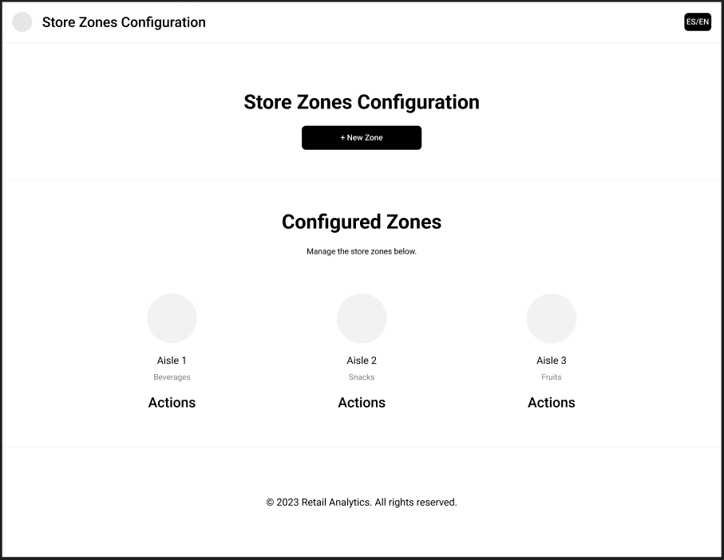

#### 2. Catálogo de Productos y Asignación (Product Catalog)
* **Descripción visual:** Vista de gestión de inventario organizada en tarjetas y listas. Muestra la imagen referencial del producto, precio, stock y la **zona asignada** dentro de la tienda.
* **Propósito funcional:** Vincula el inventario físico con el mapa digital creado anteriormente.
* **Justificación de negocio:** Permite rastrear la ubicación de los productos de mayor margen, siendo la base para las recomendaciones de reubicación.

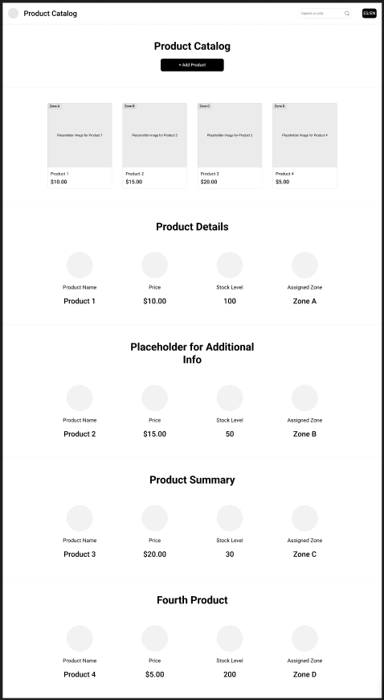

#### 3. Recomendaciones de Layout (Layout Recommendations)
* **Descripción visual:** Panel prescriptivo que despliega tarjetas con sugerencias específicas generadas por el sistema (ej. "Mover Producto A a la Zona 1"). Incluye botones para aplicar o descartar la sugerencia.
* **Propósito funcional:** Transforma datos analíticos en acciones directas cruzando el tráfico con el stock del catálogo.
* **Justificación de negocio:** Elimina la toma de decisiones basada en la intuición, proporcionando recomendaciones de IA para maximizar la rentabilidad.

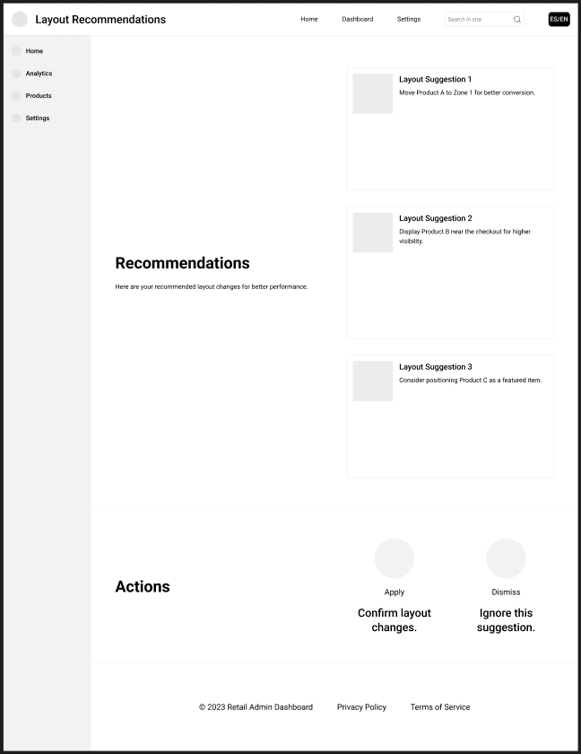

#### 4. Mapa de Calor y Flujo de Clientes (Store Heatmap & Customer Flow)
* **Descripción visual:** Núcleo analítico que presenta un plano central con rutas y concentraciones de clientes, complementado con métricas clave como hora pico y tasa de conversión.
* **Propósito funcional:** Visualiza en tiempo real o mediante reportes por dónde camina la gente y dónde se detiene más tiempo.
* **Justificación de negocio:** Elimina la "ceguera" operativa, identificando cuellos de botella o pasillos muertos que afectan las ventas.

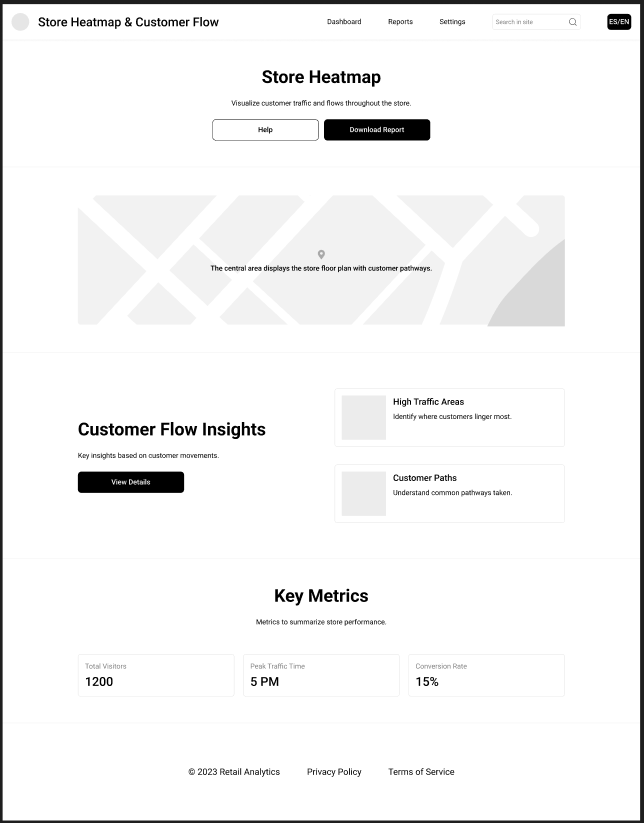

#### 5. Creación de Promociones (Active Promotions / Create New Promotion)
* **Descripción visual:** Formulario estructurado para configurar campañas. Permite seleccionar productos o zonas, asignar descuentos y definir fechas de vigencia.
* **Propósito funcional:** Ejecuta acciones comerciales inmediatas para incentivar la rotación de inventario en zonas específicas del local.
* **Justificación de negocio:** Permite reaccionar rápidamente ante zonas de bajo rendimiento, capitalizando el flujo de clientes detectado por el mapa de calor.

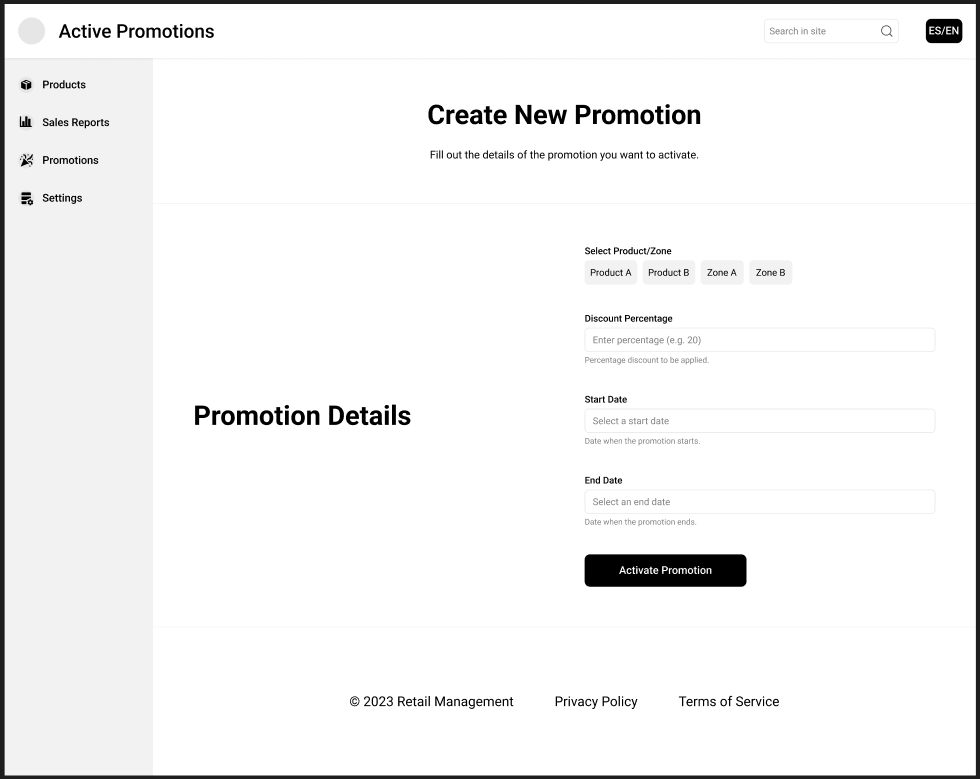


### 4.4.2. Web Applications Wireflow Diagrams

El Diagrama de Wireflows ilustra el recorrido interactivo y lógico que sigue el usuario administrador dentro de la plataforma **RetailPulse**. Este esquema conecta las interfaces de baja fidelidad (wireframes) para mapear el flujo de las principales Historias de Usuario (US).

Como se observa en el diagrama, el flujo operativo sigue esta secuencia lógica:

1. **Setup Inicial:** El administrador ingresa a la **Store Zones Configuration** para estructurar el mapa digital del local.
2. **Asignación de Inventario:** Continúa hacia el **Product Catalog** para vincular los productos físicos a las zonas previamente creadas.
3. **Toma de Decisiones (US-07):** El usuario revisa las **Layout Recommendations**, evaluando los cambios sugeridos por el algoritmo para optimizar la distribución.
4. **Análisis Visual (US-06 y US-08):** El flujo desemboca en el **Store Heatmap & Customer Flow**, donde el administrador analiza las métricas en tiempo real y el comportamiento del cliente.
5. **Acción Comercial:** Finalmente, basándose en los datos del mapa de calor, el usuario navega hacia **Active Promotions** para ejecutar campañas de descuento dirigidas a zonas específicas.

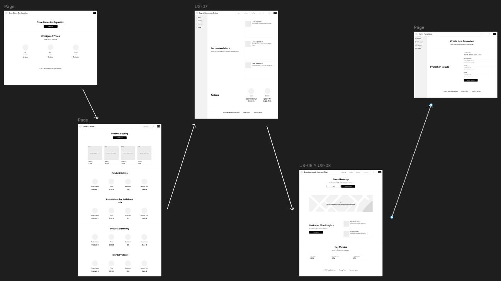

#### 4.4.3. Web Applications Mock-ups

Tras validar la arquitectura de la información y la distribución de elementos en los wireframes, se desarrolló el diseño de alta fidelidad (Mockups) aplicando las guías de estilo visual de **RetailPulse**.

Se utilizó la paleta de colores oficial, priorizando el azul oscuro corporativo para transmitir seguridad y el cyan brillante para resaltar métricas clave, alertas y llamados a la acción (CTAs). A continuación, se presentan las pantallas finales del panel administrativo:

#### 1. Dashboard Principal y Menú de Navegación
Representa la vista principal del sistema con la barra lateral (Sidebar) integrada, permitiendo al administrador navegar fluidamente entre los distintos módulos operativos.

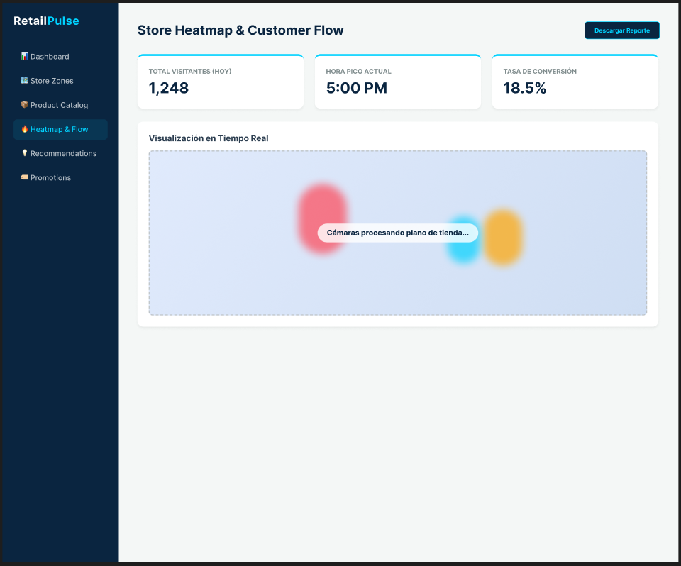

#### 2. Configuración de Zonas de la Tienda
Interfaz pulida donde los pasillos se representan mediante tarjetas interactivas, destacando el uso de sombras suaves para separar los elementos del fondo claro.

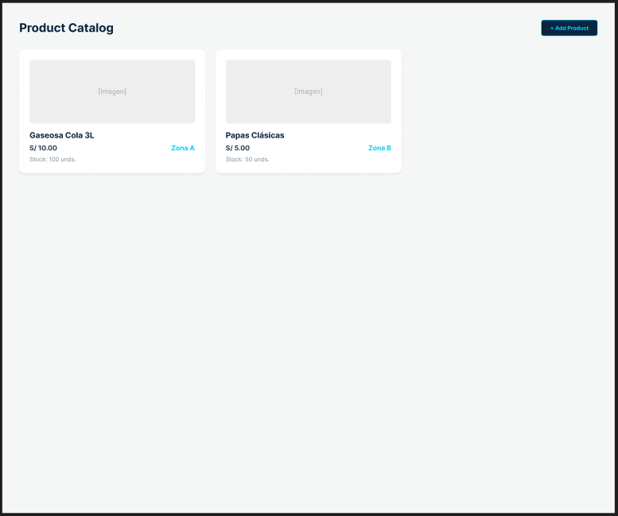

#### 3. Catálogo de Productos
Aplicación del diseño de tarjetas para el inventario. La jerarquía visual destaca el nombre del producto y su zona asignada utilizando los colores de acento de la marca.

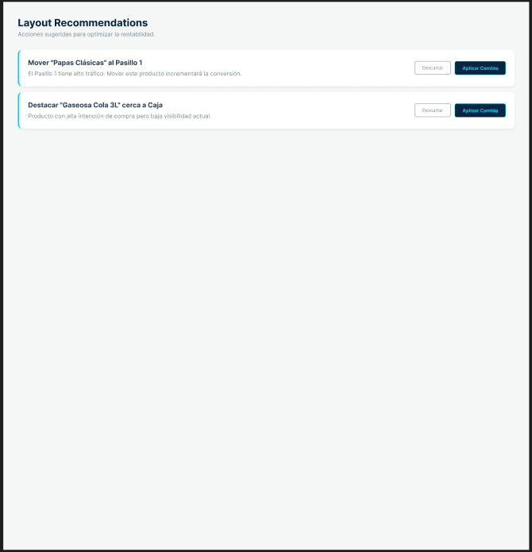

#### 4. Recomendaciones de Layout
El panel prescriptivo en alta fidelidad. Los botones de acción primaria ("Aplicar Cambio") destacan fuertemente para guiar la vista del usuario hacia la toma de decisiones.

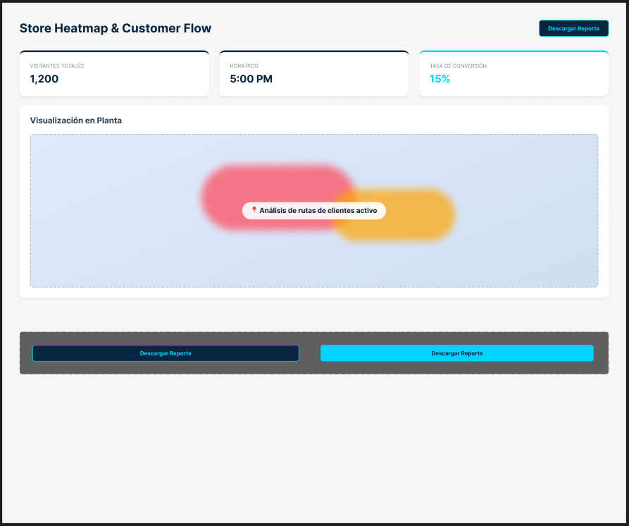

#### 5. Mapa de Calor y Flujo de Clientes
El núcleo del sistema renderizado con componentes visuales atractivos. Las "manchas" de calor y los KPIs destacan sobre el lienzo blanco, ofreciendo una lectura rápida y clara del estado de la tienda.

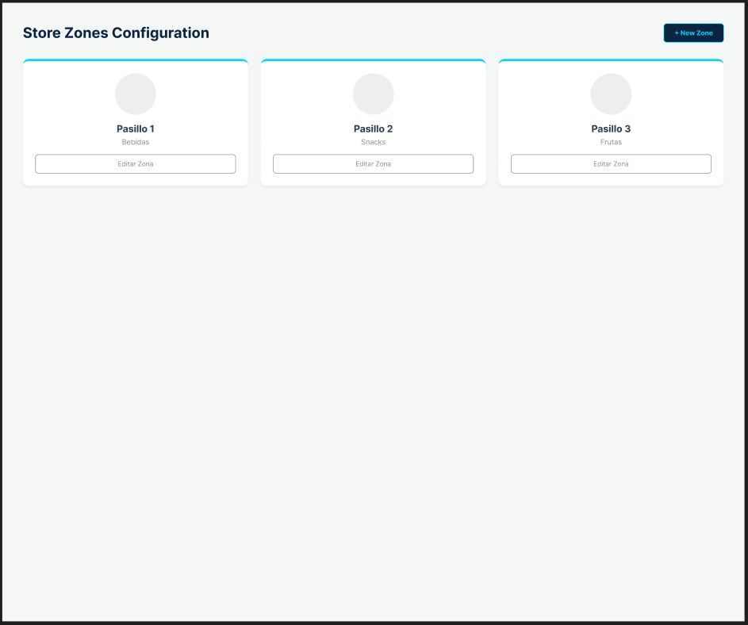

#### 4.4.4. Web Applications User Flow Diagrams

### 4.5. Web Applications Prototyping

### 4.6. Domain-Driven Software Architecture

#### 4.6.1. Design-Level Event Storming


##### 1.	Unstructured Exploration


En esta fase inicial se identificaron los eventos de dominio principales de RetailPulse, sin priorizar aún un orden cronológico. Estos eventos representan los hitos clave del negocio, desde la configuración de la tienda hasta la simulación del comportamiento del cliente, la asistencia en tienda y la generación de alertas y recomendaciones.

##### 2.	Timelines


En esta fase los eventos se organizan en líneas de tiempo que representan los flujos principales del sistema: configuración del negocio, monitoreo del comportamiento en tienda, asistencia al comprador, registro de ventas y generación de inteligencia operativa. Estas secuencias permiten visualizar cómo fluye la información desde la interacción del cliente hasta la generación de decisiones accionables dentro del negocio.

##### 3.	Pain Points 


En esta fase se identifican los puntos de fricción. Estos pain points representan fallos, demoras o vacíos de información que afectan la operación del sistema, como la falta de trazabilidad de una interacción, errores en la ubicación de productos o la ausencia de alertas oportunas. Su propósito es evidenciar dónde el flujo de negocio pierde eficiencia y cómo la solución propuesta puede corregirlo.

##### 4.	Pivotal Points


Los pivotal points representan eventos determinantes dentro del ciclo de vida del sistema. Estos hitos marcan cambios relevantes, como la activación del servicio, el inicio de una sesión de monitoreo, la detección de interacción con un producto o la generación de una alerta. Son puntos críticos porque habilitan nuevas capacidades operativas o analíticas dentro de la plataforma.

##### 5.	Commands


Los comandos representan las acciones ejecutadas por un actor o por el propio sistema que desencadenan eventos dentro del dominio. Estos comandos permiten modelar la intención de negocio y enlazan las interacciones de los usuarios con las respuestas del sistema.

##### 6.	Policies


Las políticas automatizan la lógica del sistema a partir de eventos relevantes. Su función es garantizar coherencia y reacción automática frente a situaciones del negocio, como la activación del servicio, la generación de alertas por alta demanda o la emisión de recomendaciones cuando se detecta interacción sin conversión.

##### 7.	Read Models


Los read models representan las vistas del sistema que permiten consumir la información ya procesada por la lógica del dominio. En RetailPulse, estas vistas incluyen la landing page comercial, la página de registro, los paneles de suscripción, las alertas operativas y la experiencia de asistencia al comprador mediante el quiosco.

##### 8.	External Systems


Los sistemas externos representan servicios que complementan el funcionamiento de RetailPulse sin formar parte de su dominio central. En este caso, se consideran la pasarela de pago para la activación de suscripciones y el servicio de correo para el envío de notificaciones relacionadas con la operación y la cuenta del negocio.

##### 9.	Aggregates


Los aggregates representan las estructuras principales del dominio que encapsulan la lógica de negocio y mantienen la consistencia de los datos. En RetailPulse, estos agregados permiten modelar la suscripción del negocio, la configuración del local, el monitoreo de visitas, la asistencia al comprador, el registro de ventas y la generación de alertas y recomendaciones.

##### 10.	Bounded Contexts


Los bounded contexts organizan el dominio de RetailPulse en áreas funcionales independientes, cada una con su propia responsabilidad y lenguaje de negocio. Esta separación permite estructurar la solución de manera coherente, escalable y alineada con la arquitectura del sistema, conectando el Event Storming con el modelo C4 y el diseño de la base de datos.

**Enlace de Visualización:** https://miro.com/app/board/uXjVHe0Bh8Q=/?share_link_id=570174974504


#### 4.6.2. Software Architecture Context Diagram


#### 4.6.3. Software Architecture Container Diagrams


#### 4.6.4. Software Architecture Components Diagrams


### 4.7. Software Object-Oriented Design

#### 4.7.1. Class Diagrams

##### 1. Traffic Analytics Context


Este bounded context modela el análisis del comportamiento físico dentro de la tienda. Permite representar el layout comercial, zonas de tráfico, métricas de calor, zonas muertas y congestión, alineándose con la retroalimentación que pedía un dominio más orientado a eventos, comportamiento e invariantes.

##### 2. Store Operations Context


Este bounded context representa la operación diaria del personal de tienda. Modela alertas, tareas operativas, escalamiento, asignación de personal y resolución de incidencias, evitando que el sistema se limite a mostrar una pantalla de alertas.

##### 3. Assisted Shopping Context


Este bounded context modela la experiencia del comprador dentro del quiosco web. Representa búsquedas asistidas, productos consultados, disponibilidad, ubicación, promociones y abandono de sesión, alineándose con el objetivo de reducir fricción durante la compra.

##### 4. Inventory Intelligence Context


Este bounded context representa la inteligencia de inventario. Permite modelar productos disponibles, stock crítico, quiebre de stock, reposición y ubicación física, evitando que el inventario sea tratado solo como CRUD.

##### 5. Promotion Optimization Context


Este bounded context modela recomendaciones comerciales basadas en interacción, conversión y desempeño de productos. Su objetivo es convertir datos de comportamiento en acciones como promociones, reubicaciones o recomendaciones estratégicas.

##### 6. Subscription Context


Este bounded context se mantiene como contexto de soporte del modelo SaaS. Permite gestionar la cuenta, los planes, el estado de suscripción y el cambio de plan, pero no representa el core domain principal de RetailPulse.


### 4.8. Database Design

#### 4.8.1. Database Diagrams


##### Bounded Context: Subscription

Este contexto representa el modelo SaaS de RetailPulse. Permite gestionar las cuentas de negocio, usuarios, planes disponibles y suscripciones activas. Se considera un contexto de soporte, ya que no representa la ventaja principal del dominio retail, pero permite controlar el acceso a funcionalidades según el plan contratado.


##### Bounded Context: Store Foundation

Este contexto contiene la estructura base de la tienda física. Modela la tienda, su layout, zonas comerciales y productos registrados. Aunque no es un core domain por sí mismo, sirve como base para que los demás contextos puedan analizar tráfico, ubicar productos, generar alertas y construir recomendaciones.


##### Bounded Context: Traffic Analytics

Este contexto permite analizar el comportamiento físico de los compradores dentro de la tienda. Registra métricas de heatmap, métricas por zona, recorridos simulados de clientes e interacciones con productos. Su propósito es convertir el movimiento dentro del local en información útil para la toma de decisiones.


##### Bounded Context: Assisted Shopping

Este contexto representa la experiencia del comprador dentro del quiosco web. Permite registrar sesiones de búsqueda y consultas de productos, ayudando al comprador a encontrar disponibilidad, ubicación y promociones dentro de la tienda.


##### Bounded Context: Inventory Intelligence

Este contexto administra la disponibilidad de productos dentro de la tienda. Modela el stock actual, umbrales críticos, estado de inventario, ubicación por zona y promoción asociada. Su objetivo es detectar productos sin stock o con stock crítico para activar acciones operativas.


##### Bounded Context: Store Operations

Este contexto representa la operación diaria del personal de tienda. Permite gestionar alertas operativas y tareas asignadas, relacionadas con congestión de zonas, reposición de productos o atención de incidencias. Su objetivo es convertir eventos relevantes del sistema en acciones concretas para el personal.


##### Bounded Context: Promotion Optimization

Este contexto representa la inteligencia comercial de RetailPulse. Modela brechas de conversión, desempeño de productos, promociones y recomendaciones comerciales. Su objetivo es detectar productos con alta interacción y baja conversión para sugerir acciones que mejoren las ventas.


---

## Capítulo V: Product Implementation, Validation & Deployment

### 5.1. Software Configuration Management

#### 5.1.1. Software Development Environment Configuration

En esta sección se describen las herramientas, tecnologías y entornos utilizados para el desarrollo del proyecto RetailPulse, considerando todas las actividades del ciclo de vida: diseño, desarrollo, colaboración y despliegue.

---

#### UX/UI Design

**Figma**  
Herramienta de diseño colaborativo utilizada para la creación de wireframes, mockups, prototipos y flujos de usuario. Permite validar tempranamente la experiencia del usuario y asegurar consistencia visual entre el Landing Page y la Web Application.

---

#### Software Development

**Visual Studio Code**  
Editor de código utilizado como entorno principal de desarrollo tanto para el frontend como para configuraciones generales del proyecto. Destaca por su ligereza, extensibilidad mediante plugins y soporte para múltiples lenguajes.

**WebStorm**  
IDE especializado en desarrollo frontend utilizado para trabajar con Angular, facilitando la navegación del proyecto, debugging y gestión de componentes.

**GitHub**  
Plataforma de control de versiones utilizada para la gestión del código fuente y colaboración del equipo. Se implementa la estrategia GitFlow, junto con Conventional Commits, para mantener un historial ordenado y trazable del desarrollo.

---

#### Frontend Development

**HTML5**  
Lenguaje de marcado utilizado para estructurar las interfaces de usuario del sistema.

**CSS3**  
Lenguaje de estilos utilizado para el diseño visual, layout y adaptación responsive de la aplicación.

**TypeScript**  
Lenguaje utilizado en el desarrollo frontend, proporcionando tipado estático y mejor mantenibilidad del código.

**Angular**  
Framework principal para el desarrollo de la Web Application. Permite construir interfaces dinámicas, modulares y escalables mediante componentes reutilizables, servicios y manejo de estados.

---

#### Backend Development

**Java**  
Lenguaje de programación utilizado para el desarrollo de la lógica del lado servidor.

**Spring Boot**  
Framework utilizado para la construcción del RESTful API. Permite desarrollar servicios robustos, escalables y desacoplados, facilitando la creación de endpoints, manejo de dependencias e integración con bases de datos.

#### Software Deployment

**GitHub Pages**  
Servicio utilizado para el despliegue del Landing Page del proyecto, permitiendo su acceso público como punto de entrada al modelo de negocio.

**Vercel / Netlify (Frontend)**  
Plataforma utilizada para el despliegue del frontend desarrollado en Angular, facilitando integración continua, builds automáticos y distribución global.

**Railway / Render (Backend)**  
Plataforma utilizada para el despliegue del RESTful API desarrollado en Spring Boot, permitiendo exponer servicios en la nube y gestionar variables de entorno.

---


#### 5.1.2. Source Code Management

Para la gestión del código fuente del proyecto RetailPulse, el equipo utiliza GitHub como plataforma central de control de versiones y colaboración entre los miembros. Se ha optado por trabajar con una organización que agrupa múltiples repositorios, cada uno enfocado en un componente específico del sistema. A continuación, se detallan los repositorios utilizados:

* Organización: <https://github.com/RetailPulse-NRC11863>
* Repositorio de Landing Page: <https://github.com/RetailPulse-NRC11863/retailpulse-landing-page>
* Repositorio del Informe: <https://github.com/RetailPulse-NRC11863/retailpulse-report>
* Repositorio del Frontend: <https://github.com/RetailPulse-NRC11863/retailpulse-web-application>
* Repositorio del Backend: <https://github.com/RetailPulse-NRC11863/retailpulse-web-services>

En el repositorio del informe se implementa un flujo de trabajo basado en GitFlow. La rama `main` se utiliza para almacenar versiones estables del documento correspondientes a cada entrega del proyecto del curso, mientras que la rama `develop` actúa como punto de integración de los avances realizados por los integrantes del equipo. A partir de `develop`, cada miembro del equipo crea ramas de tipo `feature/...` para desarrollar las secciones asignadas del informe.

Las ramas feature siguen una nomenclatura relacionada al contenido trabajado, por ejemplo: `feature/chapter-1-introduction` o `feature/chapter-5-software-management`. Esta convención facilita la organización del trabajo, permite identificar rápidamente el alcance de cada rama y reduce conflictos durante la integración.

En los repositorios correspondientes a la Landing Page, Frontend y Backend también se aplica GitFlow. En estos casos, la rama `main` representa versiones funcionales y estables del producto, mientras que `develop` se utiliza como rama de integración continua del desarrollo. Las ramas `feature/...` se crean a partir de `develop`, pero a diferencia del informe, su nomenclatura está orientada a funcionalidades específicas del sistema, tales como `feature/heatmap-dashboard`, `feature/store-configuration` o `feature/sensor-integration`.

Se establece como regla que no se realizarán cambios directos sobre la rama `main`, ya que esta debe contener únicamente versiones validadas. Asimismo, el trabajo diario no se realiza directamente sobre `develop`, sino mediante ramas `feature`, las cuales posteriormente son integradas a `develop` y finalmente consolidadas en `main` una vez revisadas. De esta manera, el flujo de trabajo definido es: `feature → develop → main`, siguiendo las buenas prácticas de GitFlow.

Adicionalmente, en caso de requerirse correcciones urgentes sobre versiones estables, se emplearán ramas `hotfix/...`, y para la preparación de entregables se podrán utilizar ramas `release/...`, manteniendo coherencia con el flujo establecido.

Para el control de versiones, el equipo adopta la convención de Conventional Commits, lo que permite mantener un historial de cambios claro, consistente y fácil de auditar. Los principales prefijos utilizados son:

* feat: incorporación de nuevas funcionalidades
* fix: corrección de errores
* docs: cambios en documentación
* style: ajustes de formato o estilo sin afectar la lógica
* refactor: reestructuración del código sin cambios funcionales
* test: adición o modificación de pruebas
* chore: tareas de mantenimiento o configuración

En el repositorio del informe se emplean mensajes como `docs(report): add project cover page` o `docs: add startup profile and lean ux process for chapter 1`. En los repositorios de software se utilizan mensajes como `feat: implement heatmap visualization`, `feat: add sensor event tracking` o `fix: correct authentication validation`. Esta práctica asegura que el historial de commits refleje de manera clara el trabajo realizado por cada integrante del equipo.

#### 5.1.3. Source Code Style Guide & Conventions

**HTML5 (Angular Templates)**

En este proyecto de RetailPulse (Angular), la estructura de la landing page se define en templates HTML (app.html) con enfoque semántico, accesible y mantenible.

- Usar etiquetas semánticas como header, main, section y footer para organizar claramente la página.
- Mantener etiquetas y atributos en minúsculas.
- Cerrar correctamente todas las etiquetas.
- Respetar la jerarquía de títulos h1, h2 y h3 por sección.
- Incluir alt en imágenes y aria-label en botones o iconos cuando corresponda.
- Usar rutas estáticas consistentes para assets, como /assets/images/.
- Evitar texto hardcodeado cuando ya existe i18n; preferir bindings desde copy() para traducciones.
- Usar la sintaxis de control de Angular (@for, @if) de forma clara y legible.
- Evitar estructuras de marcado innecesariamente complejas.

**CSS**

Los estilos se gestionan principalmente en app.css con variables, layout responsive y soporte de tema claro y oscuro.

- Usar nombres de clase descriptivos y consistentes con el componente, como brand-*, benefit-* y contact-*.
- Centralizar colores y tokens en variables CSS, por ejemplo en :host y :host.theme-dark.
- Mantener indentación uniforme y bloques agrupados por sección visual.
- Reutilizar estilos comunes como button, grids y cards para evitar duplicación.
- Priorizar diseño responsive con breakpoints definidos, por ejemplo 960px y 640px.
- Evitar selectores excesivamente específicos.
- Mantener reglas de estado claras, como .active y .visible.
- Controlar la experiencia de formularios con estilos de foco visibles.
- Usar resize: none en textarea cuando se busque un layout fijo.

**TypeScript (Angular)**

En este proyecto, la lógica está implementada en TypeScript (app.ts, i18n.service.ts, translations.ts), no en JavaScript puro.

- Nombrar variables y métodos en camelCase.
- Mantener tipado explícito, como Theme, Language y Record.
- Preferir readonly y encapsulación private o protected cuando aplique.
- Mantener funciones cortas y con una sola responsabilidad.
- Usar Signals de Angular para estado reactivo.
- Usar constantes para keys de localStorage, como THEME_STORAGE_KEY.
- Evitar acceso directo al DOM sin inyección; usar DOCUMENT cuando sea necesario.
- Manejar cleanup de recursos, como timers, en ngOnDestroy.
- Para formularios de la landing, interceptar submit con preventDefault si aún no existe backend.
- Mantener la lógica de i18n centralizada en traducciones y servicio, no en el template.

**Gherkin**

Para documentar el comportamiento funcional de la landing, se deben usar escenarios claros y trazables a user stories.

- Redactar escenarios cortos y directos.
- Usar la estructura estándar Given, When y Then.
- Definir un escenario por funcionalidad principal.
- Evitar redundancias entre escenarios.
- Cubrir funcionalidades actuales del proyecto, como:
  - cambio de idioma (ES/EN),
  - cambio de tema (claro/oscuro) y persistencia,
  - envío simulado del formulario con toast de confirmación,
  - render correcto de imágenes en header, equipo y beneficios,
  - comportamiento responsive en desktop y móvil.

#### 5.1.4. Software Deployment Configuration

Para la publicación en línea del proyecto **RetailPulse Landing Page**, se implementó un proceso de despliegue automatizado utilizando **Netlify** como plataforma principal de hosting y **GitHub** como repositorio central del código fuente. Esta configuración permite una integración continua (CI) y despliegue continuo (CD), asegurando la disponibilidad, rendimiento y actualización constante del sitio web.


### Proceso de Despliegue

**1. Integración con Repositorios Git**  
El repositorio del proyecto se encuentra alojado en GitHub. Netlify se conecta directamente al repositorio, lo que permite que cada vez que se realiza un *push* o un *merge* a la rama principal (`main`), se ejecute automáticamente el proceso de construcción y despliegue del sitio.

**2. Compilación Automatizada**  
Durante el proceso de build, Netlify ejecuta el comando `npm run build`.

Esto permite compilar la aplicación Angular y generar una versión optimizada para producción. Este proceso incluye:

- Minificación de archivos HTML, CSS y JavaScript.  
- Optimización de recursos estáticos (imágenes, fuentes).  
- Generación de archivos listos para despliegue en el directorio `/dist/RetailPulse/browser`.

**3. Despliegue en Netlify**  
Una vez finalizada la compilación, Netlify distribuye automáticamente el contenido en su red global de entrega de contenido (CDN), garantizando tiempos de carga rápidos y alta disponibilidad desde cualquier ubicación.

**4. Vistas Previas por Rama (Deploy Previews)**  
Netlify genera automáticamente una vista previa del sitio por cada rama o Pull Request. Esto permite al equipo revisar los cambios antes de ser integrados a la rama principal, facilitando la detección temprana de errores y validación visual.

**5. Despliegue Continuo (Continuous Deployment)**  
Cada vez que se realiza un merge a la rama `main`, Netlify actualiza automáticamente la versión en producción. De esta manera, el sitio siempre refleja la versión más reciente y estable del proyecto.


### Productos Desplegados

- **Landing Page de RetailPulse:** Aplicación web desarrollada en Angular y desplegada en Netlify, accesible públicamente mediante una URL generada automáticamente por la plataforma.

### 5.2. Landing Page, Services & Applications Implementation

#### 5.2.1. Sprint 1

##### 5.2.1.1. Sprint Planning 1

A continuación, se presenta la planificación correspondiente al Sprint 1 del proyecto RetailPulse, el cual tiene como enfoque principal la validación de la propuesta de valor mediante la implementación del landing page y una primera funcionalidad básica de búsqueda de productos en tienda. En esta etapa inicial, el equipo definió el objetivo del sprint, seleccionó las historias de usuario más relevantes y estableció los entregables clave que permitirán construir una primera versión funcional y visualmente clara del sistema.

<table>
  <tr>
    <th>Sprint #</th>
    <th>Sprint 1</th>
  </tr>

  <tr>
    <td><strong>Sprint Planning Background</strong></td>
    <td>Primera planificación del proyecto enfocada en validar la propuesta de valor del sistema RetailPulse.</td>
  </tr>

  <tr>
    <td>Date</td>
    <td>2026-04-23</td>
  </tr>

  <tr>
    <td>Time</td>
    <td>23:00 pm (GMT-5)</td>
  </tr>

  <tr>
    <td>Location</td>
    <td>Modalidad remota mediante la plataforma Discord</td>
  </tr>

  <tr>
    <td>Prepared By</td>
    <td>Vallejo Trujillo, Fabio Cesar</td>
  </tr>

  <tr>
    <td>Attendees (to planning meeting)</td>
    <td>
      Faustino Hurtado, Anghelo Edwin / Franco del Carpio, José María / Godoy Santillan, Jesus Andres / Rubio Ortiz, Luis Sebastián / Vallejo Trujillo, Fabio Cesar
    </td>
  </tr>

  <tr>
    <td>Sprint 0 Review Summary</td>
    <td>Dado que este es el sprint inicial del proyecto, no se cuenta con un sprint previo a evaluar.</td>
  </tr>

  <tr>
    <td>Sprint 0 Retrospective Summary</td>
    <td>Al tratarse del primer sprint, no se dispone de retroalimentación previa.</td>
  </tr>

  <tr>
    <td><strong>Sprint Goal & User Stories</strong></td>
    <td></td>
  </tr>

  <tr>
    <td>Sprint 1 Goal</td>
    <td>
      El objetivo del Sprint 1 es validar la propuesta de valor de RetailPulse mediante la implementación del landing page y una funcionalidad básica de búsqueda de productos en tienda.
      <br><br>
      Se busca que los usuarios comprendan claramente el valor del sistema, puedan visualizar sus beneficios y explorar una simulación inicial de interacción dentro del entorno de tienda.
    </td>
  </tr>

  <tr>
    <td>Sprint 1 Velocity</td>
    <td>19 puntos</td>
  </tr>

  <tr>
    <td>Sum of Story Points</td>
    <td>19 puntos</td>
  </tr>
</table>

##### 5.2.1.2. Aspect Leaders and Collaborators

Durante el Sprint 1, el equipo se enfocó exclusivamente en la validación de la propuesta de valor de RetailPulse mediante el desarrollo del Landing Page. En este contexto, se definieron los principales aspectos relacionados al diseño, contenido y experiencia de usuario de la página.

Para asegurar una correcta organización del equipo, se elaboró la matriz LACX (Leader and Collaborators), asignando a cada integrante un rol de liderazgo (L) en un aspecto específico del landing page y participación como colaborador (C) en los demás.

| Team Member (Last Name, First Name) | GitHub Username | Hero Section & Value Proposition | About Us | Benefits | Demonstrations | Contact |
|-----------------------------------|----------------|----------------------------------|----------|----------|----------------|---------|
| Vallejo Trujillo, Fabio Cesar     | fabiovallejo   | L                                | C        | C        | C              | C       |
| Godoy Santillan, Jesus Andres     | JesusGodoyS    | C                                | L        | C        | C              | C       |
| Rubio Ortiz, Luis Sebastián       | notoriussxd    | C                                | C        | L        | C              | C       |
| Faustino Hurtado, Anghelo Edwin   | Limos05        | C                                | C        | C        | L              | C       |
| Franco del Carpio, José María     | VoltTrd        | C                                | C        | C        | C              | L       |

##### 5.2.1.3. Sprint Backlog 1

**Duración:** 2 semanas

**Objetivo del Sprint:**
Validar la propuesta de valor de RetailPulse mediante la implementación del landing page y habilitar la funcionalidad básica de búsqueda de productos en tienda.

<table>
<tr>
  <th>Sprint #</th>
  <th colspan="7">Sprint 1</th>
</tr>

<tr>
  <th colspan="2">User Story</th>
  <th colspan="6">Work-Item / Task</th>
</tr>

<tr>
  <th>Id</th>
  <th>Title</th>
  <th>Id</th>
  <th>Title</th>
  <th>Description</th>
  <th>Estimation (Hours)</th>
  <th>Assigned To</th>
  <th>Status</th>
</tr>

<tr>
  <td rowspan="2">US-01</td>
  <td rowspan="2">Explorar planes y propuesta de valor</td>
  <td>T-01</td>
  <td>Redactar contenido del landing</td>
  <td>Definir textos de valor, beneficios y secciones principales del landing page.</td>
  <td>5</td>
  <td>Vallejo Trujillo, Fabio Cesar</td>
  <td>Done</td>
</tr>

<tr>
  <td>T-02</td>
  <td>Diseñar sección de planes</td>
  <td>Construir la visualización de planes y beneficios del sistema.</td>
  <td>5</td>
  <td>Godoy Santillan, Jesus Andres</td>
  <td>Done</td>
</tr>

<tr>
  <td rowspan="2">US-16</td>
  <td rowspan="2">Visualizar valor del sistema</td>
  <td>T-03</td>
  <td>Sección beneficios</td>
  <td>Mostrar cómo RetailPulse mejora la operación y conversión.</td>
  <td>5</td>
  <td>Franco del Carpio, José María</td>
  <td>Done</td>
</tr>

<tr>
  <td>T-04</td>
  <td>Casos de uso</td>
  <td>Ejemplificar escenarios reales dentro de tienda.</td>
  <td>4</td>
  <td>Faustino Hurtado, Anghelo Edwin</td>
  <td>Done</td>
</tr>

<tr>
  <td rowspan="2">US-17</td>
  <td rowspan="2">Ver demostraciones del sistema</td>
  <td>T-05</td>
  <td>Diseñar demos visuales</td>
  <td>Crear mockups de heatmap, alertas y quiosco.</td>
  <td>6</td>
  <td>Rubio Ortiz, Luis Sebastián</td>
  <td>To-do</td>
</tr>

<tr>
  <td>T-06</td>
  <td>Integrar demos</td>
  <td>Incorporar las demostraciones en el flujo del landing.</td>
  <td>4</td>
  <td>Godoy Santillan, Jesus Andres</td>
  <td>To-do</td>
</tr>

<tr>
  <td rowspan="2">US-04</td>
  <td rowspan="2">Buscar productos y ubicación</td>
  <td>T-07</td>
  <td>Formulario de búsqueda</td>
  <td>Implementar input y lógica básica de consulta.</td>
  <td>6</td>
  <td>Vallejo Trujillo, Fabio Cesar</td>
  <td>To-do</td>
</tr>

<tr>
  <td>T-08</td>
  <td>Resultados de búsqueda</td>
  <td>Mostrar productos, stock y ubicación simulada.</td>
  <td>5</td>
  <td>Franco del Carpio, José María</td>
  <td>To-do</td>
</tr>

<tr>
  <td rowspan="2">US-09</td>
  <td rowspan="2">Promociones en quiosco</td>
  <td>T-09</td>
  <td>Panel promociones</td>
  <td>Diseñar módulo de promociones relacionadas.</td>
  <td>4</td>
  <td>Rubio Ortiz, Luis Sebastián</td>
  <td>To-do</td>
</tr>

<tr>
  <td>T-10</td>
  <td>Integración promociones</td>
  <td>Mostrar promociones dentro del flujo de búsqueda.</td>
  <td>4</td>
  <td>Faustino Hurtado, Anghelo Edwin</td>
  <td>To-do</td>
</tr>

</table>

**Total Story Points:** 19

---

##### 5.2.1.4. Development Evidence for Sprint Review

Durante el Sprint 1, el equipo trabajó bajo la metodología GitFlow, utilizando múltiples ramas feature para desarrollar de forma paralela cada sección del informe y funcionalidades del sistema. La integración se realizó progresivamente hacia la rama **develop**, evidenciando un flujo continuo de commits y contribuciones por parte de todos los integrantes del equipo.

A continuación, se presenta el registro completo de commits realizados durante el desarrollo del Sprint 1.


<table>
<tr>
<th>Repository</th>
<th>Branch</th>
<th>Commit Message</th>
<th>Author</th>
<th>Date</th>
</tr>

<!-- APR 23 -->
<tr><td>RetailPulse/report</td><td>feature/student-outcome</td><td>docs: added student outcome for the project</td><td>fabiovallejo</td><td>23-04-2026</td></tr>
<tr><td>RetailPulse/report</td><td>feature/chapter-5-aspect-leaders-and-collaborators</td><td>docs: added aspect leaders and collaborators for chapter 5</td><td>fabiovallejo</td><td>23-04-2026</td></tr>
<tr><td>RetailPulse/report</td><td>feature/chapter-5-sprint-1</td><td>refactor(sprint-1): modified sprint backlog 1 for chapter 5</td><td>VoltTrd</td><td>23-04-2026</td></tr>
<tr><td>RetailPulse/report</td><td>feature/chapter-5-sprint-1</td><td>docs: added sprint planning 1 and sprint backlog 1</td><td>VoltTrd</td><td>23-04-2026</td></tr>
<tr><td>RetailPulse/report</td><td>feature/chapter-3-impact-mapping</td><td>Merge pull request feature/chapter-3-impact-mapping</td><td>notoriussxd</td><td>23-04-2026</td></tr>
<tr><td>RetailPulse/report</td><td>feature/chapter-1</td><td>docs(chapter1): update Luis profile</td><td>notoriussxd</td><td>23-04-2026</td></tr>
<tr><td>RetailPulse/report</td><td>assets</td><td>docs(assets): add profile picture for Luis</td><td>notoriussxd</td><td>23-04-2026</td></tr>
<tr><td>RetailPulse/report</td><td>feature/conclusiones</td><td>docs: added conclusions for the project</td><td>VoltTrd</td><td>23-04-2026</td></tr>
<tr><td>RetailPulse/report</td><td>feature/chapter-2</td><td>docs: added second segment interview</td><td>VoltTrd</td><td>23-04-2026</td></tr>
<tr><td>RetailPulse/report</td><td>feature/chapter-3</td><td>docs(report): add impact mapping image reference</td><td>notoriussxd</td><td>23-04-2026</td></tr>
<tr><td>RetailPulse/report</td><td>feature/chapter-4-class-diagrams</td><td>docs: added class diagrams for chapter 4</td><td>fabiovallejo</td><td>23-04-2026</td></tr>
<tr><td>RetailPulse/report</td><td>assets</td><td>docs(assets): add impact mapping diagram</td><td>notoriussxd</td><td>23-04-2026</td></tr>
<tr><td>RetailPulse/report</td><td>feature/chapter-5</td><td>docs: added software environment configuration</td><td>fabiovallejo</td><td>23-04-2026</td></tr>
<tr><td>RetailPulse/report</td><td>feature/chapter-3-user-stories-luis</td><td>Merge pull request feature/chapter-3-user-stories-luis</td><td>notoriussxd</td><td>23-04-2026</td></tr>
<tr><td>RetailPulse/report</td><td>feature/chapter-3</td><td>docs: add user stories 6-10</td><td>notoriussxd</td><td>23-04-2026</td></tr>
<tr><td>RetailPulse/report</td><td>feature/chapter-2</td><td>docs: added big picture event storming</td><td>fabiovallejo</td><td>23-04-2026</td></tr>
<tr><td>RetailPulse/report</td><td>feature/chapter-4</td><td>docs: added design level event storming</td><td>fabiovallejo</td><td>23-04-2026</td></tr>
<tr><td>RetailPulse/report</td><td>feature/chapter-4</td><td>docs: added navigation systems</td><td>VoltTrd</td><td>23-04-2026</td></tr>
<tr><td>RetailPulse/report</td><td>feature/chapter-4</td><td>docs: added searching systems</td><td>VoltTrd</td><td>23-04-2026</td></tr>
<tr><td>RetailPulse/report</td><td>feature/chapter-4</td><td>docs: added seo tags and meta tags</td><td>VoltTrd</td><td>23-04-2026</td></tr>
<tr><td>RetailPulse/report</td><td>feature/chapter-4</td><td>docs: added labeling systems</td><td>VoltTrd</td><td>23-04-2026</td></tr>
<tr><td>RetailPulse/report</td><td>feature/chapter-3</td><td>added product backlog</td><td>VoltTrd</td><td>23-04-2026</td></tr>

<!-- APR 22 -->
<tr><td>RetailPulse/report</td><td>feature/chapter-2</td><td>added ubiquitous language</td><td>VoltTrd</td><td>22-04-2026</td></tr>
<tr><td>RetailPulse/report</td><td>feature/chapter-1</td><td>docs: added antecedentes y problematica</td><td>ItsFlaZer</td><td>22-04-2026</td></tr>
<tr><td>RetailPulse/report</td><td>feature/chapter-1</td><td>docs: added target segments</td><td>fabiovallejo</td><td>22-04-2026</td></tr>
<tr><td>RetailPulse/report</td><td>feature/chapter-3</td><td>docs: added user stories 16 and 17</td><td>fabiovallejo</td><td>22-04-2026</td></tr>
<tr><td>RetailPulse/report</td><td>feature/chapter-2</td><td>docs: add interviews</td><td>fabiovallejo</td><td>22-04-2026</td></tr>
<tr><td>RetailPulse/report</td><td>feature/chapter-4</td><td>docs: add style guidelines</td><td>limozz05</td><td>22-04-2026</td></tr>
<tr><td>RetailPulse/report</td><td>feature/chapter-3</td><td>docs: update user stories backend focus</td><td>limozz05</td><td>22-04-2026</td></tr>

<!-- APR 21 -->
<tr><td>RetailPulse/report</td><td>feature/chapter-4</td><td>docs: software architecture components diagrams</td><td>fabiovallejo</td><td>21-04-2026</td></tr>
<tr><td>RetailPulse/report</td><td>feature/chapter-4</td><td>docs: software architecture container diagram</td><td>fabiovallejo</td><td>21-04-2026</td></tr>
<tr><td>RetailPulse/report</td><td>develop</td><td>Merge branch feature/chapter-4-database-design</td><td>fabiovallejo</td><td>21-04-2026</td></tr>
<tr><td>RetailPulse/report</td><td>feature/chapter-4</td><td>refactor(database): normalize schema</td><td>fabiovallejo</td><td>21-04-2026</td></tr>
<tr><td>RetailPulse/report</td><td>feature/chapter-2</td><td>docs: add competitors and analysis</td><td>limozz05</td><td>21-04-2026</td></tr>
<tr><td>RetailPulse/report</td><td>feature/chapter-1</td><td>docs: lean ux</td><td>limozz05</td><td>21-04-2026</td></tr>

<!-- APR 20 -->
<tr><td>RetailPulse/report</td><td>feature/chapter-4</td><td>docs: add C4 context diagram</td><td>fabiovallejo</td><td>20-04-2026</td></tr>
<tr><td>RetailPulse/report</td><td>feature/chapter-4</td><td>docs: add database diagrams</td><td>fabiovallejo</td><td>20-04-2026</td></tr>

<!-- APR 19 -->
<tr><td>RetailPulse/report</td><td>feature/chapter-3</td><td>docs: add user stories 1-5</td><td>fabiovallejo</td><td>19-04-2026</td></tr>
<tr><td>RetailPulse/report</td><td>feature/chapter-2</td><td>docs: add interview questions</td><td>fabiovallejo</td><td>19-04-2026</td></tr>
<tr><td>RetailPulse/report</td><td>feature/chapter-5</td><td>docs: add source code management</td><td>fabiovallejo</td><td>19-04-2026</td></tr>
<tr><td>RetailPulse/report</td><td>feature/chapter-1</td><td>docs: add lean ux problem statements</td><td>fabiovallejo</td><td>19-04-2026</td></tr>
<tr><td>RetailPulse/report</td><td>feature/chapter-1</td><td>docs: add startup profile</td><td>fabiovallejo</td><td>19-04-2026</td></tr>
<tr><td>RetailPulse/report</td><td>main</td><td>docs: initialize project report structure</td><td>fabiovallejo</td><td>19-04-2026</td></tr>

<!-- FRONTEND -->
<tr><td>RetailPulse/frontend</td><td>feature/chapter-5-code</td><td>feat(landing): add initial landing page implementation</td><td>notoriussxd</td><td>23-04-2026</td></tr>

</table>

<br>

<h6>Branches utilizadas durante el Sprint 1</h6>

<table>
<tr>
<th>Branch</th>
<th>Descripción</th>
</tr>

<tr><td>main</td><td>Versión estable del repositorio</td></tr>
<tr><td>develop</td><td>Rama de integración principal</td></tr>

<tr><td>feature/chapter-1-*</td><td>Startup, Lean UX, Problem Statements</td></tr>
<tr><td>feature/chapter-2-*</td><td>Entrevistas, Event Storming, Competidores</td></tr>
<tr><td>feature/chapter-3-*</td><td>User Stories, Impact Mapping, Backlog</td></tr>
<tr><td>feature/chapter-4-*</td><td>C4, Base de Datos, DDD, Class Diagrams</td></tr>
<tr><td>feature/chapter-5-*</td><td>Sprint Planning, Spring Backlog, Evidence</td></tr>
<tr><td>feature/conclusiones</td><td>Conclusiones del proyecto</td></tr>
<tr><td>feature/student-outcome</td><td>Evaluación del equipo</td></tr>

</table>

##### 5.2.1.5. Execution Evidence for Sprint Review

Durante el primer sprint, se lograron avances importantes en el desarrollo de la landing page de **RetailPulse**. A continuación, se presentan las evidencias de ejecución relacionadas con la implementación, organización del repositorio y visualización de las secciones principales del sitio web.

#### Evidencias del Sprint

- **Establecimiento del repositorio:**  
  Se creó y configuró el repositorio del proyecto en GitHub para gestionar el código fuente de la landing page, permitiendo mantener un control de versiones adecuado y facilitar el trabajo colaborativo del equipo.

  **Evidencia:**  
  _Insertar imagen del repositorio en GitHub._

  

- **Implementación de la Landing Page:**  
  Se diseñó y desarrolló la landing page de **RetailPulse**, orientada a una plataforma SaaS para retail físico, integrando secciones informativas que presentan la propuesta de valor, funcionalidades principales, beneficios y canales de contacto.

#### Imágenes del Landing Page

- **Inicio:**  
  Sección principal de bienvenida donde se presenta la propuesta de valor de RetailPulse, destacando la digitalización de tiendas físicas mediante inteligencia de e-commerce.

  

- **Nosotros:**  
  Sección informativa donde se describe el propósito de RetailPulse y el enfoque de la solución para mejorar la experiencia de compra en tiendas físicas.

  

- **Beneficios:**  
  Sección donde se muestran las funcionalidades clave y beneficios principales de la plataforma, como monitoreo en tiempo real, mapas de calor y asistencia al comprador.

  

- **Preguntas frecuentes:**  
  Sección destinada a resolver dudas comunes de los usuarios sobre el funcionamiento, alcance y uso de RetailPulse.

  

- **Contacto:**  
  Sección final del landing page que permite al usuario visualizar los medios de contacto o solicitar información adicional sobre la solución.

  

##### 5.2.1.6. Services Documentation Evidence for Sprint Review

##### 5.2.1.7. Software Deployment Evidence for Sprint Review

##### 5.2.1.8. Team Collaboration Insights during Sprint

#### Desarrollo de las Actividades de Implementación

Durante el Sprint 1, el equipo de RetailPulse trabajó de manera colaborativa en la construcción del informe del proyecto y la validación de la propuesta de valor mediante el desarrollo inicial del Landing Page. A diferencia de un desarrollo tradicional centrado únicamente en código, este Sprint involucró actividades de análisis, diseño, modelado y documentación técnica.

Las actividades se llevaron a cabo de la siguiente manera:

- Se utilizó la metodología GitFlow, creando ramas específicas para cada capítulo y funcionalidad del proyecto (feature/chapter-x-*), lo que permitió un trabajo paralelo organizado.
- Cada integrante asumió la responsabilidad de desarrollar secciones específicas del informe, incluyendo Lean UX, entrevistas, User Stories, arquitectura C4, Event Storming, base de datos y artefactos ágiles.
- Se realizaron commits frecuentes, registrando avances de manera continua en cada sección del proyecto.
- Los cambios fueron integrados mediante merges y Pull Requests hacia la rama develop, consolidando el trabajo del equipo.
- Se mantuvo comunicación constante mediante Discord para coordinar avances, resolver dudas y asegurar coherencia en el desarrollo del informe.
- Se aplicaron buenas prácticas de control de versiones, organización del repositorio y estructuración del trabajo por módulos.

Gracias a esta organización, el equipo logró avanzar de manera simultánea en múltiples frentes del proyecto, asegurando que todos los integrantes contribuyeran activamente en la construcción del producto y del informe.


---

#### Evidencia de Colaboración en GitHub

Se presenta a continuación la evidencia de colaboración obtenida a partir de los insights del repositorio de GitHub correspondientes al Sprint 1:

**Insights:**

- 5 autores contribuyendo activamente al repositorio.
- 44 commits realizados en el periodo del Sprint (excluyendo merges).
- Uso consistente de ramas feature para el desarrollo paralelo.
- Integración centralizada en la rama develop siguiendo GitFlow.
- Participación activa de todos los miembros del equipo en distintas áreas del proyecto.

Estos resultados evidencian una colaboración efectiva del equipo, con una distribución equilibrada del trabajo y una adecuada gestión del código fuente durante el desarrollo del Sprint 1.

---

## Conclusiones

### Conclusiones y recomendaciones

El desarrollo del proyecto RetailPulse permitió abordar de manera integral el proceso de construcción de una aplicación open source, desde la identificación de una problemática real en el sector retail hasta la propuesta de una solución tecnológica estructurada y viable. El proyecto partió de la necesidad de mejorar la experiencia de compra en tiendas físicas, así como optimizar la operación interna mediante el uso de datos y herramientas digitales.

A lo largo del trabajo, se definió una propuesta clara de valor respaldada por el diseño de un landing page orientado a comunicar los beneficios del sistema, captar usuarios potenciales y validar la solución en el mercado. Este enfoque permitió comprender la importancia de no solo desarrollar funcionalidades, sino también de presentar adecuadamente el producto.

En el ámbito del diseño del sistema, la aplicación de Domain-Driven Design (DDD) permitió estructurar la solución en base al dominio del problema, destacando la definición del Ubiquitous Language como un elemento clave para mantener consistencia entre el análisis, diseño y desarrollo. Asimismo, la organización en distintos contextos facilitó una visión modular y escalable del sistema.

Por otro lado, la incorporación de principios de experiencia de usuario, mediante el desarrollo de sistemas de etiquetado, navegación y búsqueda, permitió diseñar una interacción intuitiva y eficiente para los diferentes tipos de usuario del sistema. Esto evidencia la importancia de la arquitectura de información en la construcción de aplicaciones modernas.

En cuanto a la gestión del desarrollo, la elaboración del Product Backlog y la planificación de los sprints permitió organizar el trabajo de manera incremental, priorizando funcionalidades en función del valor de negocio. Este enfoque facilitó una evolución progresiva del sistema, comenzando con la validación del producto, seguido de la operación en tienda y culminando con la implementación de capacidades analíticas avanzadas.

Finalmente, RetailPulse se consolida como una propuesta innovadora que integra analítica de comportamiento, asistencia al comprador y optimización operativa en un solo sistema, demostrando el potencial de las tecnologías open source para resolver problemáticas reales. En conjunto, el proyecto evidencia una correcta integración entre análisis, diseño, experiencia de usuario y planificación ágil, dando como resultado una solución coherente, bien fundamentada y con potencial de aplicación en un entorno real.

## Bibliografía

## Anexos
