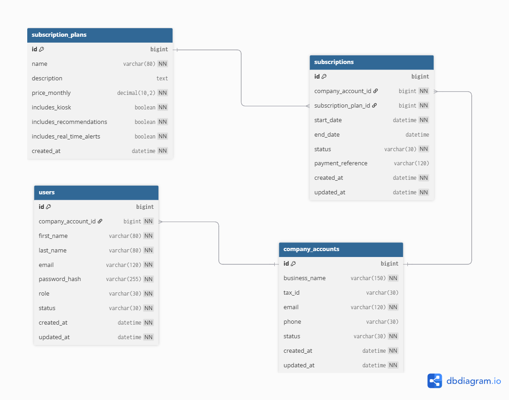
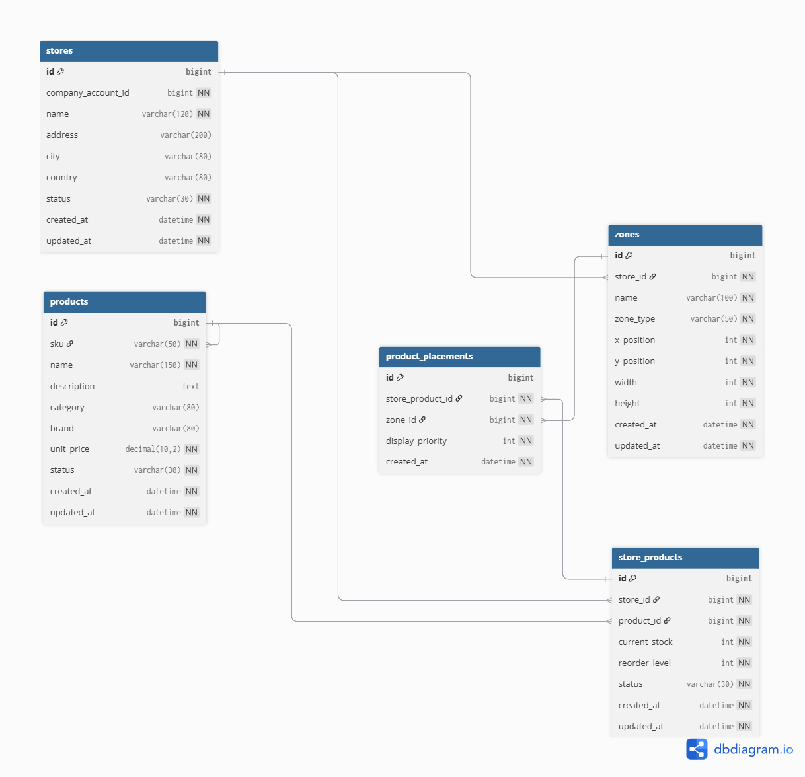
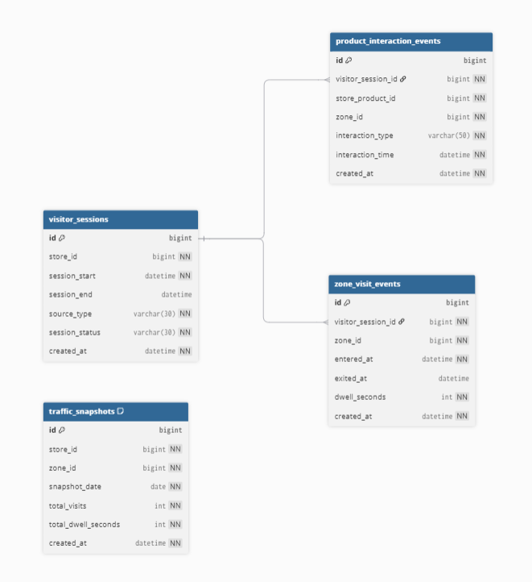
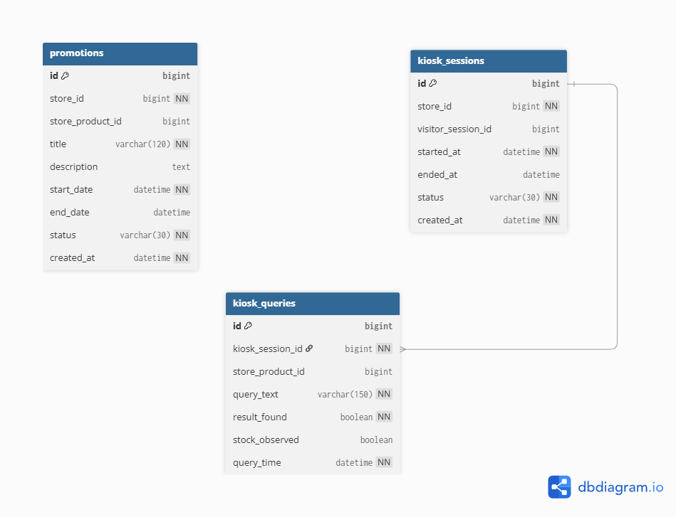
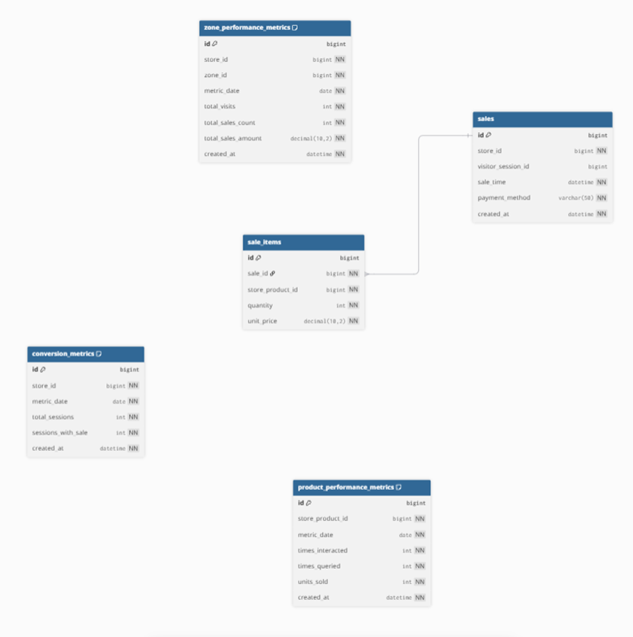
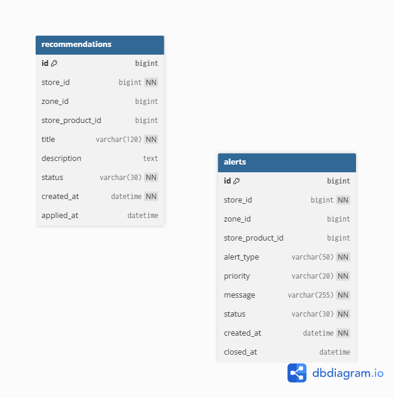

**Nombre de la Universidad:** Universidad Peruana de Ciencias Aplicadas
**Facultad:** Ingeniería  
**Carrera:** Ingeniería de Software
**Ciclo:** 2026-10  

**Código del curso:** 1ASI0729  
**Nombre del curso:** Desarrollo de Aplicaciones Open Source
**NRC:** 11863  
**Nombre del profesor:** Iván Robles Fernández

**"Informe de Trabajo: AV1"**
**Nombre del startup:** RetailPulse

**Relación de integrantes:**

* U20241B331 - Faustino Hurtado, Anghelo Edwin
* U202319178 - Franco del Carpio, José María
* U20251C350 - Godoy Santillan, Jesus Andres
* U202310349 - Rubio Ortiz, Luis Sebastián
* U20211D989 - Vallejo Trujillo, Fabio Cesar

##### Abril, 2026

---

## Registro de Versiones del Informe

| Avance | Fecha | Autor | Descripción de Modificación |
| :--- | :--- | :--- | :--- |
| AV1 | --/04/2026 | "-" | "-" |

---

## Project Report Collaboration Insights

El equipo ha utilizado un flujo de trabajo en github: [retailpulse-report](https://github.com/RetailPulse-NRC11863/retailpulse-report)

---

## Contenido

1. [Student Outcome](#student-outcome)
2. [Capítulo I: Introducción](#capítulo-i-introducción)
3. [Capítulo II: Requirements Elicitation & Analysis](#capítulo-ii-requirements-elicitation--analysis)
4. [Capítulo III: Requirements Specification](#capítulo-iii-requirements-specification)
5. [Capítulo IV: Product Design](#capítulo-iv-product-design)
6. [Capítulo V: Product Implementation, Validation & Deployment](#capítulo-v-product-implementation-validation--deployment)
7. [Conclusiones](#conclusiones)
8. [Bibliografía](#bibliografía)

---

## Student Outcome

**ABET - EAC - Student Outcome 3:** Capacidad de comunicarse efectivamente con un rango de audiencias.

---

## Capítulo I: Introducción

### 1.1. Startup Profile

RetailPulse es una startup tecnológica conformada por estudiantes de la Universidad Peruana de Ciencias Aplicadas (UPC), orientada al desarrollo de soluciones digitales para mejorar la gestión comercial y la experiencia de compra en tiendas físicas del sector retail. La problematica surge a partir de que el comercio electrónico cuenta con métricas detalladas sobre el comportamiento de sus usuarios, muchos negocios físicos todavía operan con información limitada, tomando decisiones comerciales en función de intuición, experiencia previa o únicamente datos de venta.

La propuesta de valor de RetailPulse se materializa en una plataforma web SaaS que conecta la analítica de comportamiento en tienda con herramientas de apoyo operativo y experiencia asistida para el cliente. Por un lado, permite a boutiques, minimarkets y tiendas de conveniencia visualizar información como zonas de mayor tráfico, tiempo de permanencia, productos con alta interacción y baja conversión, y patrones de circulación dentro del local. Por otro lado, incorpora una interfaz web de consulta para el cliente en tienda, mediante la cual puede buscar productos, verificar disponibilidad, ubicar artículos dentro del local y acceder a promociones o recomendaciones durante su recorrido.

RetailPulse no se limita a mostrar datos, sino que los transforma en acciones concretas para el negocio. A partir de la información capturada, la plataforma puede generar recomendaciones para optimizar la distribución del local, activar promociones en zonas estratégicas, emitir alertas al personal cuando una zona requiere atención y facilitar decisiones relacionadas con exhibición, stock y conversión. De esta manera, RetailPulse busca llevar al retail físico un nivel de inteligencia operativa similar al del comercio electrónico, ayudando a los negocios a vender con mayor precisión y a los clientes a comprar con menos fricción.

#### 1.1.1. Descripción de la Startup

#### 1.1.2. Perfiles de integrantes del equipo

<table>
  <tr>
    <td rowspan="3"></td>
    <td>Jesús Andres Godoy Santillan (U20251C350)</td>
  </tr>
  <tr>
    <td>Ingeniería de Software</td>
  </tr>
  <tr>
    <td>Soy Jesús, tengo 23 años. Me apasiona la programación desde temprana edad, habiendo desarrollado proyectos que van desde videojuegos hasta plataformas para eventos online con creadores de contenido. Cuento con experiencia en el desarrollo de sistemas personalizados para el sector agroindustrial y brindo asesoría técnica en soluciones tecnológicas y resolución de problemas.</td>
  </tr>
  <tr>
    <td rowspan="3"></td>
    <td>Faustino Hurtado, Anghelo Edwin (U20241B331)</td>
  </tr>
  <tr>
    <td>Ingeniería de Software</td>
  </tr>
  <tr>
    <td>Tengo 20 años. Me interesa el aprendizaje de nuevas tecnologías y el desarrollo de aplicaciones. Me considero una persona responsable, con capacidad para el razonamiento lógico y buena disposición para el trabajo en equipo en proyectos colaborativos.
</td>
  </tr>
  <tr>
    <td rowspan="3"></td>
    <td>Franco del Carpio, José María (U202319178)</td>
  </tr>
  <tr>
    <td>Ingeniería de Software</td>
  </tr>
  <tr>
    <td>[Insertar biografía aquí]</td>
  </tr>
  <tr>
    <td rowspan="3"></td>
    <td>Rubio Ortiz, Luis Sebastián (U202310349)</td>
  </tr>
  <tr>
    <td>Ingeniería de Software</td>
  </tr>
  <tr>
    <td>[Insertar biografía aquí]</td>
  </tr>
  <tr>
    <td rowspan="3"></td>
    <td>Vallejo Trujillo, Fabio Cesar (U20211D989)</td>
  </tr>
  <tr>
    <td>Ingeniería de Software</td>
  </tr>
  <tr>
    <td>Soy Fabio, estudiante de ingenieria de software en quinto ciclo. Tengo 22 años, me gusta aprender nuevas tecnologías de programación y mantener buenas prácticas. Puedo aportar al proyecto manteniendo al grupo organizado con los entregables y con mis conocimientos técnicos en las multiples areas de programación, modelado de base de datos y arquitectura de software.</td>
  </tr>
</table>

### 1.2. Solution Profile

#### 1.2.1 Antecedentes y problemática

What?

Muchos negocios minoristas físicos operan actualmente con información limitada sobre lo que sucede dentro de sus locales. A diferencia del comercio electrónico, que posee métricas detalladas del usuario, el retail físico toma decisiones basadas en la intuición o únicamente en datos de venta final, ignorando el comportamiento previo a la conversión.

When?

La problemática se manifiesta durante todo el horario de atención comercial, especialmente cuando se acumula tráfico en zonas específicas sin que el personal lo note o cuando un cliente no encuentra un producto y abandona la tienda por falta de asistencia inmediata.

Where?

El problema se localiza en el interior de tiendas físicas como boutiques, minimarkets y tiendas de conveniencia. Estas carecen de herramientas para visualizar patrones de circulación o para ofrecer consultas digitales de stock en el mismo punto de venta.

Who?

Los afectados son los dueños y administradores de negocios retail, quienes no pueden optimizar su rentabilidad por zona, y los compradores, quienes experimentan fricciones al buscar productos o promociones.

Why?

La causa principal es la ausencia de una infraestructura digital que conecte sensores de monitoreo con interfaces de usuario, lo que genera exclusión de datos valiosos y limitaciones en la atención al cliente.

How?

La solución se implementará mediante una arquitectura distribuida que incluye un RESTful API en Java y una Web Application en Angular. Esta plataforma capturará eventos de interacción, generará mapas de calor para el administrador y ofrecerá un quiosco web de consulta para el comprador.

How much?

¿Cuánto afecta este problema?: Afecta al 100% de la eficiencia operativa del local, ya que las zonas de baja conversión no son identificadas ni corregidas a tiempo.

¿Cuánto costará resolver este problema?: El costo se define por el desarrollo de la arquitectura Open Source, el despliegue en la nube y el mantenimiento de los servicios de analítica.

¿Cuántas personas se beneficiarán?: Se beneficiarán tanto el personal operativo (mejor coordinación) como los cientos de clientes diarios que encontrarán una tienda más organizada y asistida.

Conclusiones de 5w y 2h:

En conclusión, el análisis identifica una desconexión crítica entre el potencial de venta del local y el conocimiento real del cliente. Retailplus implementará una solución innovadora que lleva la inteligencia del mundo online al entorno físico, eliminando la fricción para el comprador y maximizando la precisión operativa para el negocio.

#### 1.2.2 Lean UX Process

##### 1.2.2.1. Lean UX Problem Statements

En el retail físico, especialmente en boutiques y minimarkets, los negocios enfrentan una desventaja importante frente al comercio electrónico ya que no cuentan con herramientas que les permitan comprender con claridad qué ocurre dentro del local antes de que se concrete una venta. En la mayoría de los casos, los dueños o administradores solo pueden apoyarse en reportes de ventas, observación informal del comportamiento del cliente o criterios empíricos para decidir cómo distribuir productos, dónde colocar promociones, que promociones enviar a sus clientes o qué zonas del local requieren mayor atención.

Hemos identificado que este problema afecta directamente a dos segmentos clave. Por un lado, los dueños y administradores de tiendas necesitan visibilidad sobre el comportamiento de los clientes dentro del espacio físico para tomar decisiones comerciales mejor fundamentadas. Por otro lado, los propios compradores dentro de la tienda no siempre cuentan con una experiencia ágil para ubicar productos, promociones irresistibles, consultar stock o acceder a información útil durante su recorrido, lo que puede generar fricción, pérdida de tiempo y oportunidades desaprovechadas de venta.

Actualmente, ambas necesidades permanecen desconectadas. Mientras el negocio no dispone de información suficiente para optimizar su operación y mejorar la conversión, el cliente tampoco recibe apoyo inmediato dentro del local para encontrar lo que necesita o descubrir oportunidades y ofertas relevantes. Como consecuencia, se pierden posibilidades de mejorar la experiencia en tienda, aumentar ventas, optimizar la atención del personal y fomentar la fidelización.

¿Cómo podríamos desarrollar una plataforma web que permita a los dueños y administradores de tiendas físicas entender mejor el comportamiento de los clientes dentro del local y, al mismo tiempo, ofrecer a los compradores una experiencia de consulta asistida que reduzca fricción, facilite la compra y contribuya al incremento de la conversión y la fidelización?

##### 1.2.2.2. Lean UX Assumptions

**A. Business Assumptions**

1. Creemos que nuestros clientes necesitan reducir la pérdida de ventas por quiebres de stock y entender el flujo de clientes en su tienda.
2. Estas necesidades se resuelven con una plataforma SaaS que integre analítica de mapas de calor y un quiosco web de asistencia al comprador.
3. Nuestros primeros clientes serán administradores y dueños de minimarkets y tiendas de conveniencia urbanas.
4. **Valor #1 esperado:** visibilidad del tráfico en tiempo real y reducción de fricción en la compra.
5. **Beneficios adicionales:** optimización de la distribución del local, reposición ágil de productos, mejora en la experiencia del cliente.
6. **Adquisición:** referencias boca-a-boca, visitas comerciales a locales físicos y alianzas con gremios de retail.
7. **Ingresos:** suscripción mensual escalonada basada en el tamaño del local o número de zonas monitoreadas.
8. **Competencia principal:** RetailNext, Dor, Sensormatic Solutions.
9. **Ventaja competitiva:** integración de analítica operativa con asistencia directa al cliente, precio accesible y arquitectura open source.
10. **Mayor riesgo de producto:** rechazo a la instalación de sensores o cámaras por percepción de complejidad.
11. **Mitigación:** ofrecer un plan piloto inicial de bajo impacto, onboarding guiado y mostrar métricas accionables en la primera semana.
12. **Otros supuestos críticos:** conectividad a internet estable dentro de los locales comerciales; disposición de los clientes a usar pantallas interactivas.

**B. User Assumptions**

* **¿Quién es el usuario?** Administradores de tiendas físicas, personal operativo y compradores finales.
* **¿Dónde encaja el producto?** En el ecosistema físico de la tienda (oficina para el admin, pasillos para el personal y quiosco para el cliente).
* **Problema a resolver:** toma de decisiones empíricas → zonas de baja conversión y saturación de consultas al personal.
* **Uso típico:** revisar mapas de calor, recibir alertas de reposición, buscar la ubicación de un producto en el quiosco.
* **Características importantes:** analítica en tiempo real, alertas operativas, buscador interactivo de productos, UI intuitiva.
* **Look & feel:** dashboards oscuros (dark mode) para contraste de datos analíticos; UI limpia, clara y amigable con botones grandes para el quiosco web.

**C. User Outcome & Benefit Assumptions**

* Distribución de productos optimizada basada en datos reales, no en intuición.
* Menos consultas repetitivas al personal, permitiendo enfoque en tareas clave.
* Compradores encuentran productos y promociones de forma rápida y autónoma.
* Reducción de ventas perdidas por alertas preventivas de falta de stock.

**D. Business Outcome Assumptions (métricas objetivo)**

* Aumentar en un 25 % la tasa de conversión en zonas optimizadas en 3 meses.
* Reducir en un 30 % el tiempo promedio de búsqueda de productos por parte de los clientes.
* Disminuir a menos de 5 minutos el tiempo de respuesta del personal ante alertas de zonas desatendidas.
* Lograr la adopción de la plataforma en 10 locales piloto en los primeros 3 meses (2026).

**E. Feature Assumptions**

1. **Dashboard de analítica y mapas de calor** permite a la gerencia optimizar el layout de la tienda.
2. **Quiosco web interactivo** acelera la búsqueda de productos y mejora la experiencia de compra autónoma.
3. **Sistema de alertas operativas** notifica al personal sobre quiebres de stock para reposición inmediata.
4. **Módulo de promociones personalizadas** fideliza al cliente y aumenta las ventas cruzadas en zonas estratégicas.

##### 1.2.2.3. Lean UX Hypothesis Statements

**1. Dashboard de analítica y mapas de calor**
> Creemos que al ofrecer un dashboard con mapas de calor en tiempo real incrementaremos la tasa de conversión de las tiendas en un 25 %. Sabremos que estamos bien cuando veamos los siguientes comentarios del mercado: administradores reportan que "ahora sé exactamente qué pasillos son los más rentables y cómo distribuir mis productos" y/o los dashboards muestran un aumento del 25 % en ventas en las zonas optimizadas del local.

**2. Quiosco web interactivo**
> Creemos que implementar un quiosco web interactivo para la búsqueda autónoma de stock reducirá el tiempo de búsqueda del cliente en un 30 %. Sabremos que estamos bien cuando veamos los siguientes comentarios del mercado: compradores comentan que "fue muy fácil y rápido encontrar el pasillo de mi producto sin tener que buscar a un vendedor" y/o el sistema registra que más del 80 % de las consultas en pantalla terminan en una búsqueda exitosa en menos de 1 minuto.

**3. Sistema de alertas operativas**
> Creemos que incorporar notificaciones móviles sobre quiebres de stock o zonas desatendidas reducirá el tiempo de respuesta del personal a menos de 5 minutos. Sabremos que estamos bien cuando veamos los siguientes comentarios del mercado: el personal de piso expresa que "las alertas me permiten reponer los productos antes de que el estante quede vacío" y/o se observa una reducción de más del 40 % en el tiempo en que un anaquel reporta falta de inventario.

**4. Módulo de promociones personalizadas**
> Creemos que mostrar sugerencias y promociones cruzadas directamente en el quiosco web aumentará las ventas de productos complementarios en un 20 %. Sabremos que estamos bien cuando veamos los siguientes comentarios del mercado: dueños de negocio afirman que "las promociones en pantalla realmente impulsan las compras impulsivas de los clientes" y/o el número de cupones o promociones canjeadas en caja crece de manera sostenida más del 20 % mensual.

##### 1.2.2.4. Lean UX Canvas

<table>
  <tr>
    <td valign="top" width="33%">
      <b>1. Problema de negocios</b>  
      El estado actual del sector retail físico ha dependido principalmente de la intuición y la observación visual por parte de administradores para distribuir el local. Utilizan reportes de ventas finales sin entender el comportamiento previo. Esto genera zonas muertas, pérdida de ventas y falta de control operativo. Lo que los productos actuales no resuelven es la necesidad de una solución de analítica de tráfico accesible que integre asistencia directa al comprador sin requerir hardware excesivamente costoso.  
      Nuestro producto abordará esta brecha mediante una plataforma web SaaS que mapea el tráfico (mapas de calor), emite alertas operativas y asiste al cliente mediante quioscos interactivos. Nuestro enfoque inicial estará dirigido a administradores de minimarkets urbanos, personal de tienda y compradores finales.  
      Sabremos que hemos tenido éxito cuando veamos una optimización del layout basada en datos, una reducción en las consultas operativas repetitivas y un uso recurrente del quiosco por parte de los compradores.
    </td>
    <td rowspan="2" valign="top" width="33%">
      <b>5. Ideas de las soluciones</b>  
      - <b>Dashboard de analítica y mapas de calor:</b> Implementar un panel web interactivo para gerencia que permita visualizar las zonas de mayor y menor tráfico dentro de la tienda, cruzando estos datos con métricas de ventas en tiempo real para optimizar la distribución.  
      - <b>Quiosco web interactivo:</b> Desarrollar una interfaz táctil en el local para la búsqueda autónoma de stock, ubicación exacta del producto y visualización de promociones personalizadas (mediante ingreso de DNI).  
      - <b>Sistema de alertas operativas:</b> Crear un panel móvil responsivo que notifique al personal de piso en tiempo real sobre quiebres de stock en pasillos o zonas con alta aglomeración de clientes que requieran atención inmediata.
    </td>
    <td valign="top" width="33%">
      <b>2. Resultados comerciales</b>  
      - Aumentar en un 25 % la tasa de conversión en las zonas optimizadas por el administrador en los primeros 3 meses.  
      - Reducir en un 30 % el tiempo promedio de búsqueda de productos por parte de los clientes usando los quioscos.  
      - Disminuir a menos de 5 minutos el tiempo de respuesta del personal ante alertas de zonas desatendidas o sin stock.  
      - Lograr la adopción de la plataforma en 10 locales piloto en los primeros 3 meses de 2026.
    </td>
  </tr>
  <tr>
    <td valign="top">
      <b>3. Usuarios y Clientes</b>  
      - <b>Administradores o dueños de retail:</b> Dueños de minimarkets y tiendas de conveniencia que buscan optimizar la rentabilidad de su espacio físico y mejorar la conversión de visitantes a compradores.  
      - <b>Personal de tienda:</b> Trabajadores operativos encargados de reponer stock, ordenar pasillos y atender consultas recurrentes en piso.  
      - <b>Compradores físicos:</b> Clientes que visitan la tienda buscando encontrar productos rápidamente, confirmar precios y aprovechar promociones sin fricciones.
    </td>
    <td valign="top">
      <b>4. Beneficios del usuario</b>  
      - Toma de decisiones basada en datos precisos de tráfico y no en la intuición. 
      - Mayor autonomía y agilidad para el comprador en su recorrido. 
      - Reducción de frustración por no encontrar productos o no saber el precio. 
      - Personal de piso menos saturado de consultas repetitivas y mejor coordinado. 
      - Comunicación clara de promociones cruzadas directamente en el punto de decisión.
    </td>
  </tr>
  <tr>
    <td valign="top">
      <b>6. Hipótesis</b>  
      - Creemos que al ofrecer un dashboard con mapas de calor incrementaremos la tasa de conversión en un 25 %. Sabremos que estamos bien cuando los dashboards muestren un aumento del 25 % en ventas en las zonas optimizadas.  
      - Creemos que el quiosco web interactivo reducirá el tiempo de búsqueda en un 30 %. Sabremos que estamos bien cuando más del 80 % de las consultas terminen de forma exitosa en menos de 1 minuto.  
      - Creemos que las notificaciones móviles reducirán el tiempo de respuesta a menos de 5 minutos. Sabremos que estamos bien cuando el tiempo en que un anaquel reporta falta de inventario baje un 40 %.  
      - Creemos que las promociones en el quiosco aumentarán las ventas cruzadas en un 20 %. Sabremos que estamos bien cuando el número de cupones canjeados crezca un 20 % mensual.
    </td>
    <td valign="top">
      <b>7. ¿Qué es lo más importante que necesitamos aprender primero?</b>  
      - Si el sistema analítico no es capaz de procesar datos de tráfico de manera clara, los dueños de negocios no confiarán en los mapas de calor para cambiar la distribución física de su local.  
      - Si la interfaz del quiosco web es lenta o compleja, los compradores la ignorarán y seguirán interrumpiendo al personal de tienda, anulando el propósito de la autonomía.  
      - Si las alertas operativas generan mucho ruido o falsos positivos, el personal de tienda las ignorará y el tiempo de reposición de stock no mejorará en la práctica.
    </td>
    <td valign="top">
      <b>8. ¿Cuál es la menor cantidad de trabajo que necesitamos hacer para resolver las dudas y para hacer siguiente más importante?</b>  
      - <b>Entrevistas a Usuarios:</b> Realizar entrevistas a dueños de minimarkets y compradores para validar las fricciones actuales y la disposición a usar quioscos interactivos en tienda.  
      - <b>Pruebas de Usabilidad con Prototipos:</b> Diseñar wireframes funcionales de las tres vistas (Admin, Personal, Comprador) y realizar testeos con usuarios reales para iterar la interfaz antes de programar.  
      - <b>Realizar una prueba piloto local:</b> Implementar un MVP (Minimum Viable Product) de la plataforma en un solo minimarket de prueba para medir si la infraestructura de captura de datos funciona establemente.
    </td>
  </tr>
</table>

### 1.3. Segmentos objetivo

De acuerdo con el Boletín de Indicadores de Sector Comercio publicado por el Ministerio de la Producción (PRODUCE), el sector retail minorista en el Perú muestra una recuperación dinámica, aunque persisten brechas tecnológicas en la medición del comportamiento del consumidor en locales físicos. Asimismo, reportes del Gremio de Retail de la Cámara de Comercio de Lima (CCL), resaltan que el 70% de las decisiones de compra aún se concretan en el punto de venta físico, lo que subraya la necesidad de herramientas como RetailPulse.

Nuestros principales segmentos objetivo son:

##### Negocios retail físicos (Administradores y Dueños):

Este segmento representa a los clientes directos de la plataforma SaaS de Retailplus. Incluye a dueños de boutiques y minimarkets que buscan optimizar su rentabilidad mediante decisiones basadas en datos de tráfico y conversión por zona. Para este grupo, el sistema ofrece una solución de analítica avanzada que sustituye la gestión basada en la intuición por métricas precisas.

##### Compradores en tiendas físicas:

Representan el segmento de usuarios finales que interactuará con el quiosco web. Este perfil busca eficiencia y autonomía durante su recorrido en la tienda. RetailPulse les otorga la capacidad de consultar disponibilidad de productos y promociones de forma inmediata mediante su identificación (DNI), reduciendo la fricción en la búsqueda de artículos y mejorando su experiencia de compra general.

---

## Capítulo II: Requirements Elicitation & Analysis

### 2.1. Competidores

Luego de realizar una investigación del mercado peruano e internacional de soluciones tecnológicas para la optimización de puntos de venta y análisis del comportamiento del consumidor, hemos identificado los siguientes competidores potenciales para Retailplus:

- **RetailNext:** Es una plataforma líder a nivel global en analítica de retail que utiliza sensores de video e inteligencia artificial para rastrear el comportamiento del cliente en el local.
- **Dor:** Es una solución SaaS basada en hardware térmico que se especializa en el conteo de tráfico de personas para tiendas minoristas.
- **Sensormatic Solutions:** Es una de las empresas líderes a nivel global y local en inteligencia de inventario y análisis de tráfico de compradores a través de su plataforma ShopperTrak.

#### 2.1.1. Análisis competitivo

<table>
  <tr>
    <th colspan="16" valign="top"><b>Competitive Analysis Landscape</b></th>
  </tr>
  <tr>
    <td colspan="9" valign="top">¿Por qué llevar a cabo este análisis?</td>
    <td colspan="7" valign="top">Este análisis tiene como finalidad identificar a nuestros potenciales competidores en el mercado de analítica de retail y asistencia digital en Perú. Buscamos idear estrategias y tácticas para diferenciarnos mediante la integración de un ecosistema que conecte la analítica operativa con la experiencia del comprador final, aprovechando una arquitectura Open Source escalable.</td>
  </tr>
  <tr>
    <td colspan="6" valign="top">
<b>Nombre</b>

</td>
    <td colspan="3" valign="top"><b>RetailPulse (Nuestro producto)</b></td>
    <td colspan="3" valign="top"><b>RetailNext</b></td>
    <td colspan="3" valign="top"><b>Dor</b></td>
    <td valign="top"><b>Sensormatic Solutions</b></td>
  </tr>
  <tr>
    <td colspan="3" rowspan="4" valign="top"><b>Perfil</b></td>
    <td colspan="3" rowspan="2" valign="top"><b>Overview</b></td>
    <td colspan="3" rowspan="2" valign="top">RetailPulse es una plataforma SaaS que conecta la analítica de comportamiento en tienda, la asistencia digital al comprador mediante quioscos web y la coordinación operativa del personal en un solo ecosistema digital.</td>
    <td colspan="3" rowspan="2" valign="top">Plataforma global de analítica de retail basada en sensores de video e inteligencia artificial. Rastrea el comportamiento individual del cliente y ofrece métricas de tráfico y conversión para grandes corporaciones.</td>
    <td colspan="3" rowspan="2" valign="top">Solución SaaS enfocada en el conteo de tráfico de personas utilizando hardware térmico. Proporciona métricas simplificadas de entradas y salidas para pequeños y medianos negocios.</td>
    <td rowspan="2" valign="top">Ecosistema integral de inteligencia de inventario y prevención de pérdidas que utiliza ShopperTrak para analizar el tráfico de compradores y el rendimiento operativo en tiendas físicas.</td>
  </tr>
  <tr></tr>
  <tr>
    <td colspan="3" rowspan="2" valign="top"><b>Ventaja competitiva ¿Qué valor ofrece a los clientes?</b></td>
    <td colspan="3" rowspan="2" valign="top">Integración de analítica operativa y asistencia directa al comprador bajo una arquitectura abierta. Ofrece una solución integral para reducir la fricción en la compra y optimizar el personal simultáneamente.</td>
    <td colspan="3" rowspan="2" valign="top">Extrema precisión en el seguimiento de trayectorias mediante IA y madurez tecnológica en el mercado internacional de retail de lujo.</td>
    <td colspan="3" rowspan="2" valign="top">Instalación "plug-and-play" inmediata y total privacidad para los clientes al no utilizar cámaras, ideal para locales con alta sensibilidad a la privacidad.</td>
    <td rowspan="2" valign="top">Capacidad masiva de integrar datos de inventario en tiempo real con el tráfico de personas y sistemas de seguridad física ya existentes.</td>
  </tr>
  <tr></tr>
  <tr>
    <td colspan="3" rowspan="2" valign="top"><b>Perfil de Marketing</b></td>
    <td colspan="3" valign="top"><b>Mercado objetivo</b></td>
    <td colspan="3" valign="top">Boutiques, minimarkets y tiendas de conveniencia en Perú que buscan digitalizar su operación y mejorar la atención autónoma al cliente.</td>
    <td colspan="3" valign="top">Grandes cadenas minoristas internacionales, tiendas de departamento y centros comerciales de alto volumen.</td>
    <td colspan="3" valign="top">Pequeños comercios independientes y negocios retail locales que requieren métricas básicas de tráfico sin inversión en hardware complejo.</td>
    <td valign="top">Hipermercados, farmacias de cadena y retailers con necesidad crítica de control de inventario y prevención de pérdidas.</td>
  </tr>
  <tr>
    <td colspan="3" valign="top"><b>Estrategias de Marketing</b></td>
    <td colspan="3" valign="top">Marketing digital enfocado en democratización de datos para PYMES, alianzas con gremios de retail local y demostraciones de impacto en conversión.</td>
    <td colspan="3" valign="top">Participación en ferias internacionales de retail tech, marketing B2B de alto nivel y casos de éxito con marcas globales de lujo.</td>
    <td colspan="3" valign="top">Publicidad directa en redes sociales resaltando la simplicidad y el bajo costo de suscripción mensual.</td>
    <td valign="top">Venta directa institucional y consultoría técnica personalizada para grandes superficies y seguridad corporativa.</td>
  </tr>
  <tr>
    <td colspan="3" rowspan="3" valign="top"><b>Perfil de producto</b></td>
    <td colspan="3" valign="top"><b>Productos y Servicios</b></td>
    <td colspan="3" valign="top">Dashboards de tráfico, mapas de calor, quioscos web interactivos para búsqueda de stock y panel de alertas para el personal de tienda.</td>
    <td colspan="3" valign="top">Analítica de video avanzada, optimización de staff mediante IA y mapas de calor precisos basados en trayectorias.</td>
    <td colspan="3" valign="top">Sensores térmicos de puerta, reportes básicos de tráfico y dashboards de tasa de conversión simplificados.</td>
    <td valign="top">Software ShopperTrak, etiquetas inteligentes RFID, sensores de seguridad y plataformas de análisis de prevención de pérdidas.</td>
  </tr>
  <tr>
    <td colspan="3" valign="top"><b>Precios y Costos</b></td>
    <td colspan="3" valign="top">Modelo de suscripción SaaS escalable basado en planes según el tamaño de la tienda y número de zonas monitoreadas.</td>
    <td colspan="3" valign="top">Costos elevados por licencias enterprise, hardware propietario de video y servicios de consultoría e implementación.</td>
    <td colspan="3" valign="top">Costo de hardware inicial accesible y una suscripción mensual fija por dispositivo de bajo costo.</td>
    <td valign="top">Inversión inicial muy alta en infraestructura de red y seguridad, con contratos de mantenimiento a largo plazo.</td>
  </tr>
  <tr>
    <td colspan="3" valign="top"><b>Canales de distribución</b></td>
    <td colspan="3" valign="top">Distribución directa mediante plataforma web oficial y servicios en la nube (AWS/Azure) con soporte técnico local en Perú.</td>
    <td colspan="3" valign="top">Red global de socios tecnológicos certificados y venta directa para cuentas corporativas.</td>
    <td colspan="3" valign="top">Venta directa a través de sitio web con envío de hardware a nivel internacional y activación remota de SaaS.</td>
    <td valign="top">Fuerza de ventas corporativa directa y distribuidores especializados en seguridad electrónica y retail masivo.</td>
  </tr>
  <tr>
    <td colspan="3" rowspan="4" valign="top"><b>Análisis FODA</b></td>
    <td colspan="3" valign="top"><b>Fortalezas</b></td>
    <td colspan="3" valign="top">- Única solución que integra asistencia al comprador con analítica. - Arquitectura Open Source adaptable. - Enfoque específico en el mercado minorista peruano.</td>
    <td colspan="3" valign="top">- Líder mundial reconocido. - Tecnología de IA altamente precisa. - Robustez en el procesamiento de grandes volúmenes de datos.</td>
    <td colspan="3" valign="top">- Extrema simplicidad y privacidad. - Bajo costo de hardware. - Modelo de negocio escalable para pequeñas tiendas.</td>
    <td valign="top">- Sólida integración con prevención de pérdidas. - Ecosistema de hardware RFID líder. - Soporte global y local establecido.</td>
  </tr>
  <tr>
    <td colspan="3" valign="top"><b>Debilidades</b></td>
    <td colspan="3" valign="top">- Producto en fase de desarrollo académico inicial. - Necesidad de validar la precisión de sensores de bajo costo frente a competidores.</td>
    <td colspan="3" valign="top">- Precios prohibitivos para el sector minorista peruano (PYMES). - Curva de aprendizaje técnica muy elevada.</td>
    <td colspan="3" valign="top">- Funcionalidad limitada al conteo básico. - No ofrece mapas de calor ni asistencia directa al cliente.</td>
    <td valign="top">- Ecosistema de hardware cerrado y propietario. - Dificultad para integrar con bibliotecas de terceros y soluciones open source.</td>
  </tr>
  <tr>
    <td colspan="3" valign="top"><b>Oportunidades</b></td>
    <td colspan="3" valign="top">- Alta brecha digital en el retail peruano. - Incremento en la demanda de experiencias de compra sin fricción. - Alianzas con asociaciones de comercio locales.</td>
    <td colspan="3" valign="top">- Expansión de servicios mediante modelos de suscripción para mercados emergentes.</td>
    <td colspan="3" valign="top">- Integración de sus datos con sistemas POS de terceros para reportes más completos.</td>
    <td valign="top">- Potencial para integrar analítica predictiva avanzada basada en patrones de inventario.</td>
  </tr>
  <tr>
    <td colspan="3" valign="top"><b>Amenazas</b></td>
    <td colspan="3" valign="top">- Entrada de competidores internacionales con mayor capital. - Resistencia cultural al monitoreo físico en locales tradicionales.</td>
    <td colspan="3" valign="top">- Crecimiento de soluciones SaaS ligeras que no requieren hardware costoso.</td>
    <td colspan="3" valign="top">- Competencia de aplicaciones móviles de conteo gratuito y manual.</td>
    <td valign="top">- Cambios en regulaciones de privacidad de datos que limiten el uso de sensores físicos.</td>
  </tr>
</table>

#### 2.1.2. Estrategias y tácticas frente a competidores

**Diferenciación de Producto:**
- **Estrategia:** Retailplus se enfocará en la integración única de analítica operativa para el negocio y asistencia digital directa para el comprador final, bajo una arquitectura abierta y escalable que no requiere hardware propietario costoso.
- **Tácticas:** Se desarrollará un motor de analítica capaz de procesar eventos en tiempo real, se implementará una interfaz de quiosco web altamente intuitiva para la búsqueda autónoma de productos y stock.

**Desarrollo Continuo:**
- **Estrategia:** La startup se compromete a la mejora constante de la plataforma mediante la integración de bibliotecas de código abierto y servicios en la nube.
- **Tácticas:** Se establecerá un ciclo de retroalimentación con administradores de tiendas locales y se implementará un flujo de integración continua.

**Colaboraciones Estratégicas:**
- **Estrategia:** Se buscarán asociaciones con gremios de comercio locales y proveedores de infraestructura tecnológica.
- **Tácticas:** Se desarrollará un programa de "tiendas piloto" en diversos distritos de Lima.

### 2.2. Entrevistas

#### 2.2.1. Diseño de entrevistas

Con el objetivo de comprender las necesidades, frustraciones y expectativas de los segmentos definidos para RetailPulse, se diseñaron preguntas de entrevista diferenciadas para cada uno de los dos segmentos objetivo:

#### Preguntas para el segmento 1: Negocios retail físicos (dueños o administradores)

1. ¿Cómo tomas actualmente decisiones sobre la distribución de productos dentro de tu tienda?
2. ¿Qué tipo de información utilizas para saber qué productos funcionan mejor o peor?
3. ¿Te resulta fácil identificar qué zonas de tu tienda atraen más clientes? ¿Por qué?
4. ¿En qué situaciones sientes que pierdes ventas sin saber exactamente qué ocurrió?
5. ¿Cómo detectas si un cliente mostró interés en un producto pero finalmente no lo compró?
6. ¿Qué dificultades tiene tu personal para atender a los clientes dentro del local?
7. ¿Cómo decides cuándo cambiar la ubicación de un producto o activar una promoción?
8. ¿Qué herramientas digitales utilizas actualmente para gestionar tu tienda?
9. Si pudieras ver con mayor claridad cómo se comportan los clientes dentro del local, ¿cómo usarías esa información?
10. ¿Qué tipo de alertas, reportes o recomendaciones te ayudarían más a mejorar tus ventas?

#### Preguntas para el segmento 2: Compradores en tienda

1. Cuando ingresas a una tienda, ¿sueles encontrar fácilmente lo que estás buscando? ¿Por qué?
2. ¿Qué haces normalmente cuando no encuentras un producto dentro del local?
3. ¿Con qué frecuencia necesitas pedir ayuda a un vendedor para ubicar un producto?
4. ¿Te suele pasar que te interesa un producto pero finalmente no lo compras? ¿Qué te detiene?
5. ¿Qué tan importante es para ti saber si un producto tiene stock antes de buscarlo?
6. ¿Te parecería útil contar con una pantalla o quiosco dentro de la tienda para buscar productos? ¿Por qué?
7. ¿Qué información te gustaría ver al consultar un producto dentro de la tienda?
8. ¿Qué tan relevantes te resultan las promociones mientras estás comprando en una tienda física?
9. ¿Qué cosas te hacen perder más tiempo o te generan más frustración al comprar en tienda?
10. ¿Qué mejoraría tu experiencia de compra para que sea más rápida, cómoda o útil?

#### 2.2.2. Registro de entrevistas

##### Segmento 1: Dueños o administradores de negocios retail fisicos

###### Entrevista 1
* Nombre: Andy Pillaca
* Edad: 27
* Distrito: San Borja
* Timing: 

**Resumen**: 
Andy gestiona la distribución de productos en base a experiencia y observación, apoyándose en reportes de ventas y comentarios del personal. Sin embargo, no cuenta con datos precisos sobre el tráfico por zonas ni sobre el comportamiento de los clientes dentro del local, lo que dificulta entender por qué algunos productos no se venden (ubicación, precio o atención).

Actualmente, no puede identificar si un cliente interactúa con un producto y no lo compra, y en horas pico el personal no logra cubrir todas las áreas. Las decisiones como promociones o reubicación de productos se toman de forma reactiva, cuando las ventas son bajas o el stock no rota.

Utiliza únicamente un sistema POS y Excel. Considera que tener visibilidad del comportamiento del cliente le permitiría mejorar la distribución, la conversión y la atención. Le resultan especialmente útiles alertas de zonas con alto tráfico y baja conversión, identificación de productos con alta interacción sin venta y recomendaciones automáticas de acciones comerciales.

**Enlace:** 

##### Segmento 2: Compradores frecuentes en tiendas fisicas

###### Entrevista 1
* Nombre: Andy Nuñez
* Edad: 26
* Distrito: Lurigancho-Chosica
* Timing:

**Resumen**: Andy Nuñez es un comprador frecuente en tiendas físicas y su experiencia depende mucho de la organización del local. En tiendas grandes o desconocidas, le resulta difícil encontrar productos debido a la falta de señalización y orden, por lo que suele recorrer toda la tienda antes de pedir ayuda, ya que los vendedores suelen estar ocupados.

Si no encuentra lo que busca, puede abandonar la tienda y buscar otra alternativa. No suele interactuar con el personal, prefiriendo tiendas donde ya conoce la distribución. Cuando no compra un producto que le interesó, generalmente se debe al precio, falta de necesidad o desconfianza en la calidad.

Valora mucho conocer rápidamente el stock de un producto para no perder tiempo ni generar frustración. Considera útil la presencia de pantallas en tienda que le permitan buscar productos, ver disponibilidad, ubicación y promociones al ingresar.

Sus principales frustraciones al comprar son no encontrar productos, perder tiempo, desorden en el local, mala señalización, precios incorrectos y largas colas.

**Enlace:** 

#### 2.2.3. Análisis de entrevistas

### 2.3. Needfinding

#### 2.3.1. User Personas

#### 2.3.2. User Task Matrix

#### 2.3.3. User Journey Mapping

#### 2.3.4. Empathy Mapping

### 2.4. Big Picture Event Storming

### 2.5. Ubiquitous Language

El **Ubiquitous Language** define un conjunto de términos compartidos entre los miembros del equipo de desarrollo, stakeholders y usuarios del sistema RetailPulse. Este lenguaje permite establecer una comunicación clara, consistente y sin ambigüedades a lo largo del diseño, desarrollo e implementación de la plataforma.

Dado que RetailPulse está basado en principios de **Domain-Driven Design (DDD)**, los términos definidos a continuación se alinean con los distintos **Bounded Contexts** del sistema, tales como *Store Configuration*, *Simulation & In-Store Monitoring*, *Buyer Assistance*, *Sales & Conversion* y *Alerts & Recommendations*.

---

#### 2.5.1. Términos del Dominio de Negocio

| Término | Definición |
|--------|-----------|
| **RetailPulse** | Plataforma SaaS orientada a la analítica de comportamiento en tiendas físicas y asistencia digital al comprador. |
| **Tienda (Store)** | Establecimiento físico donde se implementa RetailPulse para analizar el comportamiento de los clientes. |
| **Administrador** | Usuario responsable de la gestión de la tienda, toma de decisiones y análisis de métricas. |
| **Personal de tienda** | Empleados encargados de la operación diaria, reposición de productos y atención al cliente. |
| **Comprador** | Cliente final que interactúa con la tienda física y el quiosco digital. |
| **Suscripción** | Plan contratado por una tienda para acceder a las funcionalidades de RetailPulse. |
| **Plan** | Nivel de servicio ofrecido (básico, intermedio, avanzado) que define capacidades del sistema. |

---

#### 2.5.2. Términos de Configuración de Tienda

| Término | Definición |
|--------|-----------|
| **Zona (Zone)** | Área específica dentro de la tienda (pasillos, secciones, entradas, cajas). |
| **Estante (Shelf)** | Estructura física donde se ubican productos dentro de una zona. |
| **Producto (Product)** | Ítem disponible para la venta dentro de la tienda. |
| **Ubicación de producto** | Relación entre un producto y su posición exacta dentro de la tienda. |
| **Catálogo** | Conjunto de productos registrados en el sistema. |

---

#### 2.5.3. Términos de Analítica y Monitoreo

| Término | Definición |
|--------|-----------|
| **Evento** | Registro de una acción o interacción del cliente dentro de la tienda (movimiento, permanencia, interacción). |
| **Sesión de visita** | Conjunto de eventos asociados a un cliente durante su recorrido en la tienda. |
| **Mapa de calor (Heatmap)** | Visualización que representa la intensidad de tráfico o interacción en distintas zonas. |
| **Tráfico** | Cantidad de personas que transitan por una zona determinada. |
| **Tiempo de permanencia** | Duración que un cliente permanece en una zona específica. |
| **Interacción** | Acción del cliente relacionada con un producto o zona (detenerse, observar, consultar). |

---

#### 2.5.4. Términos de Asistencia al Comprador

| Término | Definición |
|--------|-----------|
| **Quiosco Web** | Interfaz interactiva en tienda que permite al comprador buscar productos y consultar información. |
| **Búsqueda de producto** | Proceso mediante el cual el comprador consulta un producto en el sistema. |
| **Disponibilidad** | Estado que indica si un producto se encuentra en stock. |
| **Ubicación del producto** | Información que indica en qué zona o estante se encuentra un producto. |
| **Promoción** | Oferta o incentivo asociado a un producto para incentivar su compra. |
| **Sesión de quiosco** | Interacción completa de un comprador con el quiosco web. |

---

#### 2.5.5. Términos de Ventas y Conversión

| Término | Definición |
|--------|-----------|
| **Venta** | Transacción en la que uno o más productos son adquiridos por el cliente. |
| **Conversión** | Relación entre interacción del cliente y compra efectiva. |
| **Tasa de conversión** | Métrica que indica el porcentaje de visitantes que realizan una compra. |
| **Producto de alta interacción** | Producto que recibe muchas consultas o interés, pero no necesariamente ventas. |
| **Zona de baja conversión** | Área con alto tráfico pero bajo nivel de compras. |

---

#### 2.5.6. Términos de Alertas y Operación

| Término | Definición |
|--------|-----------|
| **Alerta operativa** | Notificación generada por el sistema ante una condición relevante (alta demanda, falta de stock, zona desatendida). |
| **Tarea operativa** | Acción asignada al personal de tienda como respuesta a una alerta. |
| **Prioridad** | Nivel de urgencia asignado a una alerta o tarea. |
| **Recomendación** | Sugerencia generada por el sistema para optimizar la operación o la distribución de la tienda. |

---

#### 2.5.7. Consistencia del Lenguaje

Para asegurar la correcta aplicación del Ubiquitous Language en el proyecto:

- Todos los términos definidos deben ser utilizados de manera consistente en:
  - User Stories  
  - Diagramas de arquitectura  
  - Código fuente (nombres de clases, variables, servicios)  
  - Interfaces de usuario  

- Se evita el uso de sinónimos para un mismo concepto (por ejemplo, no alternar entre “cliente” y “comprador” si se ha definido uno como estándar).

- Los términos en inglés se mantienen únicamente cuando forman parte del lenguaje técnico (por ejemplo, *Heatmap*, *Dashboard*, *Stock*).

---

## Capítulo III: Requirements Specification

### 3.1. User Stories

| Epic ID | Título | Descripción |
|---|---|---|
| EP-01 | Inteligencia Retail y Asistencia en Tienda | Permite analizar el comportamiento de los clientes dentro de la tienda física, optimizar la distribución del espacio y asistir tanto al personal como al comprador en tiempo real. |
| EP-02 | Experiencia Digital del Ecosistema | Permite que visitantes, compradores y personal interactúen con la plataforma web para acceder a información útil, tomar decisiones y ejecutar acciones dentro de la tienda. |
| EP-03 | Integración y Desarrollo de APIs RESTful | Construcción de los servicios backend (endpoints) que permiten la comunicación de datos entre los sensores de la tienda, la base de datos y la interfaz web. |
| EP-04 | Arquitectura y Seguridad del Sistema | Configuración de la infraestructura base, gestión de la base de datos y mecanismos de autenticación para garantizar la estabilidad del software. |

| Story ID | Título | Descripción | Criterios de Aceptación                                                                                                                                                                                                                                                                                                                                                                                                                                                                                                                                                                                                              | Relacionado con |
|---|---|---|--------------------------------------------------------------------------------------------------------------------------------------------------------------------------------------------------------------------------------------------------------------------------------------------------------------------------------------------------------------------------------------------------------------------------------------------------------------------------------------------------------------------------------------------------------------------------------------------------------------------------------------|---|
| US-01 | Explorar planes y propuesta de valor de RetailPulse | Como visitante de página, quiero conocer los planes y beneficios de RetailPulse, para evaluar si la solución se adapta a las necesidades de mi tienda. | **Escenario 1:** Given el visitante accede al landing page, When revisa la información comercial, Then el sistema presenta la propuesta de valor y los planes disponibles.  **Escenario 2:** Given el visitante identifica un plan de interés, When consulta su detalle, Then el sistema muestra sus beneficios y alcance principal.  **Escenario 3:** Given el visitante intenta acceder a una sección no disponible del landing page, When realiza la solicitud, Then el sistema informa que el contenido no se encuentra disponible y permite volver al inicio.                                                       | EP-02 |
| US-02 | Analizar tráfico e interacción por zonas de la tienda | Como administrador de tienda, quiero visualizar métricas de tráfico, permanencia e interacción por zona, para identificar oportunidades de mejora en la distribución del local y en la conversión. | **Escenario 1:** Given la tienda registra eventos de interacción, When el administrador consulta el desempeño general, Then el sistema muestra métricas por zona para el período seleccionado.  **Escenario 2:** Given existen datos suficientes de actividad, When el administrador revisa la distribución del tráfico, Then el sistema presenta una visualización de intensidad de interacción por zonas.  **Escenario 3:** Given el administrador solicita métricas de un período sin datos registrados, When realiza la consulta, Then el sistema informa que no existen datos disponibles para el rango solicitado. | EP-01 |
| US-03 | Recibir alertas operativas por zonas de alta demanda | Como personal de tienda, quiero recibir alertas sobre zonas con alta demanda o baja atención, para priorizar mi intervención y mejorar la experiencia del comprador. | **Escenario 1:** Given una zona supera el umbral definido de actividad, When el sistema detecta la condición, Then genera una alerta operativa asociada a dicha zona.  **Escenario 2:** Given existen alertas activas, When el personal consulta su panel operativo, Then el sistema muestra las alertas ordenadas por prioridad.  **Escenario 3:** Given el personal intenta acceder al detalle de una alerta inexistente o ya cerrada, When selecciona dicha alerta, Then el sistema informa que la alerta no se encuentra disponible.                                                                                 | EP-01 |
| US-04 | Buscar productos y su ubicación dentro de la tienda | Como comprador en tienda, quiero buscar un producto y conocer su disponibilidad y ubicación, para encontrarlo rápidamente. | **Escenario 1:** Given el producto existe en el catálogo de la tienda, When el comprador realiza la búsqueda, Then el sistema devuelve su ubicación y disponibilidad.  **Escenario 2:** Given el producto existe y tiene promociones asociadas, When el comprador consulta su información, Then el sistema muestra la promoción vigente junto con la ubicación del producto.  **Escenario 3:** Given el comprador busca un producto inexistente o sin coincidencias, When realiza la búsqueda, Then el sistema informa que no se encontraron resultados y sugiere intentar otra búsqueda.                                | EP-02 |
| US-05 | Consultar tareas operativas asignadas en tienda | Como personal de tienda, quiero consultar las tareas operativas generadas por el sistema, para atender zonas, productos o incidencias priorizadas dentro del local. | **Escenario 1:** Given existen tareas operativas activas, When el personal accede a su panel, Then el sistema muestra las tareas asignadas con su prioridad y estado.  **Escenario 2:** Given una tarea operativa está pendiente, When el personal consulta su detalle, Then el sistema muestra la zona o motivo asociado para facilitar su atención.  **Escenario 3:** Given el personal intenta consultar una tarea inexistente o ya finalizada, When accede a su detalle, Then el sistema informa que la tarea no se encuentra disponible.                                                                            | EP-01 |
| US-06 | [Título de la funcionalidad] | Como [rol: administrador / personal / comprador / visitante], quiero [acción], para [beneficio]. | **Escenario 1:** Given [contexto válido], When [acción correcta], Then [resultado esperado].  **Escenario 2:** Given [otro contexto válido], When [otra acción válida], Then [resultado esperado].  **Escenario 3:** Given [contexto inválido o error], When [acción incorrecta], Then [mensaje de error o validación].                                                                                                                                                                                                                                                                                                  | [EP] |
| US-07 | [Título de la funcionalidad] | Como [rol], quiero [acción], para [beneficio]. | **Escenario 1:** Given [contexto], When [acción], Then [resultado].  **Escenario 2:** Given [contexto], When [acción], Then [resultado].  **Escenario 3:** Given [error], When [acción], Then [error].                                                                                                                                                                                                                                                                                                                                                                                                                   | [EP] |
| US-08 | [Título de la funcionalidad] | Como [rol], quiero [acción], para [beneficio]. | **Escenario 1:** Given [condición válida], When [acción], Then [resultado esperado].  **Escenario 2:** Given [otra condición], When [acción], Then [resultado].  **Escenario 3:** Given [condición inválida], When [acción], Then [mensaje de error].                                                                                                                                                                                                                                                                                                                                                                    | [EP] |
| US-09 | [Título de la funcionalidad] | Como [rol], quiero [acción], para [beneficio]. | **Escenario 1:** Given [dato existente], When [acción], Then [resultado].  **Escenario 2:** Given [dato válido], When [acción], Then [resultado].  **Escenario 3:** Given [dato inexistente], When [acción], Then [error].                                                                                                                                                                                                                                                                                                                                                                                               | [EP] |
| US-10 | [Título de la funcionalidad] | Como [rol], quiero [acción], para [beneficio]. | **Escenario 1:** Given [estado correcto], When [acción], Then [resultado].  **Escenario 2:** Given [estado válido], When [acción], Then [resultado].  **Escenario 3:** Given [estado inválido], When [acción], Then [error].                                                                                                                                                                                                                                                                                                                                                                                             | [EP] |
| US-11 | Crear endpoint para recepción de eventos de tráfico | Como desarrollador, quiero implementar un endpoint POST en la API, para que los sensores de la tienda puedan enviar los datos de movimiento al backend en tiempo real. | **Escenario 1:** Given un payload válido del sensor, When el endpoint recibe la petición, Then el sistema responde con código 201 y guarda el registro.  **Escenario 2:** Given un payload con datos faltantes, When se envía la petición, Then la API responde con error 400 Bad Request.  **Escenario 3:** Given una falla en el servidor, When procesa los datos, Then el sistema responde con error 500 y registra el log.                                                                                                                                                                                           | EP-03 |
| US-12 | Desarrollar endpoint GET de analítica y mapas de calor | Como desarrollador, quiero crear un endpoint de agregación de datos, para que el frontend pueda consumir las métricas procesadas y renderizar el mapa de calor correctamente. | **Escenario 1:** Given una consulta válida con rango de fechas, When se llama al endpoint, Then el sistema retorna un JSON con los datos agrupados por zona.  **Escenario 2:** Given una consulta en un período sin tráfico, When se solicita la data, Then el sistema retorna un array vacío con código 200.  **Escenario 3:** Given un error de formato en la fecha, When se hace la petición GET, Then el sistema retorna un error de validación.                                                                                                                                                                     | EP-03 |
| US-13 | Construir API REST para la gestión del catálogo | Como desarrollador, quiero desarrollar las rutas CRUD de productos en el backend, para que la plataforma web pueda crear, leer, actualizar y eliminar el inventario. | **Escenario 1:** Given una petición GET a la ruta de productos, When se ejecuta, Then el sistema retorna la lista completa del catálogo.  **Escenario 2:** Given los datos correctos de un nuevo producto, When se envía un POST, Then el sistema lo inserta en la base de datos.  **Escenario 3:** Given un ID de producto inexistente, When se intenta eliminar (DELETE), Then el sistema retorna un error 404 Not Found.                                                                                                                                                                                              | EP-03 |
| US-14 | Implementar seguridad y autenticación JWT | Como desarrollador, quiero configurar la seguridad mediante tokens JWT, para proteger las rutas privadas del sistema y asegurar que solo el personal autorizado acceda a la data. | **Escenario 1:** Given credenciales correctas en el login, When se procesa la petición, Then el sistema genera y devuelve un token JWT válido.  **Escenario 2:** Given una petición a una ruta protegida sin token, When el usuario intenta acceder, Then la API bloquea el acceso con código 401 Unauthorized.  **Escenario 3:** Given un token expirado, When se adjunta en la petición, Then el sistema rechaza la acción por expiración de credenciales.                                                                                                                                                             | EP-04 |
| US-15 | Configurar el esquema y conexión de Base de Datos | Como desarrollador, quiero establecer la conexión y el modelado de las tablas/colecciones, para almacenar de forma persistente y eficiente los eventos diarios de la tienda. | **Escenario 1:** Given el inicio del servidor backend, When arranca la aplicación, Then el sistema establece conexión exitosa con la base de datos.  **Escenario 2:** Given credenciales inválidas de conexión, When arranca el servicio, Then el sistema lanza una excepción explícita y detiene el proceso.  **Escenario 3:** Given la inserción de un nuevo registro, When se ejecuta el query, Then la base de datos respeta y valida las restricciones de los campos obligatorios.                                                                                                                                  | EP-04 |
| US-16 | Conocer cómo RetailPulse mejora la operación de la tienda | Como visitante de página, quiero visualizar de forma clara cómo RetailPulse ayuda a mejorar la operación, la conversión y la experiencia de compra en tienda, para entender el valor real de la solución para mi negocio. | **Escenario 1:** Given el visitante accede al landing page, when revisa la sección de beneficios del producto, then el sistema presenta de forma clara cómo RetailPulse mejora la analítica, la atención en tienda y la conversión.  **Escenario 2:** Given el visitante pertenece al segmento de negocios retail físicos, when explora la información del producto, then el sistema muestra casos de uso y beneficios asociados a la gestión de tiendas físicas.  **Escenario 3:** Given el visitante intenta acceder a una sección informativa no disponible, when realiza la navegación, then el sistema informa que el contenido no se encuentra disponible y ofrece volver a una sección válida del landing page. | EP-02 |
| US-17 | Visualizar demostraciones del funcionamiento de RetailPulse | Como visitante de página, quiero visualizar ejemplos o demostraciones del funcionamiento de RetailPulse, para comprender cómo se verían sus principales funcionalidades aplicadas en una tienda real. | **Escenario 1:** Given el visitante accede al landing page, when revisa la sección de demostración del producto, then el sistema muestra ejemplos visuales de funcionalidades como mapa de calor, alertas y búsqueda de productos.  **Escenario 2:** Given el visitante desea profundizar en el funcionamiento de la solución, when consulta la sección de demostraciones, then el sistema presenta contenido explicativo sobre el uso de RetailPulse en un entorno retail.  **Escenario 3:** Given el visitante intenta reproducir o consultar una demostración no disponible, when realiza la acción, then el sistema informa que el recurso no está disponible y mantiene la navegación dentro del landing page. | EP-02 |

### 3.2. Impact Mapping

### 3.3. Product Backlog

A continuación, se presenta el Product Backlog de RetailPulse, el cual organiza las User Stories en función de su valor para el negocio y su prioridad dentro del desarrollo del producto.

| # Orden | User Story ID | Título | Descripción | Story Points |
|--------|---------------|--------|------------|--------------|
| 1 | US-01 | Explorar planes y propuesta de valor de RetailPulse | Como visitante de página, quiero conocer los planes y beneficios de RetailPulse, para evaluar si la solución se adapta a las necesidades de mi tienda. | 3 |
| 2 | US-16 | Conocer cómo RetailPulse mejora la operación de la tienda | Como visitante de página, quiero visualizar de forma clara cómo RetailPulse ayuda a mejorar la operación, la conversión y la experiencia de compra en tienda, para entender el valor real de la solución para mi negocio. | 3 |
| 3 | US-17 | Visualizar demostraciones del funcionamiento de RetailPulse | Como visitante de página, quiero visualizar ejemplos o demostraciones del funcionamiento de RetailPulse, para comprender cómo se verían sus principales funcionalidades aplicadas en una tienda real. | 5 |
| 4 | US-04 | Buscar productos y su ubicación dentro de la tienda | Como comprador en tienda, quiero buscar un producto y conocer su disponibilidad y ubicación, para encontrarlo rápidamente. | 5 |
| 5 | US-09 | Recibir promociones personalizadas en quiosco | Como comprador en tienda, quiero recibir promociones personalizadas mientras busca productos, para aprovechar ofertas relevantes durante su compra. | 3 |
| 6 | US-05 | Consultar tareas operativas asignadas en tienda | Como personal de tienda, quiero consultar las tareas operativas generadas por el sistema, para atender zonas, productos o incidencias priorizadas dentro del local. | 3 |
| 7 | US-03 | Recibir alertas operativas por zonas de alta demanda | Como personal de tienda, quiero recibir alertas sobre zonas con alta demanda o baja atención, para priorizar mi intervención y mejorar la experiencia del comprador. | 3 |
| 8 | US-10 | Notificar falta de stock al personal | Como sistema, quiero notificar al personal cuando un producto consultado no tiene stock, para que puedan tomar acciones rápidas dentro de la tienda. | 5 |
| 9 | US-02 | Analizar tráfico e interacción por zonas de la tienda | Como administrador de tienda, quiero visualizar métricas de tráfico, permanencia e interacción por zona, para identificar oportunidades de mejora en la distribución del local y en la conversión. | 8 |
| 10 | US-06 | Visualizar mapa de calor de interacción en tienda | Como administrador de tienda, quiero visualizar un mapa de calor de interacción de clientes dentro del local, para identificar zonas de alta y baja actividad y optimizar la distribución del espacio. | 8 |
| 11 | US-08 | Visualizar patrones de circulación de clientes | Como administrador de tienda, quiero visualizar los patrones de circulación de los clientes dentro del local, para entender su comportamiento y mejorar la experiencia de compra. | 8 |
| 12 | US-07 | Recibir recomendaciones de optimización del layout | Como administrador de tienda, quiero recibir recomendaciones sobre la distribución de productos y zonas, para mejorar la conversión y el flujo de clientes. | 5 |
| 13 | US-13 | Construir API REST para la gestión del catálogo | Como desarrollador, quiero desarrollar las rutas CRUD de productos en el backend, para que la plataforma web pueda gestionar el inventario. | 5 |
| 14 | US-11 | Crear endpoint para recepción de eventos de tráfico | Como desarrollador, quiero implementar un endpoint POST en la API, para que los sensores envíen datos en tiempo real. | 5 |
| 15 | US-12 | Desarrollar endpoint GET de analítica y mapas de calor | Como desarrollador, quiero crear un endpoint de agregación de datos, para que el frontend consuma métricas procesadas. | 5 |
| 16 | US-15 | Configurar el esquema y conexión de Base de Datos | Como desarrollador, quiero establecer la conexión y el modelado de las tablas, para almacenar eventos de la tienda. | 5 |
| 17 | US-14 | Implementar seguridad y autenticación JWT | Como desarrollador, quiero configurar la seguridad mediante tokens JWT, para proteger las rutas privadas del sistema. | 3 |

---

## Capítulo IV: Product Design

### 4.1. Style Guidelines

#### 4.1.1. General Style Guidelines

En esta sección se definen los pilares visuales que rigen la identidad de marca de **RetailPulse**. Estas directrices garantizan la consistencia en todos los puntos de contacto de la plataforma, desde el informe técnico hasta la interfaz de la aplicación web, transmitiendo los valores de innovación, precisión analítica y profesionalismo premium.

**A. Brand Persona**

La identidad visual de RetailPulse proyecta la imagen de una *startup* tecnológica sofisticada y confiable. Se prioriza la claridad de los datos, el minimalismo y una estética de interfaz limpia, diseñada para facilitar la toma de decisiones gerenciales mediante visualizaciones precisas.

**B. Tipografía**

Se ha seleccionado una familia tipográfica *sans-serif* moderna, optimizada para la legibilidad en pantallas de alta densidad y compatible con estándares de desarrollo web.

* **Fuentes Principales:** `Inter` o `Poppins` (Pesos: Light 300, Regular 400, Semibold 600, Bold 700, Black 900).
* **Jerarquía Tipográfica:**
    * **Títulos (H1/H2):** Peso Bold o Black, color Deep Tech Navy Blue (`#0A2540`).
    * **Cuerpo de Texto:** Peso Regular para una lectura fluida.
    * **Monospace (APIs y Backend):** `Fira Code` o `Roboto Mono` para la documentación técnica de las US-11 a US-15.

**C. Paleta de Colores**

La paleta se compone de tonos que equilibran la seriedad corporativa con el dinamismo tecnológico de la analítica de datos.

1. **Azul Marino Profundo (Deep Tech Navy Blue):**
    * **HEX:** `#0A2540`
    * **Función:** Base corporativa que transmite confianza. Se utiliza en el texto principal, encabezados y elementos estructurales.

2. **Cian Eléctrico Vibrante (Vibrant Electric Cyan):**
    * **HEX:** `#00D2FF`
    * **Función:** Acento tecnológico y moderno. Se utiliza para resaltar elementos de analítica (líneas de pulso, gráficos), botones de acción y estados activos.

3. **Blanco Puro:**
    * **HEX:** `#FFFFFF`
    * **Función:** Fondo principal para mantener un diseño minimalista, limpio y con alto contraste.

**D. Directrices del Logotipo**

El logotipo debe presentarse siempre de forma legible, respetando su composición y colores originales:

* **Símbolo:** Representa la unión entre el sector retail (bolsa de compras con líneas sólidas) y la analítica (línea de pulso en cian).
* **Composición:** La palabra "Retail" se presenta en Deep Tech Navy Blue y "Pulse" en Vibrant Electric Cyan, reforzando la identidad dual de la herramienta.
* **Uso en Fondos:** Sobre fondo blanco se utiliza la versión a color. En fondos oscuros, se prefiere la versión monocromática blanca o con el acento cian resaltado.

**E. Principios de Layout y Espaciado**

* **Sistema de Grillas:** Basado en múltiplos de 8px para garantizar la armonía visual en todos los componentes de la UI.
* **Espacio Negativo:** Uso extensivo del blanco puro para reducir la carga cognitiva y destacar los KPIs críticos de la tienda.
* **Bordes:** Redondeado moderno (entre 4px y 8px) para suavizar la estética tecnológica y mejorar la experiencia de usuario.

#### 4.1.2. Web Style Guidelines

### 4.2. Information Architecture

#### 4.2.1. Organization Systems

#### 4.2.2. Labeling Systems

#### 4.2.3. SEO Tags and Meta Tags

#### 4.2.4. Searching Systems

#### 4.2.5. Navigation Systems

### 4.3. Landing Page UI Design

#### 4.3.1. Landing Page Wireframe

#### 4.3.2. Landing Page Mock-up

### 4.4. Web Applications UX/UI Design

#### 4.4.1. Web Applications Wireframes

#### 4.4.2. Web Applications Wireflow Diagrams

#### 4.4.2. Web Applications Mock-ups

#### 4.4.3. Web Applications User Flow Diagrams

### 4.5. Web Applications Prototyping

### 4.6. Domain-Driven Software Architecture

#### 4.6.1. Design-Level Event Storming

#### 4.6.2. Software Architecture Context Diagram

#### 4.6.3. Software Architecture Container Diagrams

#### 4.6.4. Software Architecture Components Diagrams

### 4.7. Software Object-Oriented Design

#### 4.7.1. Class Diagrams

### 4.8. Database Design

#### 4.8.1. Database Diagrams

##### Bounded Context: Subscription

Este esquema representa el contexto **Subscription**, se encarga de gestionar el modelo SaaS de RetailPulse. Su propósito es administrar las cuentas de negocio que contratan la plataforma, los tres planes disponibles, las suscripciones activas y los usuarios internos que acceden al sistema según sus roles. Este contexto permite responder quién utiliza la plataforma, bajo qué organización trabaja y qué funcionalidades puede consumir de acuerdo con el plan que se ha contratado, estableciendo así la base de acceso y control del sistema.

##### Bounded Context: Store Configuration

Este esquema representa el contexto **Store Configuration**, se enfoca en definir la estructura física y lógica de la tienda que será analizada por la plataforma. Aquí se modelan las tiendas, sus zonas, estantes, productos y la ubicación de los productos dentro del local. Este contexto es importante porque proporciona la base espacial y comercial sobre la que luego se interpretan los eventos, las búsquedas de compradores, las métricas de tráfico y los reportes de conversión.

##### Bounded Context: Simulation & In-Store Monitoring

Este esquema representa el contexto **Simulation & In-Store Monitoring**, se centra en la generación y registro de eventos simulados de comportamiento dentro de la tienda. Administra sesiones de visita, recorridos por zonas, tiempos de permanencia e interacciones con productos, reproduciendo de manera lógica la información que podría capturarse con sensores reales en un entorno de producción. Este contexto constituye el núcleo analítico del sistema, ya que alimenta funcionalidades como heatmaps, dashboards de tráfico y patrones de comportamiento en tienda.

##### Bounded Context: Buyer Assistance

Este esquema representa el contexto **Buyer Assistance**, está orientado a la experiencia del comprador dentro del local mediante el quiosco web. Gestiona sesiones de uso del quiosco, búsquedas de productos, consultas de disponibilidad y promociones asociadas a los productos. Su objetivo es reducir la fricción durante la compra, facilitar la ubicación de artículos y ofrecer información relevante en tiempo real, complementando la analítica interna con una capa de asistencia directa al cliente.

##### Bounded Context: Sales & Conversion

Este esquema representa el contexto **Sales & Conversion**, se encarga de relacionar la actividad observada en tienda con los resultados comerciales. Administra ventas, detalle de productos vendidos y métricas consolidadas de conversión, tanto a nivel general como por zona y producto. Este contexto permite evaluar si las interacciones de los compradores realmente terminan en compra, haciendo posible identificar áreas de bajo rendimiento, productos con alta interacción pero baja venta y oportunidades de optimización comercial.

##### Bounded Context: Alerts & Recommendations

Este esquema representa el contexto **Alerts & Recommendations**, se enfoca en transformar los datos del sistema en acciones concretas. Administra alertas generadas automáticamente, tareas operativas asignadas al personal y recomendaciones dirigidas al administrador del negocio. Su función es convertir el análisis de tráfico, interacción y conversión en decisiones accionables, permitiendo reaccionar ante zonas de alta demanda, problemas de atención, baja conversión o necesidades de mejora en la disposición de productos.

---

## Capítulo V: Product Implementation, Validation & Deployment

### 5.1. Software Configuration Management

#### 5.1.1. Software Development Environment Configuration

#### 5.1.2. Source Code Management

Para la gestión del código fuente del proyecto RetailPulse, el equipo utiliza GitHub como plataforma central de control de versiones y colaboración entre los miembros. Se ha optado por trabajar con una organización que agrupa múltiples repositorios, cada uno enfocado en un componente específico del sistema. A continuación, se detallan los repositorios utilizados:

* Organización: <https://github.com/RetailPulse-NRC11863>
* Repositorio de Landing Page: <https://github.com/RetailPulse-NRC11863/retailpulse-landing-page>
* Repositorio del Informe: <https://github.com/RetailPulse-NRC11863/retailpulse-report>
* Repositorio del Frontend: <https://github.com/RetailPulse-NRC11863/retailpulse-web-application>
* Repositorio del Backend: <https://github.com/RetailPulse-NRC11863/retailpulse-web-services>

En el repositorio del informe se implementa un flujo de trabajo basado en GitFlow. La rama `main` se utiliza para almacenar versiones estables del documento correspondientes a cada entrega del proyecto del curso, mientras que la rama `develop` actúa como punto de integración de los avances realizados por los integrantes del equipo. A partir de `develop`, cada miembro del equipo crea ramas de tipo `feature/...` para desarrollar las secciones asignadas del informe.

Las ramas feature siguen una nomenclatura relacionada al contenido trabajado, por ejemplo: `feature/chapter-1-introduction` o `feature/chapter-5-software-management`. Esta convención facilita la organización del trabajo, permite identificar rápidamente el alcance de cada rama y reduce conflictos durante la integración.

En los repositorios correspondientes a la Landing Page, Frontend y Backend también se aplica GitFlow. En estos casos, la rama `main` representa versiones funcionales y estables del producto, mientras que `develop` se utiliza como rama de integración continua del desarrollo. Las ramas `feature/...` se crean a partir de `develop`, pero a diferencia del informe, su nomenclatura está orientada a funcionalidades específicas del sistema, tales como `feature/heatmap-dashboard`, `feature/store-configuration` o `feature/sensor-integration`.

Se establece como regla que no se realizarán cambios directos sobre la rama `main`, ya que esta debe contener únicamente versiones validadas. Asimismo, el trabajo diario no se realiza directamente sobre `develop`, sino mediante ramas `feature`, las cuales posteriormente son integradas a `develop` y finalmente consolidadas en `main` una vez revisadas. De esta manera, el flujo de trabajo definido es: `feature → develop → main`, siguiendo las buenas prácticas de GitFlow.

Adicionalmente, en caso de requerirse correcciones urgentes sobre versiones estables, se emplearán ramas `hotfix/...`, y para la preparación de entregables se podrán utilizar ramas `release/...`, manteniendo coherencia con el flujo establecido.

Para el control de versiones, el equipo adopta la convención de Conventional Commits, lo que permite mantener un historial de cambios claro, consistente y fácil de auditar. Los principales prefijos utilizados son:

* feat: incorporación de nuevas funcionalidades
* fix: corrección de errores
* docs: cambios en documentación
* style: ajustes de formato o estilo sin afectar la lógica
* refactor: reestructuración del código sin cambios funcionales
* test: adición o modificación de pruebas
* chore: tareas de mantenimiento o configuración

En el repositorio del informe se emplean mensajes como `docs(report): add project cover page` o `docs: add startup profile and lean ux process for chapter 1`. En los repositorios de software se utilizan mensajes como `feat: implement heatmap visualization`, `feat: add sensor event tracking` o `fix: correct authentication validation`. Esta práctica asegura que el historial de commits refleje de manera clara el trabajo realizado por cada integrante del equipo.

#### 5.1.3. Source Code Style Guide & Conventions

#### 5.1.4. Software Deployment Configuration

### 5.2. Landing Page, Services & Applications Implementation

#### 5.2.1. Sprint 1

##### 5.2.1.1. Sprint Planning 1

##### 5.2.1.2. Aspect Leaders and Collaborators

##### 5.2.1.3. Sprint Backlog 1

##### 5.2.1.4. Development Evidence for Sprint Review

##### 5.2.1.5. Execution Evidence for Sprint Review

##### 5.2.1.6. Services Documentation Evidence for Sprint Review

##### 5.2.1.7. Software Deployment Evidence for Sprint Review

##### 5.2.1.8. Team Collaboration Insights during Sprint

---

## Conclusiones

### Conclusiones y recomendaciones

### Video About-the-Team

## Bibliografía

## Anexos